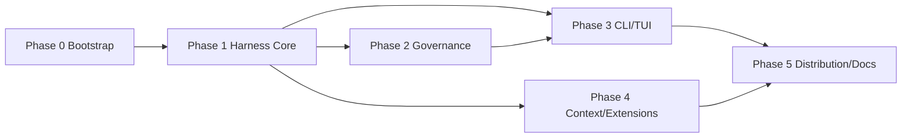

# KL Code Implementation Plan

> **For agentic workers:** REQUIRED SUB-SKILL: Use superpowers:subagent-driven-development (recommended) or superpowers:executing-plans to implement this plan task-by-task. Steps use checkbox (`- [ ]`) syntax for tracking.

**Goal:** Build the first version of KL Code, a local coding agent harness with a Python FastAPI server and a TypeScript React Ink CLI/TUI, where governance is the deep dimension and all core mechanisms are testable with a mock LLM.

**Architecture:** FastAPI server owns the agent loop, tool dispatch, guardrails, feedback, memory, context assembly, sessions, and audit logging. The React Ink TUI is a thin client using REST and WebSocket. The server supports multi-provider LLM configuration, MCP, skills, hooks, and user Python tool plugins.

**Tech Stack:** Python 3.11+, FastAPI, Pydantic, SQLite, pytest; TypeScript, React Ink, Vitest; GitHub Actions and GitLab CI.

---

## 1. Scope

This plan implements the first version defined in `SPEC.md`.

Explicitly deferred and tracked as future work:

- Subagent orchestration
- WebUI
- Remote deployment
- Docker sandbox/deployment

These items are not authorized to start until the user explicitly approves them. See `SPEC.md` §12 for the work-start gate.
Interface reservations only (not implementation tasks) are declared in `SPEC.md` §12.3.

## 2. Repository Layout

```text
SimpleCodingAgent/
  server/
    pyproject.toml
    kl_server/
      __init__.py
      bootstrap.py
      main.py
      api/
        app.py
        routes.py
        ws.py
      config/
        config.py
        credentials.py
        backends.py
        loader.py
      core/
        agent_loop.py
        auth.py
        context.py
        event_logger.py
        feedback.py
        guardrail.py
        sandbox.py
        session_manager.py
        snapshot.py
        task_manager.py
        tool_executor.py
      extensions.py
      hooks/
        manager.py
      memory/
        store.py
      mcp/
        adapter.py
        transport.py
      models/
        action.py
        feedback.py
        task.py
      plugins/
        loader.py
      providers/
        base.py
        factory.py
        mock.py
        openai_compatible.py
        registry.py
      skills/
        loader.py
      storage/
        database.py
      tools/
        base.py
        registry.py
        builtin/
          filesystem.py
          git.py
          patch.py
          search.py
          shell.py
          task.py
          validation.py
    tests/
      conftest.py
      test_agent_loop.py
      test_auth.py
      test_bootstrap.py
      test_context.py
      test_credentials.py
      test_feedback.py
      test_guardrail.py
      test_hooks.py
      test_mcp_adapter.py
      test_memory.py
      test_models.py
      test_plugin_loader.py
      test_providers.py
      test_sandbox.py
      test_session.py
      test_skills.py
      test_snapshot.py
      test_storage.py
      test_tool_executor.py
      test_tool_registry.py
      test_tools.py
      test_task.py
      test_ws.py
      test_event_logger.py
      test_extensions.py
      test_builtin_tools.py
      test_openai_provider.py
  cli/
    package.json
    tsconfig.json
    src/
      main.ts
      api/
        client.ts
        events.ts
      commands/
        registry.ts
        config.ts
        session.ts
        task.ts
      tui/
        app.tsx
        screens/
          approval.tsx
          config.tsx
          session.tsx
          task.tsx
    test/
      client.test.ts
      commands.test.ts
      registry.test.ts
  docs/
    superpowers/
      plans/
        README.md
  examples/
    guardrail_demo.py
    feedback_demo.py
    context_demo.py
    tool_error_demo.py
  .github/
    workflows/
      ci.yml
  .gitlab-ci.yml
  Makefile
  README.md
  AGENT_LOG.md
  SPEC_PROCESS.md
  REFLECTION.md
  SPEC.md
  PLAN.md
```

## 3. Task Dependencies



Parallelization rule:

- After Phase 1 tasks 1.1-1.5 pass, governance tasks 2.1-2.5 and CLI tasks 3.1-3.3 can run in separate worktrees.
- After tasks 1.1 and 1.4 pass, memory/context tasks 4.1-4.3 can start.
- Skills, hooks, MCP, and plugins depend on the tool registry and can be parallel after task 1.5.

Additional dependency edges introduced by the integration tasks:

- `1.10` depends on `1.8`; `1.11` depends on `1.3`-`1.4`; `1.12` depends on `1.5`; `1.13` depends on `1.9` and `1.11`-`1.12`.
- `1.14` depends on `1.2`, `1.8`, and `1.10`.
- `2.8` depends on `2.5` and `1.9`; `2.9` depends on `2.7` and `1.9`; `2.10` depends on `2.5` and `2.8`.
- `3.7` depends on `3.1`; `3.8` depends on `3.2`, `3.3`, and `3.10`; `3.9` depends on `2.8`, `3.1`, and `3.4`.
- `3.10` depends on `3.1` and `1.7`.
- `4.8` depends on `4.5`; `4.9` depends on `4.6`; `4.10` depends on `4.2`-`4.3` and `1.9`.
- `4.11` depends on `1.3`, `4.4`, `4.5`, `4.7`, `4.8`, `4.9`, and `4.10`.
- `5.6` depends on `1.9`-`1.14`, `2.8`-`2.10`, `3.1`, `3.7`, `3.9`, and `4.1`-`4.11`.

Execution note: task numbering is organizational, not a strict execution order. In particular, implement `3.10` before `3.8`/`3.9` even though its section appears later, because the CLI and approval loop depend on the REST routes.

## 4. Task Tracking

| Task | Name | Status |
|---|---|---|
| 0.1 | Server package skeleton | Done (`7d4554d`) |
| 0.2 | CLI package skeleton | Done (`c45547b`) |
| 0.3 | Makefile and test runner | Done (`908b864`) |
| 0.4 | CI configuration | Done (`dd1cb9b`) |
| 1.1 | Core models | Done (`0b78bda`) |
| 1.2 | Provider abstraction and mock | Done (`2864928`) |
| 1.3 | Tool interface and registry | Done (`67988b7`) |
| 1.4 | Built-in file/search tools | Done (`f46b628`) |
| 1.5 | ToolExecutor error isolation | Done (`d5bb526`) |
| 1.6 | Feedback sensors | Done (`e46c504`) |
| 1.7 | SQLite storage and sessions/tasks | Done (`4e7761f`) |
| 1.8 | Config and credentials | Pending |
| 1.9 | Basic AgentLoop | Pending |
| 1.10 | Credential backends (keyring / encrypted file / .env) | Pending |
| 1.11 | Complete built-in tool set (shell/git/patch/validation/task/delete) | Pending |
| 1.12 | ToolExecutor timeout and output truncation | Pending |
| 1.13 | Feedback re-injection into AgentLoop | Pending |
| 1.14 | OpenAI-compatible provider and config loader | Pending |
| 2.1 | ScopeFence | Pending |
| 2.2 | SandboxPolicy | Pending |
| 2.3 | DangerClassifier | Pending |
| 2.4 | HITL state machine | Pending |
| 2.5 | Guardrail pipeline | Pending |
| 2.6 | Non-Git snapshot/rollback | Pending |
| 2.7 | Audit logger | Pending |
| 2.8 | Guardrail integrated into ToolExecutor | Pending |
| 2.9 | Audit logging integrated into AgentLoop | Pending |
| 2.10 | Non-Git workspace stricter approval | Pending |
| 3.1 | FastAPI routes and WebSocket | Pending |
| 3.2 | CLI API client | Pending |
| 3.3 | Slash command registry | Pending |
| 3.4 | TUI task/approval screens | Pending |
| 3.5 | TUI config wizard | Pending |
| 3.6 | TUI session commands | Pending |
| 3.7 | Daemon token authentication | Pending |
| 3.8 | CLI top-level commands (init/run/server) | Pending |
| 3.9 | Approval and pause/resume/abort end-to-end | Pending |
| 3.10 | REST routes for sessions/tasks/providers/models/keys | Pending |
| 4.1 | MemoryStore | Pending |
| 4.2 | ContextAssembler token budget | Pending |
| 4.3 | LLM summarizer | Pending |
| 4.4 | SkillLoader | Pending |
| 4.5 | HookManager | Pending |
| 4.6 | MCP adapter | Pending |
| 4.7 | User tool plugin loader | Pending |
| 4.8 | HTTP hook support | Pending |
| 4.9 | MCP client transport (stdio / streamable-http) | Pending |
| 4.10 | ContextAssembler integrated into AgentLoop | Pending |
| 4.11 | Wire hooks/skills/MCP/plugins into harness | Pending |
| 5.1 | Mock-LLM demos | Pending |
| 5.2 | README and install docs | Pending |
| 5.3 | Distribution polish | Pending |
| 5.4 | Process docs and reflection | Pending |
| 5.5 | Final CI pass and deliverables | Pending |
| 5.6 | Application bootstrap and server composition | Pending |

Every task opens a `AGENT_LOG.md` entry before implementation and updates it in real time. Every completed task also updates this table and the relevant `- [ ]` checkboxes in this file.

---

## 5. Phase 0: Bootstrap

### Task 0.1: Server package skeleton

**Files:**

- Create: `server/pyproject.toml`
- Create: `server/kl_server/__init__.py`
- Create: `server/tests/test_package.py`

- [x] **Step 1: Write the failing test**

```python
from kl_server import __version__


def test_package_version():
    assert __version__ == "0.1.0"
```

- [x] **Step 2: Run it to verify it fails**

Run: `python -m pytest server/tests/test_package.py -v`
Expected: FAIL with `ImportError` or missing `__version__`.

- [x] **Step 3: Implement the minimal package**

```python
__version__ = "0.1.0"
```

Create `server/pyproject.toml` with `[project] name = "kl-server"`, `version = "0.1.0"`, dependencies `fastapi`, `uvicorn`, `pydantic`, `pydantic-settings`, `aiosqlite`, `keyring`, and dev dependencies `pytest`, `pytest-asyncio`, `httpx`.

- [x] **Step 4: Run the test to verify it passes**

Run: `python -m pytest server/tests/test_package.py -v`
Expected: PASS.

- [x] **Step 5: Commit**

```bash
git add server/pyproject.toml server/kl_server/__init__.py server/tests/test_package.py
git commit -m "feat: bootstrap kl-server package"
```

### Task 0.2: CLI package skeleton

**Files:**

- Create: `cli/package.json`
- Create: `cli/tsconfig.json`
- Create: `cli/src/main.ts`
- Create: `cli/test/main.test.ts`

- [x] **Step 1: Write the failing test**

```ts
import { expect, test } from 'vitest';
import { cliName } from '../src/main';

test('cli exposes package name', () => {
  expect(cliName()).toBe('kl-code');
});
```

- [x] **Step 2: Run it to verify it fails**

Run: `npm test`
Expected: FAIL with missing `cliName`.

- [x] **Step 3: Implement the minimal module**

```ts
export function cliName(): string {
  return 'kl-code';
}
```

Create `cli/package.json` with name `@kl-code/cli`, `type: module`, dependencies `ink`, `react`, `commander`, dev dependencies `typescript`, `vitest`, `tsx`, `@types/react`.

- [x] **Step 4: Run the test to verify it passes**

Run: `npm test`
Expected: PASS.

- [x] **Step 5: Commit**

```bash
git add cli/package.json cli/tsconfig.json cli/src/main.ts cli/test/main.test.ts
git commit -m "feat: bootstrap kl-code cli"
```

### Phase 0 cold-start follow-ups

Cold-start execution exposed repository hygiene requirements that must be folded into Phase 0:

- Task 0.3 must extend `.gitignore` with `__pycache__/`, `*.egg-info/`, `.pytest_cache/`, and `node_modules/`.
- Task 0.4 or the next CLI task must commit `cli/package-lock.json` and replace `*` dependencies with caret ranges.
- Before Phase 1 async tests, add `[tool.pytest.ini_options]` to `server/pyproject.toml`.
- Task 5.3 distribution must add server dependency lower bounds and a reproducible install path.

### Task 0.3: Makefile and test runner

**Files:**

- Create: `Makefile`

- [x] **Step 1: Write the Makefile**

```make
.PHONY: install ci test dev

install:
	python -m pip install -e "server[dev]"
	cd cli && npm install

ci:
	python -m pip install -e "server[dev]"
	cd cli && npm ci

test:
	python -m pytest server/tests -q
	cd cli && npm test

dev:
	@echo "make dev is not available until server main and cli tui entrypoints exist"
	@exit 1
```

- [x] **Step 2: Verify `make test` runs both suites**

Run: `make test`
Expected: server tests and CLI tests both run and pass.

- [x] **Step 3: Commit**

```bash
git add Makefile
git commit -m "chore: add make test and dev runner"
```

### Task 0.4: CI configuration

**Files:**

- Modify: `.github/workflows/ci.yml`
- Create: `.gitlab-ci.yml`

- [x] **Step 1: Update GitHub Actions**

```yaml
name: CI

on:
  push:
  pull_request:

jobs:
  unit-test:
    runs-on: ubuntu-latest
    steps:
      - name: Checkout
        uses: actions/checkout@v4

      - name: Setup Python
        uses: actions/setup-python@v5
        with:
          python-version: '3.11'

      - name: Setup Node
        uses: actions/setup-node@v4
        with:
          node-version: '22'

      - name: Install dependencies
        run: make ci

      - name: Run tests
        run: make test
```

- [x] **Step 2: Create GitLab CI**

```yaml
image: python:3.11

unit-test:
  stage: test
  before_script:
    - apt-get update
    - apt-get install -y curl
    - curl -fsSL https://deb.nodesource.com/setup_22.x | bash -
    - apt-get install -y nodejs
  script:
    - make ci
    - make test
```

- [x] **Step 3: Verify CI files are valid YAML**

Run: `python -c "import yaml; yaml.safe_load(open('.github/workflows/ci.yml')); yaml.safe_load(open('.gitlab-ci.yml'))"`
Expected: no exception.

- [x] **Step 4: Commit**

```bash
git add .github/workflows/ci.yml .gitlab-ci.yml
git commit -m "ci: add python and node unit-test pipeline"
```

---

## 6. Phase 1: Harness Core

### Task 1.1: Core models

**Files:**

- Create: `server/kl_server/models/__init__.py`
- Create: `server/kl_server/models/action.py`
- Create: `server/kl_server/models/feedback.py`
- Create: `server/kl_server/models/task.py`
- Test: `server/tests/test_models.py`

- [x] **Step 1: Write the failing test**

```python
from kl_server.models.action import Action, ToolResult
from kl_server.models.feedback import Feedback, FeedbackCategory
from kl_server.models.task import Session, Task, TaskStatus


def test_action_and_result_roundtrip():
    action = Action(tool="read_file", args={"path": "a.py"}, task_id="t1")
    result = ToolResult(ok=True, output="content")
    assert action.tool == "read_file"
    assert result.ok is True


def test_feedback_category():
    feedback = Feedback(category=FeedbackCategory.TEST_FAILURE, summary="1 failed")
    assert feedback.category.value == "test_failure"


def test_session_and_task_relationships():
    session = Session(id="s1", workspace="E:/repo", name="main")
    task = Task(id="t1", session_id=session.id, description="fix tests", status=TaskStatus.PENDING)
    assert task.session_id == "s1"
```

- [x] **Step 2: Run it to verify it fails**

Run: `python -m pytest server/tests/test_models.py -v`
Expected: FAIL with missing modules.

- [x] **Step 3: Implement the models**

```python
# server/kl_server/models/action.py
from dataclasses import dataclass
from typing import Any


@dataclass(frozen=True)
class Action:
    tool: str
    args: dict[str, Any]
    task_id: str
    seq: int = 0
    workspace: str = ""
    raw_command: str | None = None


@dataclass
class ToolResult:
    ok: bool
    output: str
    error: str | None = None
```

```python
# server/kl_server/models/feedback.py
from dataclasses import dataclass
from enum import Enum


class FeedbackCategory(str, Enum):
    SUCCESS = "success"
    TEST_FAILURE = "test_failure"
    BUILD_FAILURE = "build_failure"
    LINT_ERROR = "lint_error"
    TYPE_ERROR = "type_error"
    TIMEOUT = "timeout"
    TOOL_ERROR = "tool_error"
    PROVIDER_ERROR = "provider_error"
    UNKNOWN = "unknown_error"


@dataclass(frozen=True)
class Feedback:
    category: FeedbackCategory
    summary: str
    raw_ref: str | None = None
```

```python
# server/kl_server/models/task.py
from dataclasses import dataclass, field
from enum import Enum
from datetime import datetime, timezone


class TaskStatus(str, Enum):
    PENDING = "pending"
    RUNNING = "running"
    AWAITING_APPROVAL = "awaiting_approval"
    PAUSED = "paused"
    SUCCEEDED = "succeeded"
    FAILED = "failed"
    CANCELED = "canceled"


@dataclass
class Session:
    id: str
    workspace: str
    name: str = "default"
    provider: str = "mock"
    model: str = "mock-model"
    status: str = "active"
    created_at: datetime = field(default_factory=lambda: datetime.now(timezone.utc))


@dataclass
class Task:
    id: str
    session_id: str
    description: str
    status: TaskStatus = TaskStatus.PENDING
    workspace_mode: str = "git"
    branch: str | None = None
    snapshot_path: str | None = None
    summary: str = ""
    created_at: datetime = field(default_factory=lambda: datetime.now(timezone.utc))
```

- [x] **Step 4: Run the test to verify it passes**

Run: `python -m pytest server/tests/test_models.py -v`
Expected: PASS.

- [x] **Step 5: Commit**

```bash
git add server/kl_server/models server/tests/test_models.py
git commit -m "feat: add harness core models"
```

### Task 1.2: Provider abstraction and mock

**Files:**

- Create: `server/kl_server/providers/__init__.py`
- Create: `server/kl_server/providers/base.py`
- Create: `server/kl_server/providers/mock.py`
- Create: `server/kl_server/providers/registry.py`
- Test: `server/tests/test_providers.py`

- [x] **Step 1: Write the failing test**

```python
import pytest
from kl_server.providers.base import ProviderRequest
from kl_server.providers.mock import MockProvider
from kl_server.providers.registry import ProviderRegistry


@pytest.mark.asyncio
async def test_mock_provider_returns_sequence():
    provider = MockProvider(responses=["first", "second"])
    first = await provider.complete(ProviderRequest(messages=[], model="mock-model"))
    second = await provider.complete(ProviderRequest(messages=[], model="mock-model"))
    assert (first.text, second.text) == ("first", "second")


def test_registry_requires_known_provider():
    registry = ProviderRegistry()
    with pytest.raises(KeyError):
        registry.get("missing")
```

- [x] **Step 2: Run it to verify it fails**

Run: `python -m pytest server/tests/test_providers.py -v`
Expected: FAIL.

- [x] **Step 3: Implement provider layer**

```python
# server/kl_server/providers/base.py
from dataclasses import dataclass
from typing import Protocol


@dataclass(frozen=True)
class ProviderRequest:
    messages: list[dict[str, str]]
    model: str
    max_tokens: int = 2048


@dataclass(frozen=True)
class ProviderResponse:
    text: str
    raw: dict | None = None


class Provider(Protocol):
    async def complete(self, request: ProviderRequest) -> ProviderResponse:
        ...
```

```python
# server/kl_server/providers/mock.py
from kl_server.providers.base import ProviderRequest, ProviderResponse


class MockProvider:
    def __init__(self, responses: list[str] | None = None):
        self.responses = responses or []
        self.calls: list[ProviderRequest] = []

    async def complete(self, request: ProviderRequest) -> ProviderResponse:
        self.calls.append(request)
        if not self.responses:
            return ProviderResponse(text="final")
        return ProviderResponse(text=self.responses.pop(0))
```

```python
# server/kl_server/providers/registry.py
from kl_server.providers.mock import MockProvider


class ProviderRegistry:
    def __init__(self):
        self._providers = {"mock": MockProvider()}

    def register(self, name: str, provider) -> None:
        self._providers[name] = provider

    def get(self, name: str):
        return self._providers[name]
```

- [x] **Step 4: Run the test to verify it passes**

Run: `python -m pytest server/tests/test_providers.py -v`
Expected: PASS.

- [x] **Step 5: Commit**

```bash
git add server/kl_server/providers server/tests/test_providers.py
git commit -m "feat: add provider abstraction and mock provider"
```

### Task 1.3: Tool interface and registry

**Files:**

- Create: `server/kl_server/tools/__init__.py`
- Create: `server/kl_server/tools/base.py`
- Create: `server/kl_server/tools/registry.py`
- Test: `server/tests/test_tool_registry.py`

- [x] **Step 1: Write the failing test**

```python
import pytest
from kl_server.models.action import ToolResult
from kl_server.tools.base import Tool, ToolContext
from kl_server.tools.registry import ToolRegistry


class EchoTool(Tool):
    name = "echo"
    description = "echo args"
    schema = {"type": "object", "properties": {"text": {"type": "string"}}}

    async def execute(self, args, ctx: ToolContext) -> ToolResult:
        return ToolResult(ok=True, output=args["text"])


@pytest.mark.asyncio
async def test_registry_executes_tool():
    registry = ToolRegistry()
    registry.register(EchoTool())
    result = await registry.execute("echo", {"text": "hi"}, ToolContext(workspace="."))
    assert result.output == "hi"


def test_registry_unknown_tool():
    registry = ToolRegistry()
    with pytest.raises(KeyError):
        registry.get("missing")
```

- [x] **Step 2: Run it to verify it fails**

Run: `python -m pytest server/tests/test_tool_registry.py -v`
Expected: FAIL.

- [x] **Step 3: Implement tool layer**

```python
# server/kl_server/tools/base.py
from dataclasses import dataclass
from typing import Any, Protocol

from kl_server.models.action import ToolResult


@dataclass
class ToolContext:
    workspace: str
    task_id: str = ""


class Tool(Protocol):
    name: str
    description: str
    schema: dict[str, Any]

    async def execute(self, args: dict[str, Any], ctx: ToolContext) -> ToolResult:
        ...
```

```python
# server/kl_server/tools/registry.py
from typing import Any

from kl_server.models.action import ToolResult
from kl_server.tools.base import Tool, ToolContext


class ToolRegistry:
    def __init__(self):
        self._tools: dict[str, Tool] = {}

    def register(self, tool: Tool) -> None:
        self._tools[tool.name] = tool

    def get(self, name: str) -> Tool:
        return self._tools[name]

    def catalog(self) -> list[dict[str, Any]]:
        return [
            {"name": tool.name, "description": tool.description, "schema": tool.schema}
            for tool in self._tools.values()
        ]

    async def execute(self, name: str, args: dict[str, Any], ctx: ToolContext) -> ToolResult:
        return await self.get(name).execute(args, ctx)
```

- [x] **Step 4: Run the test to verify it passes**

Run: `python -m pytest server/tests/test_tool_registry.py -v`
Expected: PASS.

- [x] **Step 5: Commit**

```bash
git add server/kl_server/tools server/tests/test_tool_registry.py
git commit -m "feat: add tool interface and registry"
```

### Task 1.4: Built-in file/search tools

**Files:**

- Create: `server/kl_server/tools/builtin/__init__.py`
- Create: `server/kl_server/tools/builtin/filesystem.py`
- Create: `server/kl_server/tools/builtin/search.py`
- Test: `server/tests/test_builtin_tools.py`

- [x] **Step 1: Write the failing test**

```python
import pytest
from kl_server.tools.base import ToolContext
from kl_server.tools.builtin.filesystem import ListDirTool, ReadFileTool, WriteFileTool
from kl_server.tools.builtin.search import GlobTool, GrepTool


@pytest.mark.asyncio
async def test_write_read_list(tmp_path):
    ctx = ToolContext(workspace=str(tmp_path))
    write = await WriteFileTool().execute({"path": "a.txt", "content": "hello"}, ctx)
    read = await ReadFileTool().execute({"path": "a.txt"}, ctx)
    listed = await ListDirTool().execute({}, ctx)
    assert write.ok and read.output == "hello" and "a.txt" in listed.output


@pytest.mark.asyncio
async def test_grep_and_glob(tmp_path):
    ctx = ToolContext(workspace=str(tmp_path))
    (tmp_path / "a.py").write_text("def add(): pass", encoding="utf-8")
    grep = await GrepTool().execute({"pattern": "def add", "path": "."}, ctx)
    glob = await GlobTool().execute({"pattern": "*.py"}, ctx)
    assert "a.py" in grep.output and "a.py" in glob.output
```

- [x] **Step 2: Run it to verify it fails**

Run: `python -m pytest server/tests/test_builtin_tools.py -v`
Expected: FAIL.

- [x] **Step 3: Implement tools**

```python
# server/kl_server/tools/builtin/filesystem.py
from pathlib import Path

from kl_server.models.action import ToolResult
from kl_server.tools.base import Tool, ToolContext


class ListDirTool(Tool):
    name = "list_dir"
    description = "List files and directories in a workspace path"
    schema = {"type": "object", "properties": {"path": {"type": "string", "default": "."}}}

    async def execute(self, args, ctx: ToolContext) -> ToolResult:
        target = (Path(ctx.workspace) / args.get("path", ".")).resolve()
        if not str(target).startswith(str(Path(ctx.workspace).resolve())):
            return ToolResult(ok=False, output="", error="path outside workspace")
        lines = [p.name for p in target.iterdir()]
        return ToolResult(ok=True, output="\n".join(lines))


class ReadFileTool(Tool):
    name = "read_file"
    description = "Read a UTF-8 text file inside the workspace"
    schema = {"type": "object", "properties": {"path": {"type": "string"}}, "required": ["path"]}

    async def execute(self, args, ctx: ToolContext) -> ToolResult:
        target = (Path(ctx.workspace) / args["path"]).resolve()
        if not str(target).startswith(str(Path(ctx.workspace).resolve())):
            return ToolResult(ok=False, output="", error="path outside workspace")
        return ToolResult(ok=True, output=target.read_text(encoding="utf-8"))


class WriteFileTool(Tool):
    name = "write_file"
    description = "Write UTF-8 text into a file inside the workspace"
    schema = {
        "type": "object",
        "properties": {"path": {"type": "string"}, "content": {"type": "string"}},
        "required": ["path", "content"],
    }

    async def execute(self, args, ctx: ToolContext) -> ToolResult:
        target = (Path(ctx.workspace) / args["path"]).resolve()
        if not str(target).startswith(str(Path(ctx.workspace).resolve())):
            return ToolResult(ok=False, output="", error="path outside workspace")
        target.parent.mkdir(parents=True, exist_ok=True)
        target.write_text(args["content"], encoding="utf-8")
        return ToolResult(ok=True, output=str(target))
```

```python
# server/kl_server/tools/builtin/search.py
import re
from pathlib import Path

from kl_server.models.action import ToolResult
from kl_server.tools.base import Tool, ToolContext


class GrepTool(Tool):
    name = "grep"
    description = "Search file contents by regex inside the workspace"
    schema = {"type": "object", "properties": {"pattern": {"type": "string"}, "path": {"type": "string"}}, "required": ["pattern"]}

    async def execute(self, args, ctx: ToolContext) -> ToolResult:
        root = Path(ctx.workspace).resolve()
        pattern = re.compile(args["pattern"])
        matches = []
        for path in root.rglob("*"):
            if path.is_file():
                try:
                    text = path.read_text(encoding="utf-8", errors="ignore")
                except OSError:
                    continue
                if pattern.search(text):
                    matches.append(str(path.relative_to(root)))
        return ToolResult(ok=True, output="\n".join(matches))


class GlobTool(Tool):
    name = "glob"
    description = "Find files matching a glob pattern inside the workspace"
    schema = {"type": "object", "properties": {"pattern": {"type": "string"}}, "required": ["pattern"]}

    async def execute(self, args, ctx: ToolContext) -> ToolResult:
        root = Path(ctx.workspace).resolve()
        matches = [str(p.relative_to(root)) for p in root.glob(args["pattern"]) if p.is_file()]
        return ToolResult(ok=True, output="\n".join(matches))
```

- [x] **Step 4: Run the test to verify it passes**

Run: `python -m pytest server/tests/test_builtin_tools.py -v`
Expected: PASS.

- [x] **Step 5: Commit**

```bash
git add server/kl_server/tools/builtin server/tests/test_builtin_tools.py
git commit -m "feat: add built-in file and search tools"
```

### Task 1.5: ToolExecutor error isolation

**Files:**

- Create: `server/kl_server/core/__init__.py`
- Create: `server/kl_server/core/tool_executor.py`
- Test: `server/tests/test_tool_executor.py`

- [x] **Step 1: Write the failing test**

```python
import pytest
from kl_server.models.action import ToolResult
from kl_server.tools.base import Tool, ToolContext
from kl_server.tools.registry import ToolRegistry
from kl_server.core.tool_executor import ToolExecutor


class CrashTool(Tool):
    name = "crash"
    description = "always crashes"
    schema = {"type": "object", "properties": {}}

    async def execute(self, args, ctx: ToolContext) -> ToolResult:
        raise RuntimeError("boom")


@pytest.mark.asyncio
async def test_crash_returns_tool_error():
    registry = ToolRegistry()
    registry.register(CrashTool())
    executor = ToolExecutor(registry)
    result = await executor.execute("crash", {}, ToolContext(workspace="."))
    assert result.ok is False
    assert result.error == "boom"
```

- [x] **Step 2: Run it to verify it fails**

Run: `python -m pytest server/tests/test_tool_executor.py -v`
Expected: FAIL because exception propagates.

- [x] **Step 3: Implement ToolExecutor**

```python
from kl_server.models.action import ToolResult
from kl_server.tools.base import ToolContext
from kl_server.tools.registry import ToolRegistry


class ToolExecutor:
    def __init__(self, registry: ToolRegistry):
        self.registry = registry

    async def execute(self, name: str, args: dict, ctx: ToolContext) -> ToolResult:
        try:
            return await self.registry.execute(name, args, ctx)
        except Exception as exc:
            return ToolResult(ok=False, output="", error=str(exc))
```

- [x] **Step 4: Run the test to verify it passes**

Run: `python -m pytest server/tests/test_tool_executor.py -v`
Expected: PASS.

- [x] **Step 5: Commit**

```bash
git add server/kl_server/core/tool_executor.py server/tests/test_tool_executor.py
git commit -m "feat: isolate tool crashes from agent loop"
```

### Task 1.6: Feedback sensors

**Files:**

- Create: `server/kl_server/core/feedback.py`
- Test: `server/tests/test_feedback.py`

- [x] **Step 1: Write the failing test**

```python
from kl_server.core.feedback import classify_command_result
from kl_server.models.feedback import FeedbackCategory


def test_exit_zero_is_success():
    feedback = classify_command_result(exit_code=0, stdout="ok", stderr="")
    assert feedback.category == FeedbackCategory.SUCCESS


def test_pytest_failure_is_test_failure():
    feedback = classify_command_result(1, "1 failed", "assert 1 == 2")
    assert feedback.category == FeedbackCategory.TEST_FAILURE


def test_timeout_is_timeout():
    feedback = classify_command_result(None, "", "timeout")
    assert feedback.category == FeedbackCategory.TIMEOUT
```

- [x] **Step 2: Run it to verify it fails**

Run: `python -m pytest server/tests/test_feedback.py -v`
Expected: FAIL.

- [x] **Step 3: Implement feedback sensor**

```python
from kl_server.models.feedback import Feedback, FeedbackCategory


def classify_command_result(exit_code: int | None, stdout: str, stderr: str) -> Feedback:
    combined = f"{stdout}\n{stderr}".lower()
    if exit_code is None:
        return Feedback(category=FeedbackCategory.TIMEOUT, summary=stderr or stdout)
    if exit_code == 0:
        return Feedback(category=FeedbackCategory.SUCCESS, summary=stdout)
    if "failed" in combined or "assert" in combined:
        return Feedback(category=FeedbackCategory.TEST_FAILURE, summary=combined[-1000:])
    return Feedback(category=FeedbackCategory.UNKNOWN, summary=combined[-1000:])
```

- [x] **Step 4: Run the test to verify it passes**

Run: `python -m pytest server/tests/test_feedback.py -v`
Expected: PASS.

- [x] **Step 5: Commit**

```bash
git add server/kl_server/core/feedback.py server/tests/test_feedback.py
git commit -m "feat: add deterministic feedback classification"
```

### Task 1.7: SQLite storage and session/task management

**Files:**

- Create: `server/kl_server/storage/__init__.py`
- Create: `server/kl_server/storage/database.py`
- Create: `server/kl_server/core/session_manager.py`
- Create: `server/kl_server/core/task_manager.py`
- Test: `server/tests/test_storage.py`

- [x] **Step 1: Write the failing test**

```python
import pytest
from kl_server.models.task import Session, Task, TaskStatus
from kl_server.storage.database import Database
from kl_server.core.session_manager import SessionManager
from kl_server.core.task_manager import TaskManager


@pytest.mark.asyncio
async def test_session_and_task_persist(tmp_path):
    db = Database(tmp_path / "kl.db")
    sessions = SessionManager(db)
    tasks = TaskManager(db)
    session = await sessions.create(Session(id="s1", workspace=str(tmp_path), name="main"))
    task = await tasks.create(Task(id="t1", session_id=session.id, description="fix"))
    loaded = await sessions.get("s1")
    task.status = TaskStatus.SUCCEEDED
    await tasks.update(task)
    assert loaded.id == "s1"
    assert (await tasks.get("t1")).status == TaskStatus.SUCCEEDED
```

- [x] **Step 2: Run it to verify it fails**

Run: `python -m pytest server/tests/test_storage.py -v`
Expected: FAIL.

- [x] **Step 3: Implement storage**

```python
import sqlite3
from pathlib import Path

from kl_server.models.task import Session, Task, TaskStatus


class Database:
    def __init__(self, path: Path):
        self.conn = sqlite3.connect(path)
        self.conn.execute(
            "CREATE TABLE IF NOT EXISTS sessions (id TEXT PRIMARY KEY, workspace TEXT, name TEXT, provider TEXT, model TEXT, status TEXT)"
        )
        self.conn.execute(
            "CREATE TABLE IF NOT EXISTS tasks (id TEXT PRIMARY KEY, session_id TEXT, description TEXT, status TEXT)"
        )
        self.conn.commit()
```

```python
from kl_server.models.task import Session, Task, TaskStatus
from kl_server.storage.database import Database


class SessionManager:
    def __init__(self, db: Database):
        self.db = db

    async def create(self, session: Session) -> Session:
        self.db.conn.execute(
            "INSERT INTO sessions VALUES (?, ?, ?, ?, ?, ?)",
            (session.id, session.workspace, session.name, session.provider, session.model, session.status),
        )
        self.db.conn.commit()
        return session

    async def get(self, session_id: str) -> Session:
        row = self.db.conn.execute(
            "SELECT id, workspace, name, provider, model, status FROM sessions WHERE id = ?", (session_id,)
        ).fetchone()
        if row is None:
            raise KeyError(session_id)
        return Session(id=row[0], workspace=row[1], name=row[2], provider=row[3], model=row[4], status=row[5])


class TaskManager:
    def __init__(self, db: Database):
        self.db = db

    async def create(self, task: Task) -> Task:
        self.db.conn.execute(
            "INSERT INTO tasks VALUES (?, ?, ?, ?)",
            (task.id, task.session_id, task.description, task.status.value),
        )
        self.db.conn.commit()
        return task

    async def get(self, task_id: str) -> Task:
        row = self.db.conn.execute("SELECT id, session_id, description, status FROM tasks WHERE id = ?", (task_id,)).fetchone()
        if row is None:
            raise KeyError(task_id)
        return Task(id=row[0], session_id=row[1], description=row[2], status=TaskStatus(row[3]))

    async def update(self, task: Task) -> None:
        self.db.conn.execute("UPDATE tasks SET status = ? WHERE id = ?", (task.status.value, task.id))
        self.db.conn.commit()
```

- [x] **Step 4: Run the test to verify it passes**

Run: `python -m pytest server/tests/test_storage.py -v`
Expected: PASS.

- [x] **Step 5: Commit**

```bash
git add server/kl_server/storage server/kl_server/core/session_manager.py server/kl_server/core/task_manager.py server/tests/test_storage.py
git commit -m "feat: add sqlite session and task persistence"
```

### Task 1.8: Config and credentials

**Files:**

- Create: `server/kl_server/config/__init__.py`
- Create: `server/kl_server/config/config.py`
- Create: `server/kl_server/config/credentials.py`
- Test: `server/tests/test_credentials.py`

- [ ] **Step 1: Write the failing test**

```python
from kl_server.config.credentials import InMemoryCredentialStore


def test_credential_store_never_returns_plaintext_config():
    store = InMemoryCredentialStore()
    store.set("openai", "sk-test")
    assert store.has("openai") is True
    assert store.get("openai") == "sk-test"
    assert "sk-test" not in store.safe_snapshot()
```

- [ ] **Step 2: Run it to verify it fails**

Run: `python -m pytest server/tests/test_credentials.py -v`
Expected: FAIL.

- [ ] **Step 3: Implement credential store**

```python
from typing import Protocol


class CredentialStore(Protocol):
    def set(self, ref: str, secret: str) -> None: ...
    def get(self, ref: str) -> str | None: ...
    def has(self, ref: str) -> bool: ...
    def clear(self, ref: str) -> None: ...
    def safe_snapshot(self) -> dict[str, bool]: ...


class InMemoryCredentialStore:
    def __init__(self):
        self._secrets: dict[str, str] = {}

    def set(self, ref: str, secret: str) -> None:
        self._secrets[ref] = secret

    def get(self, ref: str) -> str | None:
        return self._secrets.get(ref)

    def has(self, ref: str) -> bool:
        return ref in self._secrets

    def clear(self, ref: str) -> None:
        self._secrets.pop(ref, None)

    def safe_snapshot(self) -> dict[str, bool]:
        return {ref: True for ref in self._secrets}
```

Create `server/kl_server/config/config.py` with Pydantic models `ProviderConfig` and `AppConfig`; provider config stores `name`, `type`, `base_url`, `default_model`, `credential_ref` and rejects secret fields.

- [ ] **Step 4: Run the test to verify it passes**

Run: `python -m pytest server/tests/test_credentials.py -v`
Expected: PASS.

- [ ] **Step 5: Commit**

```bash
git add server/kl_server/config server/tests/test_credentials.py
git commit -m "feat: add credential-safe config layer"
```

### Task 1.9: Basic AgentLoop

**Files:**

- Create: `server/kl_server/core/agent_loop.py`
- Test: `server/tests/test_agent_loop.py`

- [ ] **Step 1: Write the failing test**

```python
import pytest
from kl_server.core.agent_loop import AgentLoop, LoopSettings
from kl_server.models.action import Action, ToolResult
from kl_server.models.task import Session
from kl_server.providers.mock import MockProvider
from kl_server.tools.base import Tool, ToolContext
from kl_server.tools.registry import ToolRegistry


class FinalTool(Tool):
    name = "final"
    description = "returns final marker"
    schema = {"type": "object", "properties": {}}

    async def execute(self, args, ctx: ToolContext) -> ToolResult:
        return ToolResult(ok=True, output="done")


@pytest.mark.asyncio
async def test_loop_runs_tool_and_stops():
    registry = ToolRegistry()
    registry.register(FinalTool())
    provider = MockProvider(responses=['{"tool":"final","args":{}}', "DONE"])
    loop = AgentLoop(provider=provider, tools=registry, settings=LoopSettings(max_iterations=3))
    result = await loop.run(Session(id="s1", workspace="."), "finish task")
    assert result == "DONE"
    assert len(provider.calls) == 2
```

- [ ] **Step 2: Run it to verify it fails**

Run: `python -m pytest server/tests/test_agent_loop.py -v`
Expected: FAIL.

- [ ] **Step 3: Implement basic loop**

```python
import json
from dataclasses import dataclass

from kl_server.models.action import Action
from kl_server.models.task import Session
from kl_server.providers.base import ProviderRequest
from kl_server.tools.base import ToolContext
from kl_server.tools.registry import ToolRegistry


@dataclass
class LoopSettings:
    max_iterations: int = 10


class AgentLoop:
    def __init__(self, provider, tools: ToolRegistry, settings: LoopSettings):
        self.provider = provider
        self.tools = tools
        self.settings = settings

    async def run(self, session: Session, task: str) -> str:
        history = [{"role": "user", "content": task}]
        for _ in range(self.settings.max_iterations):
            response = await self.provider.complete(ProviderRequest(messages=history, model=session.model))
            text = response.text.strip()
            if text == "DONE":
                return text
            try:
                payload = json.loads(text)
            except json.JSONDecodeError:
                history.append({"role": "assistant", "content": text})
                continue
            result = await self.tools.execute(
                payload["tool"],
                payload.get("args", {}),
                ToolContext(workspace=session.workspace),
            )
            history.append({"role": "assistant", "content": text})
            history.append({"role": "tool", "content": result.output})
        return "MAX_ITERATIONS"
```

- [ ] **Step 4: Run the test to verify it passes**

Run: `python -m pytest server/tests/test_agent_loop.py -v`
Expected: PASS.

- [ ] **Step 5: Commit**

```bash
git add server/kl_server/core/agent_loop.py server/tests/test_agent_loop.py
git commit -m "feat: add basic agent main loop"
```

### Task 1.10: Credential backends (keyring / encrypted file / .env)

Requirement §2.1 mandates at least one secure credential storage; `InMemoryCredentialStore` from Task 1.8 only proves the interface. This task adds the real backends and a `.env` loader, then wires `kl init` / `kl config key` to them.

**Files:**

- Create: `server/kl_server/config/backends.py`
- Modify: `server/kl_server/config/credentials.py` (add `create_credential_store` factory)
- Modify: `server/pyproject.toml` (add `cryptography`)
- Test: `server/tests/test_credentials.py`

- [ ] **Step 1: Write the failing test**

```python
import pytest
from kl_server.config.backends import EncryptedFileBackend, KeyringBackend, load_env_file


class FakeKeyring:
    store: dict[tuple, str] = {}

    @classmethod
    def set_password(cls, service, ref, secret):
        cls.store[(service, ref)] = secret

    @classmethod
    def get_password(cls, service, ref):
        return cls.store.get((service, ref))

    @classmethod
    def delete_password(cls, service, ref):
        cls.store.pop((service, ref), None)


def test_encrypted_file_roundtrip_hides_secret(tmp_path):
    backend = EncryptedFileBackend(tmp_path / "secrets.enc", password="pw")
    backend.set("openai", "sk-test")
    assert backend.get("openai") == "sk-test"
    raw = (tmp_path / "secrets.enc").read_bytes()
    assert b"sk-test" not in raw


def test_keyring_backend_uses_os_keyring():
    backend = KeyringBackend(service="kl-code", keyring_module=FakeKeyring)
    backend.set("openai", "sk-test")
    assert FakeKeyring.store[("kl-code", "openai")] == "sk-test"


def test_keyring_backend_falls_back_in_memory():
    backend = KeyringBackend(service="kl-code", keyring_module=None)
    backend.set("openai", "sk-test")
    assert backend.get("openai") == "sk-test"
    assert backend.safe_snapshot() == {"openai": True}


def test_load_env_file_parses_and_marks_plaintext(tmp_path):
    env = tmp_path / ".env"
    env.write_text("# comment\nKL_OPENAI_KEY=sk-env\n", encoding="utf-8")
    assert load_env_file(env) == {"KL_OPENAI_KEY": "sk-env"}
```

- [ ] **Step 2: Run it to verify it fails**

Run: `python -m pytest server/tests/test_credentials.py -v`
Expected: FAIL with missing `backends` module.

- [ ] **Step 3: Implement the backends**

```python
# server/kl_server/config/backends.py
import hashlib
import json
import os
from pathlib import Path
from typing import Protocol

from cryptography.hazmat.primitives.ciphers.aead import AESGCM


class SecretStore(Protocol):
    def set(self, ref: str, secret: str) -> None: ...
    def get(self, ref: str) -> str | None: ...
    def has(self, ref: str) -> bool: ...
    def clear(self, ref: str) -> None: ...
    def safe_snapshot(self) -> dict[str, bool]: ...


class EncryptedFileBackend:
    """AES-GCM encrypted JSON file protected by a master password."""

    def __init__(self, path: Path, password: str):
        self.path = Path(path)
        self._key = hashlib.pbkdf2_hmac("sha256", password.encode("utf-8"), b"kl-code", 200_000)

    def _read(self) -> dict[str, str]:
        if not self.path.exists():
            return {}
        blob = self.path.read_bytes()
        nonce, ciphertext = blob[:12], blob[12:]
        plain = AESGCM(self._key).decrypt(nonce, ciphertext, None)
        return json.loads(plain.decode("utf-8"))

    def _write(self, data: dict[str, str]) -> None:
        nonce = os.urandom(12)
        plain = json.dumps(data).encode("utf-8")
        self.path.write_bytes(nonce + AESGCM(self._key).encrypt(nonce, plain, None))

    def set(self, ref, secret): data = self._read(); data[ref] = secret; self._write(data)
    def get(self, ref): return self._read().get(ref)
    def has(self, ref): return ref in self._read()
    def clear(self, ref): data = self._read(); data.pop(ref, None); self._write(data)
    def safe_snapshot(self): return {ref: True for ref in self._read()}


class KeyringBackend:
    """OS keyring backend; falls back to an in-memory store when keyring is unavailable."""

    def __init__(self, service: str = "kl-code", keyring_module=None):
        self.service = service
        if keyring_module is None:
            try:
                import keyring as keyring_module
            except Exception:
                keyring_module = None
        self._keyring = keyring_module
        self._memory: dict[str, str] | None = None if keyring_module is not None else {}

    def set(self, ref, secret):
        if self._keyring is not None:
            self._keyring.set_password(self.service, ref, secret)
        else:
            self._memory[ref] = secret

    def get(self, ref):
        if self._keyring is not None:
            return self._keyring.get_password(self.service, ref)
        return self._memory.get(ref)

    def has(self, ref):
        return self.get(ref) is not None

    def clear(self, ref):
        if self._keyring is not None:
            self._keyring.delete_password(self.service, ref)
        else:
            self._memory.pop(ref, None)

    def safe_snapshot(self):
        return {ref: True for ref in (self._memory or {})} if self._keyring is None else {}


def load_env_file(path: Path) -> dict[str, str]:
    """Parse a .env file. Values are PLAINTEXT; only use for local dev and document the risk."""
    result: dict[str, str] = {}
    if not Path(path).exists():
        return result
    for raw in Path(path).read_text(encoding="utf-8").splitlines():
        line = raw.strip()
        if not line or line.startswith("#") or "=" not in line:
            continue
        key, _, value = line.partition("=")
        result[key.strip()] = value.strip().strip('"').strip("'")
    return result
```

In `server/kl_server/config/credentials.py` add a factory that selects keyring first, then encrypted file, then falls back to in-memory with a warning:

```python
def create_credential_store(prefer_keyring: bool = True, fallback_path=None, password: str = ""):
    if prefer_keyring:
        store = KeyringBackend(service="kl-code")
        if store._keyring is not None:
            return store
    if fallback_path is not None and password:
        return EncryptedFileBackend(fallback_path, password=password)
    return InMemoryCredentialStore()
```

Add `cryptography` to `server/pyproject.toml` dependencies.

- [ ] **Step 4: Run the test to verify it passes**

Run: `python -m pytest server/tests/test_credentials.py -v`
Expected: PASS.

- [ ] **Step 5: Commit**

```bash
git add server/kl_server/config server/pyproject.toml server/tests/test_credentials.py
git commit -m "feat: add keyring and encrypted-file credential backends"
```

### Task 1.11: Complete the built-in tool set

SPEC §3.5 lists 17 built-in tools; Task 1.4 only implemented file/search tools. This task implements the remaining tools so acceptance criterion 3 ("内置工具齐全") can pass. `grep` / `glob` are already done.

**Files:**

- Modify: `server/kl_server/tools/base.py` (add `task_state` to `ToolContext`)
- Modify: `server/kl_server/tools/builtin/filesystem.py` (add `DeleteFileTool`)
- Create: `server/kl_server/tools/builtin/shell.py`
- Create: `server/kl_server/tools/builtin/patch.py`
- Create: `server/kl_server/tools/builtin/git.py`
- Create: `server/kl_server/tools/builtin/validation.py`
- Create: `server/kl_server/tools/builtin/task.py`
- Test: `server/tests/test_builtin_tools.py`

- [ ] **Step 1: Write the failing test**

```python
import json
import subprocess

import pytest

from kl_server.tools.base import ToolContext
from kl_server.tools.builtin.filesystem import DeleteFileTool
from kl_server.tools.builtin.git import GitStatusTool
from kl_server.tools.builtin.patch import ApplyPatchTool
from kl_server.tools.builtin.shell import RunCommandTool
from kl_server.tools.builtin.task import TaskManageTool
from kl_server.tools.builtin.validation import RunTestsTool


@pytest.mark.asyncio
async def test_delete_file(tmp_path):
    ctx = ToolContext(workspace=str(tmp_path))
    (tmp_path / "a.txt").write_text("x", encoding="utf-8")
    result = await DeleteFileTool().execute({"path": "a.txt"}, ctx)
    assert result.ok is True
    assert not (tmp_path / "a.txt").exists()


@pytest.mark.asyncio
async def test_run_command_returns_structured_output(tmp_path):
    ctx = ToolContext(workspace=str(tmp_path))
    result = await RunCommandTool().execute({"command": "python -c \"import sys; sys.exit(3)\""}, ctx)
    payload = json.loads(result.output)
    assert payload["exit_code"] == 3


@pytest.mark.asyncio
async def test_apply_patch_single_hunk(tmp_path):
    ctx = ToolContext(workspace=str(tmp_path))
    (tmp_path / "a.txt").write_text("one\ntwo\n", encoding="utf-8")
    diff = "--- a.txt\n+++ b.txt\n@@ -1,2 +1,2 @@\n-one\n+one!\n two\n"
    result = await ApplyPatchTool().execute({"patch": diff}, ctx)
    assert (tmp_path / "a.txt").read_text(encoding="utf-8") == "one!\ntwo\n"


@pytest.mark.asyncio
async def test_git_status_in_repo(tmp_path):
    ctx = ToolContext(workspace=str(tmp_path))
    subprocess.run(["git", "init", "-q"], cwd=tmp_path, check=True)
    subprocess.run(["git", "config", "user.email", "t@t"], cwd=tmp_path)
    subprocess.run(["git", "config", "user.name", "t"], cwd=tmp_path)
    result = await GitStatusTool().execute({}, ctx)
    assert result.ok is True


@pytest.mark.asyncio
async def test_validation_tool_reports_failed_tests(tmp_path):
    ctx = ToolContext(workspace=str(tmp_path))
    (tmp_path / "test_x.py").write_text("def test_x(): assert False\n", encoding="utf-8")
    result = await RunTestsTool().execute({}, ctx)
    payload = json.loads(result.output)
    assert payload["exit_code"] != 0


@pytest.mark.asyncio
async def test_task_manage_crud(tmp_path):
    ctx = ToolContext(workspace=str(tmp_path))
    created = await TaskManageTool().execute({"action": "create", "title": "fix bug"}, ctx)
    listed = await TaskManageTool().execute({"action": "list"}, ctx)
    assert created.ok and '"fix bug"' in listed.output
```

- [ ] **Step 2: Run it to verify it fails**

Run: `python -m pytest server/tests/test_builtin_tools.py -v`
Expected: FAIL with missing modules.

- [ ] **Step 3: Implement the tools**

Update `ToolContext` in `server/kl_server/tools/base.py`:

```python
from dataclasses import dataclass, field


@dataclass
class ToolContext:
    workspace: str
    task_id: str = ""
    task_state: dict = field(default_factory=dict)
```

Add `DeleteFileTool` to `server/kl_server/tools/builtin/filesystem.py`:

```python
class DeleteFileTool(Tool):
    name = "delete_file"
    description = "Delete a file inside the workspace"
    schema = {"type": "object", "properties": {"path": {"type": "string"}}, "required": ["path"]}

    async def execute(self, args, ctx: ToolContext) -> ToolResult:
        target = (Path(ctx.workspace) / args["path"]).resolve()
        if not str(target).startswith(str(Path(ctx.workspace).resolve())):
            return ToolResult(ok=False, output="", error="path outside workspace")
        target.unlink(missing_ok=True)
        return ToolResult(ok=True, output=str(target))
```

```python
# server/kl_server/tools/builtin/shell.py
import json
import subprocess

from kl_server.models.action import ToolResult
from kl_server.tools.base import Tool, ToolContext


class RunCommandTool(Tool):
    name = "run_command"
    description = "Run a shell command and return exit code, stdout, and stderr as JSON"
    schema = {"type": "object", "properties": {"command": {"type": "string"}}, "required": ["command"]}

    async def execute(self, args, ctx: ToolContext) -> ToolResult:
        try:
            proc = subprocess.run(
                args["command"], shell=True, cwd=ctx.workspace, capture_output=True,
                text=True, timeout=60, errors="replace",
            )
        except subprocess.TimeoutExpired:
            return ToolResult(ok=False, output="", error="timeout")
        except OSError as exc:
            return ToolResult(ok=False, output="", error=str(exc))
        payload = {"exit_code": proc.returncode, "stdout": proc.stdout[-8000:], "stderr": proc.stderr[-8000:]}
        return ToolResult(ok=True, output=json.dumps(payload, ensure_ascii=False))
```

```python
# server/kl_server/tools/builtin/patch.py
import re
from pathlib import Path

from kl_server.models.action import ToolResult
from kl_server.tools.base import Tool, ToolContext


def apply_unified_diff(source: str, diff: str) -> str:
    """Apply a minimal unified diff to source text."""
    src_lines = source.splitlines(keepends=True)
    out: list[str] = []
    src_idx = 0
    for line in diff.splitlines(keepends=True):
        if line.startswith(("---", "+++", "\\")):
            continue
        if line.startswith("@@ "):
            match = re.match(r"@@ -(\d+)(?:,\d+)? \+(\d+)(?:,\d+)? @@", line.strip())
            if not match:
                continue
            new_start = int(match.group(2))
            while len(out) < new_start - 1 and src_idx < len(src_lines):
                out.append(src_lines[src_idx])
                src_idx += 1
            continue
        if line.startswith("-"):
            src_idx += 1
        elif line.startswith("+"):
            out.append(line[1:])
        elif line.startswith(" "):
            out.append(line[1:])
            src_idx += 1
    out.extend(src_lines[src_idx:])
    return "".join(out)


class ApplyPatchTool(Tool):
    name = "apply_patch"
    description = "Apply a unified diff to a file inside the workspace"
    schema = {"type": "object", "properties": {"patch": {"type": "string"}, "path": {"type": "string"}}, "required": ["patch"]}

    async def execute(self, args, ctx: ToolContext) -> ToolResult:
        match = re.search(r"^--- (\S+)", args["patch"], re.M)
        if not match:
            return ToolResult(ok=False, output="", error="no file path in patch")
        target = (Path(ctx.workspace) / match.group(1)).resolve()
        if not str(target).startswith(str(Path(ctx.workspace).resolve())):
            return ToolResult(ok=False, output="", error="path outside workspace")
        target.write_text(apply_unified_diff(target.read_text(encoding="utf-8"), args["patch"]), encoding="utf-8")
        return ToolResult(ok=True, output=str(target))
```

```python
# server/kl_server/tools/builtin/git.py
import subprocess

from kl_server.models.action import ToolResult
from kl_server.tools.base import Tool, ToolContext


def _git(workspace: str, *args: str) -> str:
    proc = subprocess.run(["git", *args], cwd=workspace, capture_output=True, text=True, timeout=30)
    if proc.returncode != 0:
        raise RuntimeError(proc.stderr.strip())
    return proc.stdout.strip()


class GitStatusTool(Tool):
    name = "git_status"
    description = "Show git status"
    schema = {"type": "object", "properties": {}}

    async def execute(self, args, ctx: ToolContext) -> ToolResult:
        return ToolResult(ok=True, output=_git(ctx.workspace, "status"))


class GitDiffTool(Tool):
    name = "git_diff"
    description = "Show working-tree diff"
    schema = {"type": "object", "properties": {}}

    async def execute(self, args, ctx: ToolContext) -> ToolResult:
        return ToolResult(ok=True, output=_git(ctx.workspace, "diff"))


class GitBranchTool(Tool):
    name = "git_branch"
    description = "Create and switch to a branch"
    schema = {"type": "object", "properties": {"name": {"type": "string"}}, "required": ["name"]}

    async def execute(self, args, ctx: ToolContext) -> ToolResult:
        return ToolResult(ok=True, output=_git(ctx.workspace, "switch", "-c", args["name"]))


class GitCommitTool(Tool):
    name = "git_commit"
    description = "Commit all current changes"
    schema = {"type": "object", "properties": {"message": {"type": "string"}}, "required": ["message"]}

    async def execute(self, args, ctx: ToolContext) -> ToolResult:
        _git(ctx.workspace, "add", "-A")
        return ToolResult(ok=True, output=_git(ctx.workspace, "commit", "-m", args["message"]))
```

```python
# server/kl_server/tools/builtin/validation.py
from kl_server.models.action import ToolResult
from kl_server.tools.base import Tool, ToolContext
from kl_server.tools.builtin.shell import RunCommandTool


class RunTestsTool(Tool):
    name = "run_tests"
    description = "Run the test suite"
    schema = {"type": "object", "properties": {"command": {"type": "string"}}}

    async def execute(self, args, ctx: ToolContext) -> ToolResult:
        return await RunCommandTool().execute({"command": args.get("command", "pytest -q")}, ctx)


class RunLintTool(Tool):
    name = "run_lint"
    description = "Run the linter"
    schema = {"type": "object", "properties": {"command": {"type": "string"}}}

    async def execute(self, args, ctx: ToolContext) -> ToolResult:
        return await RunCommandTool().execute({"command": args.get("command", "ruff check .")}, ctx)


class TypecheckTool(Tool):
    name = "typecheck"
    description = "Run the type checker"
    schema = {"type": "object", "properties": {"command": {"type": "string"}}}

    async def execute(self, args, ctx: ToolContext) -> ToolResult:
        return await RunCommandTool().execute({"command": args.get("command", "mypy .")}, ctx)
```

```python
# server/kl_server/tools/builtin/task.py
import json

from kl_server.models.action import ToolResult
from kl_server.tools.base import Tool, ToolContext


class TaskManageTool(Tool):
    name = "task_manage"
    description = "Track the task's sub-task breakdown: create / update / list"
    schema = {
        "type": "object",
        "properties": {
            "action": {"type": "string", "enum": ["create", "update", "list"]},
            "title": {"type": "string"},
            "item_id": {"type": "string"},
            "status": {"type": "string"},
        },
        "required": ["action"],
    }

    async def execute(self, args, ctx: ToolContext) -> ToolResult:
        subtasks = ctx.task_state.setdefault("subtasks", [])
        action = args["action"]
        if action == "create":
            item = {"id": str(len(subtasks) + 1), "title": args.get("title", ""), "status": "pending"}
            subtasks.append(item)
            return ToolResult(ok=True, output=f"created {item['id']}")
        if action == "update":
            for item in subtasks:
                if item["id"] == args.get("item_id"):
                    item["status"] = args.get("status", item["status"])
                    if args.get("title"):
                        item["title"] = args["title"]
                    return ToolResult(ok=True, output=f"updated {item['id']}")
            return ToolResult(ok=False, output="", error="item not found")
        if action == "list":
            return ToolResult(ok=True, output=json.dumps(subtasks, ensure_ascii=False))
        return ToolResult(ok=False, output="", error=f"unknown action: {action}")
```

- [ ] **Step 4: Run the test to verify it passes**

Run: `python -m pytest server/tests/test_builtin_tools.py -v`
Expected: PASS.

- [ ] **Step 5: Commit**

```bash
git add server/kl_server/tools server/tests/test_builtin_tools.py
git commit -m "feat: complete the built-in tool set"
```

### Task 1.12: ToolExecutor timeout and output truncation

SPEC §3.5 boundary promises timeouts and resource limits. Task 1.5 only catches exceptions; this task adds `asyncio.wait_for` and output truncation so a hung or chatty tool cannot stall the loop or blow the context.

**Files:**

- Modify: `server/kl_server/core/tool_executor.py`
- Test: `server/tests/test_tool_executor.py`

- [ ] **Step 1: Write the failing test**

```python
import asyncio

import pytest

from kl_server.models.action import ToolResult
from kl_server.tools.base import Tool, ToolContext
from kl_server.tools.registry import ToolRegistry
from kl_server.core.tool_executor import ToolExecutor


class BigTool(Tool):
    name = "big"
    description = "returns huge output"
    schema = {"type": "object", "properties": {}}

    async def execute(self, args, ctx: ToolContext) -> ToolResult:
        return ToolResult(ok=True, output="x" * 100_000)


class SlowTool(Tool):
    name = "slow"
    description = "sleeps too long"
    schema = {"type": "object", "properties": {}}

    async def execute(self, args, ctx: ToolContext) -> ToolResult:
        await asyncio.sleep(1)
        return ToolResult(ok=True, output="late")


@pytest.mark.asyncio
async def test_executor_truncates_large_output():
    registry = ToolRegistry()
    registry.register(BigTool())
    executor = ToolExecutor(registry, max_output_chars=10_000)
    result = await executor.execute("big", {}, ToolContext(workspace="."))
    assert len(result.output) == 10_000


@pytest.mark.asyncio
async def test_executor_times_out_slow_tool():
    registry = ToolRegistry()
    registry.register(SlowTool())
    executor = ToolExecutor(registry, timeout=0.05)
    result = await executor.execute("slow", {}, ToolContext(workspace="."))
    assert result.ok is False
    assert result.error == "timeout"
```

- [ ] **Step 2: Run it to verify it fails**

Run: `python -m pytest server/tests/test_tool_executor.py -v`
Expected: FAIL (large output returned in full; slow tool blocks).

- [ ] **Step 3: Implement timeout and truncation**

```python
import asyncio

from kl_server.models.action import ToolResult
from kl_server.tools.base import ToolContext
from kl_server.tools.registry import ToolRegistry


class ToolExecutor:
    def __init__(self, registry: ToolRegistry, timeout: float = 60.0, max_output_chars: int = 20_000, guardrail=None):
        self.registry = registry
        self.timeout = timeout
        self.max_output_chars = max_output_chars
        self.guardrail = guardrail

    async def execute(self, name: str, args: dict, ctx: ToolContext) -> ToolResult:
        try:
            result = await asyncio.wait_for(self.registry.execute(name, args, ctx), timeout=self.timeout)
        except asyncio.TimeoutError:
            return ToolResult(ok=False, output="", error="timeout")
        except Exception as exc:
            return ToolResult(ok=False, output="", error=str(exc))
        if len(result.output) > self.max_output_chars:
            result.output = result.output[: self.max_output_chars] + "\n...[truncated]"
        return result
```

- [ ] **Step 4: Run the test to verify it passes**

Run: `python -m pytest server/tests/test_tool_executor.py -v`
Expected: PASS.

- [ ] **Step 5: Commit**

```bash
git add server/kl_server/core/tool_executor.py server/tests/test_tool_executor.py
git commit -m "feat: add tool timeout and output truncation"
```

### Task 1.13: Feedback re-injection into AgentLoop

This is the core of the harness loop (SPEC §3.3, §3.7): after each tool run, parse the result into a structured `Feedback`, append it to history, and let the model see it next round. It is what makes acceptance criterion 4 ("反馈分类和回灌") and requirement §4.4 demo ② ("注入失败后反馈闭环使 agent 改变下一步") pass.

**Files:**

- Modify: `server/kl_server/core/feedback.py` (add `classify_tool_result`)
- Modify: `server/kl_server/core/agent_loop.py`
- Test: `server/tests/test_agent_loop.py`

- [ ] **Step 1: Write the failing test**

```python
import json

import pytest

from kl_server.core.agent_loop import AgentLoop, LoopSettings
from kl_server.models.action import ToolResult
from kl_server.models.task import Session
from kl_server.providers.mock import MockProvider
from kl_server.tools.base import Tool, ToolContext
from kl_server.tools.registry import ToolRegistry


class FailingCommandTool(Tool):
    name = "run_command"
    description = "runs a command that fails"
    schema = {"type": "object", "properties": {}}

    async def execute(self, args, ctx: ToolContext) -> ToolResult:
        return ToolResult(ok=True, output='{"exit_code": 1, "stdout": "1 failed", "stderr": ""}')


@pytest.mark.asyncio
async def test_loop_reinjects_feedback_into_history():
    registry = ToolRegistry()
    registry.register(FailingCommandTool())
    provider = MockProvider(responses=['{"tool":"run_command","args":{}}', "DONE"])
    loop = AgentLoop(provider=provider, tools=registry, settings=LoopSettings(max_iterations=3))
    await loop.run(Session(id="s1", workspace="."), "fix")
    feedback_msgs = [m for m in provider.calls[1].messages if m.get("role") == "feedback"]
    assert feedback_msgs and "test_failure" in feedback_msgs[0]["content"]
```

- [ ] **Step 2: Run it to verify it fails**

Run: `python -m pytest server/tests/test_agent_loop.py -v`
Expected: FAIL (no feedback role appended).

- [ ] **Step 3: Implement feedback re-injection**

Add to `server/kl_server/core/feedback.py`:

```python
import json

from kl_server.models.action import ToolResult


def classify_tool_result(result: ToolResult) -> Feedback:
    """Classify a ToolResult into Feedback. Structured command output wins; otherwise fall back to ok/error."""
    if result.ok is False:
        return Feedback(category=FeedbackCategory.TOOL_ERROR, summary=result.error or result.output)
    try:
        payload = json.loads(result.output)
        exit_code = payload.get("exit_code")
        return classify_command_result(exit_code, payload.get("stdout", ""), payload.get("stderr", ""))
    except (json.JSONDecodeError, AttributeError):
        return Feedback(category=FeedbackCategory.SUCCESS, summary=result.output[:1000])
```

Modify `server/kl_server/core/agent_loop.py` to append feedback after each tool result:

```python
from kl_server.core.feedback import classify_tool_result

# inside the loop, after `result = await self.tools.execute(...)`:
feedback = classify_tool_result(result)
history.append({"role": "assistant", "content": text})
history.append({"role": "tool", "content": result.output})
history.append({"role": "feedback", "content": f"{feedback.category.value}: {feedback.summary[:500]}"})
```

- [ ] **Step 4: Run the test to verify it passes**

Run: `python -m pytest server/tests/test_agent_loop.py -v`
Expected: PASS.

- [ ] **Step 5: Commit**

```bash
git add server/kl_server/core/feedback.py server/kl_server/core/agent_loop.py server/tests/test_agent_loop.py
git commit -m "feat: reinject structured feedback into the agent loop"
```

---

### Task 1.14: OpenAI-compatible provider and config loader

SPEC §3.4 and §8 require an OpenAI-compatible provider as the first real LLM backend and `.kl/config.yaml` as the provider configuration source. Task 1.2 only implements `MockProvider`; this task adds the real provider and the YAML loader used by CLI/TUI/server wiring.

**Files:**

- Modify: `server/kl_server/config/config.py` (define concrete Pydantic fields)
- Create: `server/kl_server/config/loader.py`
- Create: `server/kl_server/providers/openai_compatible.py`
- Create: `server/kl_server/providers/factory.py`
- Modify: `server/pyproject.toml` (add `PyYAML` and `httpx`)
- Test: `server/tests/test_openai_provider.py`

- [ ] **Step 1: Write the failing test**

```python
import httpx
import pytest

from kl_server.config.loader import load_app_config
from kl_server.providers.base import ProviderRequest
from kl_server.providers.factory import build_provider_registry
from kl_server.providers.openai_compatible import OpenAICompatibleProvider


@pytest.mark.asyncio
async def test_openai_compatible_provider_parses_chat_completion():
    async def handler(request):
        return httpx.Response(200, json={"choices": [{"message": {"content": "hello"}}]})

    client = httpx.AsyncClient(transport=httpx.MockTransport(handler))
    provider = OpenAICompatibleProvider(
        base_url="https://example.com/v1",
        api_key="sk-test",
        model="gpt-test",
        client=client,
    )
    response = await provider.complete(ProviderRequest(messages=[], model="gpt-test"))
    assert response.text == "hello"


def test_load_app_config_parses_yaml(tmp_path):
    path = tmp_path / "config.yaml"
    path.write_text(
        "providers:\n"
        "  openai:\n"
        "    type: openai-compatible\n"
        "    base_url: https://example.com/v1\n"
        "    default_model: gpt-test\n"
        "    credential_ref: openai\n",
        encoding="utf-8",
    )
    config = load_app_config(path)
    assert config.providers["openai"].base_url == "https://example.com/v1"


def test_provider_factory_builds_mock_and_openai(tmp_path):
    class FakeCredentialStore:
        def get(self, ref):
            return "sk-test" if ref == "openai" else None

    path = tmp_path / "config.yaml"
    path.write_text(
        "providers:\n"
        "  openai:\n"
        "    type: openai-compatible\n"
        "    base_url: https://example.com/v1\n"
        "    default_model: gpt-test\n"
        "    credential_ref: openai\n",
        encoding="utf-8",
    )
    config = load_app_config(path)
    registry = build_provider_registry(config, FakeCredentialStore())
    assert registry.get("mock") is not None
```

- [ ] **Step 2: Run it to verify it fails**

Run: `python -m pytest server/tests/test_openai_provider.py -v`
Expected: FAIL with missing `loader`, `openai_compatible`, or `factory` modules.

- [ ] **Step 3: Implement provider, loader, and factory**

Modify `server/kl_server/config/config.py`:

```python
from pydantic import BaseModel, Field


class ProviderConfig(BaseModel):
    type: str = "openai-compatible"
    base_url: str
    default_model: str
    credential_ref: str | None = None


class AppConfig(BaseModel):
    default_provider: str = "mock"
    providers: dict[str, ProviderConfig] = Field(default_factory=dict)
```

Create `server/kl_server/config/loader.py`:

```python
from pathlib import Path

import yaml

from kl_server.config.config import AppConfig


def load_app_config(path: Path) -> AppConfig:
    if not Path(path).exists():
        return AppConfig()
    data = yaml.safe_load(Path(path).read_text(encoding="utf-8")) or {}
    return AppConfig.model_validate(data)
```

Create `server/kl_server/providers/openai_compatible.py`:

```python
import httpx

from kl_server.providers.base import ProviderRequest, ProviderResponse


class OpenAICompatibleProvider:
    def __init__(self, base_url: str, api_key: str | None, model: str, client: httpx.AsyncClient | None = None):
        self.base_url = base_url.rstrip("/")
        self.api_key = api_key
        self.model = model
        self.client = client or httpx.AsyncClient()

    async def complete(self, request: ProviderRequest) -> ProviderResponse:
        headers = {}
        if self.api_key:
            headers["Authorization"] = f"Bearer {self.api_key}"
        response = await self.client.post(
            f"{self.base_url}/chat/completions",
            headers=headers,
            json={
                "model": request.model,
                "messages": request.messages,
                "max_tokens": request.max_tokens,
            },
        )
        response.raise_for_status()
        data = response.json()
        return ProviderResponse(text=data["choices"][0]["message"]["content"], raw=data)
```

Create `server/kl_server/providers/factory.py`:

```python
from kl_server.config.config import AppConfig
from kl_server.providers.mock import MockProvider
from kl_server.providers.openai_compatible import OpenAICompatibleProvider
from kl_server.providers.registry import ProviderRegistry


def build_provider_registry(config: AppConfig, credential_store) -> ProviderRegistry:
    registry = ProviderRegistry()
    registry.register("mock", MockProvider())
    for name, provider_config in config.providers.items():
        api_key = credential_store.get(provider_config.credential_ref) if provider_config.credential_ref else None
        registry.register(
            name,
            OpenAICompatibleProvider(
                base_url=provider_config.base_url,
                api_key=api_key,
                model=provider_config.default_model,
            ),
        )
    return registry
```

Add `PyYAML` and `httpx` to `server/pyproject.toml` runtime dependencies.

- [ ] **Step 4: Run the test to verify it passes**

Run: `python -m pytest server/tests/test_openai_provider.py -v`
Expected: PASS.

- [ ] **Step 5: Commit**

```bash
git add server/kl_server/config server/kl_server/providers server/pyproject.toml server/tests/test_openai_provider.py
git commit -m "feat: add openai-compatible provider and config loader"
```

---

## 7. Phase 2: Governance Deep Dive

### Task 2.1: ScopeFence

**Files:**

- Create: `server/kl_server/core/guardrail.py`
- Test: `server/tests/test_guardrail.py`

- [ ] **Step 1: Write the failing test**

```python
from pathlib import Path
from kl_server.core.guardrail import ScopeFence


def test_scope_fence_allows_inside_and_blocks_outside(tmp_path):
    fence = ScopeFence(str(tmp_path))
    inside = tmp_path / "a.py"
    outside = tmp_path.parent / "outside.py"
    assert fence.allow(inside) is True
    assert fence.allow(outside) is False
```

- [ ] **Step 2: Run it to verify it fails**

Run: `python -m pytest server/tests/test_guardrail.py -v`
Expected: FAIL.

- [ ] **Step 3: Implement ScopeFence**

```python
from pathlib import Path


class ScopeFence:
    def __init__(self, workspace: str):
        self.root = Path(workspace).resolve()

    def allow(self, path: Path | str) -> bool:
        candidate = Path(path).resolve()
        return candidate == self.root or self.root in candidate.parents
```

- [ ] **Step 4: Run the test to verify it passes**

Run: `python -m pytest server/tests/test_guardrail.py -v`
Expected: PASS.

- [ ] **Step 5: Commit**

```bash
git add server/kl_server/core/guardrail.py server/tests/test_guardrail.py
git commit -m "feat: add workspace scope fence"
```

### Task 2.2: SandboxPolicy

**Files:**

- Modify: `server/kl_server/core/guardrail.py`
- Create: `server/kl_server/core/sandbox.py`
- Test: `server/tests/test_sandbox.py`

- [ ] **Step 1: Write the failing test**

```python
from kl_server.core.sandbox import SandboxPolicy


def test_sandbox_denies_blacklisted_command():
    policy = SandboxPolicy(allow=["pytest"], deny=["rm"])
    assert policy.allow_command("pytest tests") is True
    assert policy.allow_command("rm -rf .") is False
```

- [ ] **Step 2: Run it to verify it fails**

Run: `python -m pytest server/tests/test_sandbox.py -v`
Expected: FAIL.

- [ ] **Step 3: Implement SandboxPolicy**

```python
class SandboxPolicy:
    def __init__(self, allow: list[str], deny: list[str]):
        self.allow = allow
        self.deny = deny

    def allow_command(self, command: str) -> bool:
        binary = command.split()[0]
        if binary in self.deny:
            return False
        return not self.allow or binary in self.allow
```

- [ ] **Step 4: Run the test to verify it passes**

Run: `python -m pytest server/tests/test_sandbox.py -v`
Expected: PASS.

- [ ] **Step 5: Commit**

```bash
git add server/kl_server/core/sandbox.py server/tests/test_sandbox.py
git commit -m "feat: add sandbox command policy"
```

### Task 2.3: DangerClassifier

**Files:**

- Modify: `server/kl_server/core/guardrail.py`
- Test: update `server/tests/test_guardrail.py`

- [ ] **Step 1: Write the failing test**

```python
from kl_server.core.guardrail import DangerClassifier
from kl_server.models.action import Action


def test_dangerous_rm_is_critical():
    classifier = DangerClassifier()
    action = Action(tool="run_command", args={"command": "rm -rf /"}, task_id="t1")
    assert classifier.classify(action) == "critical"


def test_safe_command_is_normal():
    classifier = DangerClassifier()
    action = Action(tool="run_command", args={"command": "pytest"}, task_id="t1")
    assert classifier.classify(action) == "normal"
```

- [ ] **Step 2: Run it to verify it fails**

Run: `python -m pytest server/tests/test_guardrail.py -v`
Expected: FAIL.

- [ ] **Step 3: Implement classifier**

```python
from kl_server.models.action import Action


class DangerClassifier:
    CRITICAL_PATTERNS = ["rm -rf /", "format c:", "drop database", "git push --force"]

    def classify(self, action: Action) -> str:
        command = " ".join(str(v) for v in action.args.values()).lower()
        if any(pattern in command for pattern in self.CRITICAL_PATTERNS):
            return "critical"
        if action.tool == "delete_file":
            return "dangerous"
        return "normal"
```

- [ ] **Step 4: Run the test to verify it passes**

Run: `python -m pytest server/tests/test_guardrail.py -v`
Expected: PASS.

- [ ] **Step 5: Commit**

```bash
git add server/kl_server/core/guardrail.py server/tests/test_guardrail.py
git commit -m "feat: add danger classifier"
```

### Task 2.4: HITL state machine

**Files:**

- Modify: `server/kl_server/core/guardrail.py`
- Test: update `server/tests/test_guardrail.py`

- [ ] **Step 1: Write the failing test**

```python
from kl_server.core.guardrail import ApprovalRequest, HITLManager


def test_hitl_approve_and_reject():
    manager = HITLManager()
    req = manager.request("a1", "run_command", "rm -rf /")
    assert req.state == "pending"
    assert manager.approve("a1") == "approved"
    assert manager.reject("a2") == "rejected"
```

- [ ] **Step 2: Run it to verify it fails**

Run: `python -m pytest server/tests/test_guardrail.py -v`
Expected: FAIL.

- [ ] **Step 3: Implement HITL state machine**

```python
from dataclasses import dataclass, field


@dataclass
class ApprovalRequest:
    action_id: str
    tool: str
    command: str
    state: str = "pending"


class HITLManager:
    def __init__(self):
        self.requests: dict[str, ApprovalRequest] = {}

    def request(self, action_id: str, tool: str, command: str) -> ApprovalRequest:
        req = ApprovalRequest(action_id=action_id, tool=tool, command=command)
        self.requests[action_id] = req
        return req

    def approve(self, action_id: str) -> str:
        self.requests[action_id].state = "approved"
        return self.requests[action_id].state

    def reject(self, action_id: str) -> str:
        if action_id not in self.requests:
            self.requests[action_id] = ApprovalRequest(action_id=action_id, tool="", command="")
        self.requests[action_id].state = "rejected"
        return self.requests[action_id].state
```

- [ ] **Step 4: Run the test to verify it passes**

Run: `python -m pytest server/tests/test_guardrail.py -v`
Expected: PASS.

- [ ] **Step 5: Commit**

```bash
git add server/kl_server/core/guardrail.py server/tests/test_guardrail.py
git commit -m "feat: add hitl approval state machine"
```

### Task 2.5: Guardrail pipeline

**Files:**

- Modify: `server/kl_server/core/guardrail.py`
- Test: update `server/tests/test_guardrail.py`

- [ ] **Step 1: Write the failing test**

```python
from kl_server.core.guardrail import DangerClassifier, Guardrail, HITLManager, ScopeFence
from kl_server.core.sandbox import SandboxPolicy
from kl_server.models.action import Action


def test_guardrail_blocks_outside_scope(tmp_path):
    guardrail = Guardrail(
        scope=ScopeFence(str(tmp_path)),
        sandbox=SandboxPolicy(allow=["pytest"], deny=["rm"]),
        danger=DangerClassifier(),
        hitl=HITLManager(),
    )
    action = Action(tool="read_file", args={"path": "../outside.py"}, task_id="t1")
    decision = guardrail.check(action)
    assert decision == "rejected"
```

- [ ] **Step 2: Run it to verify it fails**

Run: `python -m pytest server/tests/test_guardrail.py -v`
Expected: FAIL.

- [ ] **Step 3: Implement pipeline**

```python
from kl_server.models.action import Action


class Guardrail:
    def __init__(self, scope, sandbox, danger, hitl):
        self.scope = scope
        self.sandbox = sandbox
        self.danger = danger
        self.hitl = hitl

    def check(self, action: Action) -> str:
        path = action.args.get("path")
        if path and not self.scope.allow(path):
            return "rejected"
        command = action.args.get("command", "")
        if command and not self.sandbox.allow_command(command):
            return "rejected"
        level = self.danger.classify(action)
        if level == "critical":
            self.hitl.request(action.task_id, action.tool, command)
            return "requires_approval"
        return "allowed"
```

- [ ] **Step 4: Run the test to verify it passes**

Run: `python -m pytest server/tests/test_guardrail.py -v`
Expected: PASS.

- [ ] **Step 5: Commit**

```bash
git add server/kl_server/core/guardrail.py server/tests/test_guardrail.py
git commit -m "feat: add guardrail pipeline"
```

### Task 2.6: Non-Git snapshot/rollback

**Files:**

- Create: `server/kl_server/core/snapshot.py`
- Test: `server/tests/test_snapshot.py`

- [ ] **Step 1: Write the failing test**

```python
from pathlib import Path
from kl_server.core.snapshot import SnapshotManager


def test_snapshot_and_rollback(tmp_path):
    target = tmp_path / "work"
    target.mkdir()
    (target / "a.txt").write_text("before", encoding="utf-8")
    manager = SnapshotManager(str(target))
    snapshot = manager.create()
    (target / "a.txt").write_text("after", encoding="utf-8")
    manager.restore(snapshot)
    assert (target / "a.txt").read_text(encoding="utf-8") == "before"
```

- [ ] **Step 2: Run it to verify it fails**

Run: `python -m pytest server/tests/test_snapshot.py -v`
Expected: FAIL.

- [ ] **Step 3: Implement snapshot manager**

```python
import shutil
from pathlib import Path


class SnapshotManager:
    def __init__(self, workspace: str):
        self.workspace = Path(workspace)

    def create(self) -> Path:
        snapshot = Path(self.workspace.parent) / f"{self.workspace.name}.snapshot"
        if snapshot.exists():
            shutil.rmtree(snapshot)
        shutil.copytree(self.workspace, snapshot)
        return snapshot

    def restore(self, snapshot: Path) -> None:
        for child in self.workspace.iterdir():
            if child.is_dir():
                shutil.rmtree(child)
            else:
                child.unlink()
        for child in snapshot.iterdir():
            shutil.move(str(child), self.workspace / child.name)
```

- [ ] **Step 4: Run the test to verify it passes**

Run: `python -m pytest server/tests/test_snapshot.py -v`
Expected: PASS.

- [ ] **Step 5: Commit**

```bash
git add server/kl_server/core/snapshot.py server/tests/test_snapshot.py
git commit -m "feat: add non-git snapshot and rollback"
```

### Task 2.7: Audit logger

**Files:**

- Create: `server/kl_server/core/event_logger.py`
- Test: `server/tests/test_event_logger.py`

- [ ] **Step 1: Write the failing test**

```python
import json
from kl_server.core.event_logger import EventLogger


def test_event_logger_appends_and_redacts(tmp_path):
    logger = EventLogger(tmp_path / "audit.jsonl")
    logger.write("action", {"key": "sk-secret", "command": "pytest"})
    lines = (tmp_path / "audit.jsonl").read_text(encoding="utf-8").strip().splitlines()
    payload = json.loads(lines[0])["payload"]
    assert payload["key"] == "[REDACTED]"
```

- [ ] **Step 2: Run it to verify it fails**

Run: `python -m pytest server/tests/test_event_logger.py -v`
Expected: FAIL.

- [ ] **Step 3: Implement audit logger**

```python
import json
import re
from pathlib import Path


class EventLogger:
    def __init__(self, path: Path):
        self.path = path
        self.path.parent.mkdir(parents=True, exist_ok=True)

    def write(self, event: str, payload: dict) -> None:
        redacted = self._redact(payload)
        with self.path.open("a", encoding="utf-8") as f:
            f.write(json.dumps({"event": event, "payload": redacted}, ensure_ascii=False) + "\n")

    def _redact(self, payload: dict) -> dict:
        return {key: ("[REDACTED]" if re.search(r"key|secret|token", key, re.I) else value) for key, value in payload.items()}
```

- [ ] **Step 4: Run the test to verify it passes**

Run: `python -m pytest server/tests/test_event_logger.py -v`
Expected: PASS.

- [ ] **Step 5: Commit**

```bash
git add server/kl_server/core/event_logger.py server/tests/test_event_logger.py
git commit -m "feat: add redacting audit logger"
```

### Task 2.8: Guardrail integrated into ToolExecutor

Governance is the deep dimension, but it only matters if every tool call actually passes through it. This task wires `Guardrail.check` into `ToolExecutor.execute` so every action is scope-checked, sandbox-checked, and danger-classified before execution, and dangerous actions are returned as `requires_approval` instead of running.

**Files:**

- Modify: `server/kl_server/models/action.py` (add `meta` to `ToolResult`)
- Modify: `server/kl_server/core/tool_executor.py`
- Test: `server/tests/test_tool_executor.py`

- [ ] **Step 1: Write the failing test**

```python
import pytest

from kl_server.core.guardrail import DangerClassifier, Guardrail, HITLManager, ScopeFence
from kl_server.core.sandbox import SandboxPolicy
from kl_server.core.tool_executor import ToolExecutor
from kl_server.models.action import ToolResult
from kl_server.tools.base import Tool, ToolContext
from kl_server.tools.registry import ToolRegistry


class WriteTool(Tool):
    name = "write_file"
    description = "writes a file"
    schema = {"type": "object", "properties": {"path": {"type": "string"}, "content": {"type": "string"}}}

    async def execute(self, args, ctx: ToolContext) -> ToolResult:
        return ToolResult(ok=True, output="wrote")


def make_guardrail(tmp_path):
    return Guardrail(
        scope=ScopeFence(str(tmp_path)),
        sandbox=SandboxPolicy(allow=[], deny=["rm"]),
        danger=DangerClassifier(),
        hitl=HITLManager(),
    )


@pytest.mark.asyncio
async def test_executor_rejects_out_of_scope(tmp_path):
    registry = ToolRegistry()
    registry.register(WriteTool())
    executor = ToolExecutor(registry, guardrail=make_guardrail(tmp_path))
    result = await executor.execute("write_file", {"path": "../x", "content": "hi"}, ToolContext(workspace=str(tmp_path)))
    assert result.ok is False
    assert result.error == "rejected"


@pytest.mark.asyncio
async def test_executor_returns_requires_approval(tmp_path):
    registry = ToolRegistry()
    registry.register(WriteTool())
    executor = ToolExecutor(registry, guardrail=make_guardrail(tmp_path))
    result = await executor.execute("run_command", {"command": "git push --force"}, ToolContext(workspace=str(tmp_path)))
    assert result.ok is False
    assert result.error == "requires_approval"
```

- [ ] **Step 2: Run it to verify it fails**

Run: `python -m pytest server/tests/test_tool_executor.py -v`
Expected: FAIL (guardrail not consulted; `git push --force` raises `KeyError` for the unregistered tool).

- [ ] **Step 3: Implement the integration**

Add `meta` to `ToolResult` in `server/kl_server/models/action.py`:

```python
@dataclass
class ToolResult:
    ok: bool
    output: str
    error: str | None = None
    meta: dict = field(default_factory=dict)
```

Modify `server/kl_server/core/tool_executor.py`:

```python
import asyncio

from kl_server.models.action import Action, ToolResult
from kl_server.tools.base import ToolContext
from kl_server.tools.registry import ToolRegistry


class ToolExecutor:
    def __init__(self, registry: ToolRegistry, timeout: float = 60.0, max_output_chars: int = 20_000, guardrail=None):
        self.registry = registry
        self.timeout = timeout
        self.max_output_chars = max_output_chars
        self.guardrail = guardrail

    async def execute(self, name: str, args: dict, ctx: ToolContext) -> ToolResult:
        if self.guardrail is not None:
            action = Action(tool=name, args=args, task_id=ctx.task_id, workspace=ctx.workspace)
            decision = self.guardrail.check(action)
            if decision == "rejected":
                return ToolResult(ok=False, output="", error="rejected")
            if decision == "requires_approval":
                return ToolResult(ok=False, output="", error="requires_approval", meta={"tool": name, "args": args})
        return await self._run(name, args, ctx)

    async def _run(self, name: str, args: dict, ctx: ToolContext) -> ToolResult:
        try:
            result = await asyncio.wait_for(self.registry.execute(name, args, ctx), timeout=self.timeout)
        except asyncio.TimeoutError:
            return ToolResult(ok=False, output="", error="timeout")
        except Exception as exc:
            return ToolResult(ok=False, output="", error=str(exc))
        if len(result.output) > self.max_output_chars:
            result.output = result.output[: self.max_output_chars] + "\n...[truncated]"
        return result
```

Note: the guardrail check runs before dispatch, so the second test passes even though `run_command` is not registered. The AgentLoop must call `ToolExecutor` (not the raw registry) from this point on; Task 3.9 adds the approval resolution path (`execute_approved`).

- [ ] **Step 4: Run the test to verify it passes**

Run: `python -m pytest server/tests/test_tool_executor.py -v`
Expected: PASS.

- [ ] **Step 5: Commit**

```bash
git add server/kl_server/models/action.py server/kl_server/core/tool_executor.py server/tests/test_tool_executor.py
git commit -m "feat: route every tool call through the guardrail"
```

### Task 2.9: Audit logging integrated into AgentLoop

SPEC §3.11 says `AGENT_LOG` is written in real time during execution, and the EventLog model has timestamps. Task 2.7's logger only has `write`; this task adds timestamps/`task_id` and wires the loop to log LLM calls, tool results, and loop start/end.

**Files:**

- Modify: `server/kl_server/core/event_logger.py`
- Modify: `server/kl_server/core/agent_loop.py`
- Test: `server/tests/test_agent_loop.py`

- [ ] **Step 1: Write the failing test**

```python
import pytest

from kl_server.core.agent_loop import AgentLoop, LoopSettings
from kl_server.core.event_logger import EventLogger
from kl_server.models.action import ToolResult
from kl_server.models.task import Session
from kl_server.providers.mock import MockProvider
from kl_server.tools.base import Tool, ToolContext
from kl_server.tools.registry import ToolRegistry


class FinalTool(Tool):
    name = "final"
    description = "returns final marker"
    schema = {"type": "object", "properties": {}}

    async def execute(self, args, ctx: ToolContext) -> ToolResult:
        return ToolResult(ok=True, output="done")


@pytest.mark.asyncio
async def test_loop_writes_events_in_realtime(tmp_path):
    registry = ToolRegistry()
    registry.register(FinalTool())
    provider = MockProvider(responses=['{"tool":"final","args":{}}', "DONE"])
    logger = EventLogger(tmp_path / "audit.jsonl")
    loop = AgentLoop(provider=provider, tools=registry, settings=LoopSettings(max_iterations=3), logger=logger)
    await loop.run(Session(id="s1", workspace="."), "task")
    lines = (tmp_path / "audit.jsonl").read_text(encoding="utf-8").strip().splitlines()
    events = [line.split('"event": "')[1].split('"')[0] for line in lines]
    assert "loop_start" in events and "llm_call" in events and "tool_result" in events and "loop_end" in events
```

- [ ] **Step 2: Run it to verify it fails**

Run: `python -m pytest server/tests/test_agent_loop.py -v`
Expected: FAIL (no log file written).

- [ ] **Step 3: Implement**

Modify `server/kl_server/core/event_logger.py` to add timestamp and task id:

```python
import datetime
import json
import re
from pathlib import Path


class EventLogger:
    def __init__(self, path: Path):
        self.path = path
        self.path.parent.mkdir(parents=True, exist_ok=True)

    def write(self, event: str, payload: dict, task_id: str = "") -> None:
        redacted = self._redact(payload)
        record = {
            "ts": datetime.datetime.now(datetime.timezone.utc).isoformat(),
            "task_id": task_id,
            "event": event,
            "payload": redacted,
        }
        with self.path.open("a", encoding="utf-8") as f:
            f.write(json.dumps(record, ensure_ascii=False) + "\n")

    def _redact(self, payload: dict) -> dict:
        return {key: ("[REDACTED]" if re.search(r"key|secret|token", key, re.I) else value) for key, value in payload.items()}
```

Modify `server/kl_server/core/agent_loop.py`:

```python
class AgentLoop:
    def __init__(self, provider, tools, settings, logger=None, context=None, on_approval=None, memory=None, hooks=None, skills=None):
        self.provider = provider
        self.tools = tools
        self.settings = settings
        self.logger = logger
        self.context = context
        self.on_approval = on_approval
        self.memory = memory
        self.hooks = hooks
        self.skills = skills

    async def run(self, session: Session, task: str, task_id: str = "") -> str:
        if self.logger:
            self.logger.write("loop_start", {"task": task[:500]}, task_id)
        history = [{"role": "user", "content": task}]
        for iteration in range(self.settings.max_iterations):
            if self.logger:
                self.logger.write("llm_call", {"iteration": iteration}, task_id)
            response = await self.provider.complete(ProviderRequest(messages=history, model=session.model))
            text = response.text.strip()
            if text == "DONE":
                if self.logger:
                    self.logger.write("loop_end", {"reason": "done"}, task_id)
                return text
            try:
                payload = json.loads(text)
            except json.JSONDecodeError:
                history.append({"role": "assistant", "content": text})
                continue
            result = await self.tools.execute(payload["tool"], payload.get("args", {}), ToolContext(workspace=session.workspace))
            if self.logger:
                self.logger.write("tool_result", {"tool": payload["tool"], "ok": result.ok}, task_id)
            # feedback re-injection from Task 1.13
            feedback = classify_tool_result(result)
            history.append({"role": "assistant", "content": text})
            history.append({"role": "tool", "content": result.output})
            history.append({"role": "feedback", "content": f"{feedback.category.value}: {feedback.summary[:500]}"})
        if self.logger:
            self.logger.write("loop_end", {"reason": "max_iterations"}, task_id)
        return "MAX_ITERATIONS"
```

Note: the Task 2.7 `test_event_logger_appends_and_redacts` test still passes because the new top-level fields do not affect `payload`.

- [ ] **Step 4: Run the test to verify it passes**

Run: `python -m pytest server/tests/test_agent_loop.py server/tests/test_event_logger.py -v`
Expected: PASS.

- [ ] **Step 5: Commit**

```bash
git add server/kl_server/core/event_logger.py server/kl_server/core/agent_loop.py server/tests/test_agent_loop.py
git commit -m "feat: log agent loop events in real time"
```

### Task 2.10: Non-Git workspace stricter approval

SPEC §3.2 / §3.6 require unmanaged (non-Git) workspaces to be stricter because there is no branch/diff safety net. This task threads `workspace_mode` through `DangerClassifier` and `Guardrail`, escalating write/patch/shell actions in unmanaged mode.

**Files:**

- Modify: `server/kl_server/core/guardrail.py`
- Test: `server/tests/test_guardrail.py`

- [ ] **Step 1: Write the failing test**

```python
from kl_server.core.guardrail import DangerClassifier, Guardrail, HITLManager, ScopeFence
from kl_server.core.sandbox import SandboxPolicy
from kl_server.models.action import Action


def test_unmanaged_mode_escalates_write_to_approval(tmp_path):
    guardrail = Guardrail(
        scope=ScopeFence(str(tmp_path)),
        sandbox=SandboxPolicy(allow=[], deny=["rm"]),
        danger=DangerClassifier(),
        hitl=HITLManager(),
        workspace_mode="unmanaged",
    )
    action = Action(tool="write_file", args={"path": "a.py", "content": "x"}, task_id="t1")
    assert guardrail.check(action) == "requires_approval"


def test_managed_mode_keeps_write_normal(tmp_path):
    guardrail = Guardrail(
        scope=ScopeFence(str(tmp_path)),
        sandbox=SandboxPolicy(allow=[], deny=["rm"]),
        danger=DangerClassifier(),
        hitl=HITLManager(),
        workspace_mode="managed",
    )
    action = Action(tool="write_file", args={"path": "a.py", "content": "x"}, task_id="t1")
    assert guardrail.check(action) == "allowed"


def test_delete_file_always_requires_approval(tmp_path):
    guardrail = Guardrail(
        scope=ScopeFence(str(tmp_path)),
        sandbox=SandboxPolicy(allow=[], deny=["rm"]),
        danger=DangerClassifier(),
        hitl=HITLManager(),
        workspace_mode="managed",
    )
    action = Action(tool="delete_file", args={"path": "a.txt"}, task_id="t1")
    assert guardrail.check(action) == "requires_approval"
```

- [ ] **Step 2: Run it to verify it fails**

Run: `python -m pytest server/tests/test_guardrail.py -v`
Expected: FAIL (write_file currently returns `allowed`; delete_file is not escalated).

- [ ] **Step 3: Implement workspace mode**

Modify `server/kl_server/core/guardrail.py`:

```python
class DangerClassifier:
    CRITICAL_PATTERNS = ["rm -rf /", "format c:", "drop database", "git push --force"]

    def classify(self, action: Action, workspace_mode: str = "managed") -> str:
        command = " ".join(str(v) for v in action.args.values()).lower()
        if any(pattern in command for pattern in self.CRITICAL_PATTERNS):
            return "critical"
        if action.tool in ("delete_file", "git_commit"):
            return "dangerous"
        if workspace_mode == "unmanaged" and action.tool in ("write_file", "run_command", "apply_patch"):
            return "dangerous"
        return "normal"
```

```python
class Guardrail:
    def __init__(self, scope, sandbox, danger, hitl, workspace_mode: str = "managed"):
        self.scope = scope
        self.sandbox = sandbox
        self.danger = danger
        self.hitl = hitl
        self.workspace_mode = workspace_mode

    def check(self, action: Action) -> str:
        path = action.args.get("path")
        if path and not self.scope.allow(path):
            return "rejected"
        command = action.args.get("command", "")
        if command and not self.sandbox.allow_command(command):
            return "rejected"
        level = self.danger.classify(action, self.workspace_mode)
        if level in ("critical", "dangerous"):
            self.hitl.request(action.task_id, action.tool, command)
            return "requires_approval"
        return "allowed"
```

`workspace_mode` defaults to `"managed"`, so the existing Task 2.3 / 2.5 tests keep passing. `delete_file` now requires approval in both modes, matching SPEC §11.3 ("删除...默认危险").

- [ ] **Step 4: Run the test to verify it passes**

Run: `python -m pytest server/tests/test_guardrail.py -v`
Expected: PASS.

- [ ] **Step 5: Commit**

```bash
git add server/kl_server/core/guardrail.py server/tests/test_guardrail.py
git commit -m "feat: escalate approval requirements for non-git workspaces"
```

---

## 8. Phase 3: API and CLI/TUI

### Task 3.1: FastAPI routes and WebSocket

**Files:**

- Create: `server/kl_server/main.py`
- Create: `server/kl_server/api/__init__.py`
- Create: `server/kl_server/api/app.py`
- Create: `server/kl_server/api/routes.py`
- Create: `server/kl_server/api/ws.py`
- Test: `server/tests/test_ws.py`

- [ ] **Step 1: Write the failing test**

```python
from fastapi.testclient import TestClient
from kl_server.api.app import create_app


def test_health_route():
    client = TestClient(create_app())
    response = client.get("/health")
    assert response.status_code == 200
    assert response.json() == {"status": "ok"}
```

- [ ] **Step 2: Run it to verify it fails**

Run: `python -m pytest server/tests/test_ws.py -v`
Expected: FAIL.

- [ ] **Step 3: Implement API app**

```python
from fastapi import FastAPI


def create_app() -> FastAPI:
    app = FastAPI()

    @app.get("/health")
    def health():
        return {"status": "ok"}

    return app
```

Add `server/kl_server/main.py` that calls `create_app()` and exposes `app`.
Add WebSocket route `/ws/tasks/{task_id}` that broadcasts task events; the WebSocket handler only sends events, it does not run the loop.

- [ ] **Step 4: Run the test to verify it passes**

Run: `python -m pytest server/tests/test_ws.py -v`
Expected: PASS.

- [ ] **Step 5: Commit**

```bash
git add server/kl_server/main.py server/kl_server/api server/tests/test_ws.py
git commit -m "feat: add fastapi health and task websocket"
```

### Task 3.2: CLI API client

**Files:**

- Create: `cli/src/api/client.ts`
- Create: `cli/src/api/events.ts`
- Test: `cli/test/client.test.ts`

- [ ] **Step 1: Write the failing test**

```ts
import { expect, test } from 'vitest';
import { ApiClient } from '../src/api/client';

test('client builds task URL', () => {
  const client = new ApiClient({ baseUrl: 'http://127.0.0.1:8700' });
  expect(client.taskUrl('t1')).toBe('http://127.0.0.1:8700/api/v1/tasks/t1');
});
```

- [ ] **Step 2: Run it to verify it fails**

Run: `npm test`
Expected: FAIL.

- [ ] **Step 3: Implement client**

```ts
export interface ApiClientOptions {
  baseUrl: string;
}

export class ApiClient {
  constructor(private readonly options: ApiClientOptions) {}

  taskUrl(taskId: string): string {
    return `${this.options.baseUrl}/api/v1/tasks/${taskId}`;
  }
}
```

Create `cli/src/api/events.ts` with a `TaskEvent` type and a `connectTaskEvents(taskId, onEvent)` WebSocket helper.

- [ ] **Step 4: Run the test to verify it passes**

Run: `npm test`
Expected: PASS.

- [ ] **Step 5: Commit**

```bash
git add cli/src/api cli/test/client.test.ts
git commit -m "feat: add cli api client"
```

### Task 3.3: Slash command registry

**Files:**

- Create: `cli/src/commands/registry.ts`
- Test: `cli/test/registry.test.ts`

- [ ] **Step 1: Write the failing test**

```ts
import { expect, test } from 'vitest';
import { CommandRegistry } from '../src/commands/registry';

test('registry resolves command and help', () => {
  const registry = new CommandRegistry();
  registry.register({ name: 'help', aliases: ['/h'], run: () => 'help text' });
  expect(registry.resolve('/h').name).toBe('help');
  expect(registry.help().includes('/help')).toBe(true);
});
```

- [ ] **Step 2: Run it to verify it fails**

Run: `npm test`
Expected: FAIL.

- [ ] **Step 3: Implement registry**

```ts
export interface Command {
  name: string;
  aliases: string[];
  run: (args: string[]) => string | Promise<string>;
}

export class CommandRegistry {
  private commands: Command[] = [];

  register(command: Command): void {
    this.commands.push(command);
  }

  resolve(input: string): Command {
    const name = input.toLowerCase();
    const found = this.commands.find((c) => c.name === name || c.aliases.includes(name));
    if (!found) throw new Error(`unknown command: ${input}`);
    return found;
  }

  help(): string {
    return this.commands.map((c) => `/${c.name}`).join('\n');
  }
}
```

- [ ] **Step 4: Run the test to verify it passes**

Run: `npm test`
Expected: PASS.

- [ ] **Step 5: Commit**

```bash
git add cli/src/commands/registry.ts cli/test/registry.test.ts
git commit -m "feat: add extensible slash command registry"
```

### Task 3.4: TUI task/approval screens

**Files:**

- Create: `cli/src/tui/app.tsx`
- Create: `cli/src/tui/screens/task.tsx`
- Create: `cli/src/tui/screens/approval.tsx`
- Test: `cli/test/tui.test.tsx`

- [ ] **Step 1: Write the failing test**

```tsx
import { expect, test } from 'vitest';
import { render } from 'ink-testing-library';
import React from 'react';
import { TaskInput } from '../src/tui/screens/task';

test('task input renders prompt', () => {
  const { lastFrame } = render(<TaskInput onSubmit={() => {}} />);
  expect(lastFrame()).toContain('task>');
});
```

- [ ] **Step 2: Run it to verify it fails**

Run: `npm test`
Expected: FAIL.

- [ ] **Step 3: Implement task input screen**

```tsx
import React, { useState } from 'react';
import { Text, TextInput } from 'ink';

export function TaskInput({ onSubmit }: { onSubmit: (value: string) => void }) {
  const [value, setValue] = useState('');
  return (
    <>
      <Text>task&gt;</Text>
      <TextInput value={value} onChange={setValue} onSubmit={onSubmit} />
    </>
  );
}
```

Add `cli/src/tui/app.tsx` rendering task input, event log, and approval panel.
Add `cli/src/tui/screens/approval.tsx` rendering approve/reject/modify actions.
Add `ink-testing-library` to dev dependencies.

- [ ] **Step 4: Run the test to verify it passes**

Run: `npm test`
Expected: PASS.

- [ ] **Step 5: Commit**

```bash
git add cli/src/tui cli/test/tui.test.tsx
git commit -m "feat: add tui task and approval screens"
```

### Task 3.5: TUI config wizard

**Files:**

- Create: `cli/src/commands/config.ts`
- Create: `cli/src/tui/screens/config.tsx`
- Test: `cli/test/commands.test.ts`

- [ ] **Step 1: Write the failing test**

```ts
import { expect, test } from 'vitest';
import { ConfigCommand } from '../src/commands/config';

test('config command exposes wizard name', () => {
  expect(ConfigCommand.name).toBe('config');
});
```

- [ ] **Step 2: Run it to verify it fails**

Run: `npm test`
Expected: FAIL.

- [ ] **Step 3: Implement command**

```ts
export const ConfigCommand = {
  name: 'config',
  aliases: ['/cfg'],
  run: () => 'opening config wizard',
};
```

Add `cli/src/tui/screens/config.tsx` with provider name, type, base URL, model, and hidden API key inputs.

- [ ] **Step 4: Run the test to verify it passes**

Run: `npm test`
Expected: PASS.

- [ ] **Step 5: Commit**

```bash
git add cli/src/commands/config.ts cli/src/tui/screens/config.tsx cli/test/commands.test.ts
git commit -m "feat: add tui config wizard"
```

### Task 3.6: TUI session commands

**Files:**

- Create: `cli/src/commands/session.ts`
- Test: update `cli/test/commands.test.ts`

- [ ] **Step 1: Write the failing test**

```ts
import { expect, test } from 'vitest';
import { SessionCommand } from '../src/commands/session';

test('session command exposes subcommands', () => {
  expect(SessionCommand.aliases).toContain('/sessions');
});
```

- [ ] **Step 2: Run it to verify it fails**

Run: `npm test`
Expected: FAIL.

- [ ] **Step 3: Implement command**

```ts
import { ApiClient } from '../api/client';

export const SessionCommand = {
  name: 'session',
  aliases: ['/sessions'],
  run: async (args: string[]) => {
    const client = new ApiClient({ baseUrl: 'http://127.0.0.1:8700' });
    if (args[0] === 'open' && args[1]) {
      return client.getSession(args[1]);
    }
    return client.listSessions();
  },
};
```

Wire `/sessions`, `/session new`, `/session open <id>`, `/session rename <id>`, `/session close`, `/session delete <id>` into the command registry.
Extend `cli/src/api/client.ts` with `listSessions()` and `getSession(id)` that call the REST routes from Task 3.10.

- [ ] **Step 4: Run the test to verify it passes**

Run: `npm test`
Expected: PASS.

- [ ] **Step 5: Commit**

```bash
git add cli/src/commands/session.ts cli/test/commands.test.ts
git commit -m "feat: add tui session commands"
```

### Task 3.7: Daemon token authentication

SPEC §4.2 threat model promises "daemon 使用随机本地 token，默认仅本机访问". The API built in Task 3.1 has no auth. This task adds a random-token middleware, stores the token in a local file for the CLI, and rejects unauthorized requests.

**Files:**

- Create: `server/kl_server/core/auth.py`
- Modify: `server/kl_server/api/app.py`
- Modify: `server/kl_server/main.py`
- Test: `server/tests/test_auth.py`

- [ ] **Step 1: Write the failing test**

```python
from fastapi.testclient import TestClient

from kl_server.api.app import create_app


def test_health_rejects_without_token():
    client = TestClient(create_app(auth_token="s3cret"))
    assert client.get("/health").status_code == 401


def test_health_allows_with_token():
    client = TestClient(create_app(auth_token="s3cret"))
    response = client.get("/health", headers={"Authorization": "Bearer s3cret"})
    assert response.status_code == 200


def test_no_token_means_no_auth():
    client = TestClient(create_app())
    assert client.get("/health").status_code == 200
```

- [ ] **Step 2: Run it to verify it fails**

Run: `python -m pytest server/tests/test_auth.py -v`
Expected: FAIL (unauthenticated request currently returns 200).

- [ ] **Step 3: Implement**

```python
# server/kl_server/core/auth.py
import secrets


def generate_token() -> str:
    return secrets.token_urlsafe(32)
```

Modify `server/kl_server/api/app.py` to accept an auth token and enforce it with an HTTP middleware:

```python
from fastapi import FastAPI
from fastapi.responses import JSONResponse


def create_app(auth_token: str | None = None) -> FastAPI:
    app = FastAPI()

    @app.middleware("http")
    async def auth_middleware(request, call_next):
        if auth_token:
            if request.headers.get("Authorization") != f"Bearer {auth_token}":
                return JSONResponse(status_code=401, content={"detail": "unauthorized"})
        return await call_next(request)

    @app.get("/health")
    def health():
        return {"status": "ok"}

    return app
```

Modify `server/kl_server/main.py`: generate a token on startup with `generate_token()`, write it to `~/.kl/daemon.token` (mode 0600) for the CLI to read, and pass it to `create_app()`. The API client (Task 3.2) reads the token file and sends the `Authorization` header.

- [ ] **Step 4: Run the test to verify it passes**

Run: `python -m pytest server/tests/test_auth.py server/tests/test_ws.py -v`
Expected: PASS.

- [ ] **Step 5: Commit**

```bash
git add server/kl_server/core/auth.py server/kl_server/api/app.py server/kl_server/main.py server/tests/test_auth.py
git commit -m "feat: add daemon token authentication"
```

### Task 3.8: CLI top-level commands (init / run / server)

SPEC §3.10 lists `kl init`, `kl config provider add/list/test`, `kl config key set/test/clear/show`, `kl server start/stop/status`, and `kl run "<task>"`. Task 0.2 only exposes a package name. This task wires the real commands to the server API and the credential backends from Task 1.10.

**Files:**

- Create: `cli/src/commands/init.ts`
- Create: `cli/src/commands/run.ts`
- Create: `cli/src/commands/server.ts`
- Modify: `cli/src/commands/config.ts`
- Modify: `cli/src/main.ts`
- Test: `cli/test/commands.test.ts`

- [ ] **Step 1: Write the failing test**

```ts
import { expect, test } from 'vitest';
import { InitCommand } from '../src/commands/init';
import { RunCommand } from '../src/commands/run';

test('init command exposes name', () => {
  expect(InitCommand.name).toBe('init');
});

test('run command carries task text', async () => {
  expect(await RunCommand.run(['fix the bug'])).toContain('fix the bug');
});
```

- [ ] **Step 2: Run it to verify it fails**

Run: `npm test`
Expected: FAIL with missing modules.

- [ ] **Step 3: Implement**

```ts
// cli/src/commands/init.ts
import { ApiClient } from '../api/client';

export const InitCommand = {
  name: 'init',
  run: async () => {
    const client = new ApiClient({ baseUrl: 'http://127.0.0.1:8700' });
    return client.ensureConfigured();
  },
};
```

```ts
// cli/src/commands/run.ts
import { ApiClient } from '../api/client';

export const RunCommand = {
  name: 'run',
  run: async (args: string[]) => {
    const client = new ApiClient({ baseUrl: 'http://127.0.0.1:8700' });
    return client.createTask(args.join(' '));
  },
};
```

Extend `cli/src/api/client.ts` with `ensureConfigured()` (calls `POST /api/v1/config/check` and returns the missing-provider message), `createTask(text)` (`POST /api/v1/tasks`), and a `server start/stop/status` command that talks to the daemon. Wire everything in `cli/src/main.ts` with `commander`: `kl init`, `kl run "<task>"`, `kl server <start|stop|status>`, `kl config provider <add|list|test>`, `kl config key <set|test|clear|show>`. The API client reads `~/.kl/daemon.token` and sends the `Authorization` header (from Task 3.7).

- [ ] **Step 4: Run the test to verify it passes**

Run: `npm test`
Expected: PASS.

- [ ] **Step 5: Commit**

```bash
git add cli/src/commands cli/src/api/client.ts cli/src/main.ts cli/test/commands.test.ts
git commit -m "feat: add top-level cli commands"
```

### Task 3.9: Approval and pause/resume/abort end-to-end

SPEC §3.2 task states include `awaiting_approval`, `paused`, and `canceled`; TUI has `/pause`, `/continue`, `/abort`, and an approval panel. Task 2.8 returns `requires_approval` but nothing resolves it. This task closes the chain: the loop suspends on `requires_approval`, the TaskManager exposes pause/resume/abort, the WebSocket broadcasts approval requests, and the approval panel resolves them. The test drives the whole loop with a callback so it stays deterministic without a live WebSocket.

**Files:**

- Modify: `server/kl_server/core/agent_loop.py` (suspend on `requires_approval`, `execute_approved`)
- Modify: `server/kl_server/core/tool_executor.py` (add `execute_approved`)
- Modify: `server/kl_server/core/guardrail.py` (add `HITLManager.is_approved`)
- Modify: `server/kl_server/core/task_manager.py` (add pause/resume/abort)
- Modify: `server/kl_server/api/ws.py` (broadcast approval requests; resolve via HITL)
- Modify: `cli/src/tui/screens/approval.tsx` (send approve/reject via WebSocket)
- Test: `server/tests/test_task.py`, `server/tests/test_agent_loop.py`, `server/tests/test_ws.py`

- [ ] **Step 1: Write the failing test**

```python
import pytest

from kl_server.core.agent_loop import AgentLoop, LoopSettings
from kl_server.core.guardrail import DangerClassifier, Guardrail, HITLManager, ScopeFence
from kl_server.core.sandbox import SandboxPolicy
from kl_server.core.task_manager import TaskManager
from kl_server.core.tool_executor import ToolExecutor
from kl_server.models.action import ToolResult
from kl_server.models.task import Session, Task, TaskStatus
from kl_server.providers.mock import MockProvider
from kl_server.storage.database import Database
from kl_server.tools.base import Tool, ToolContext
from kl_server.tools.registry import ToolRegistry


class FinalTool(Tool):
    name = "final"
    description = "returns final marker"
    schema = {"type": "object", "properties": {}}

    async def execute(self, args, ctx: ToolContext) -> ToolResult:
        return ToolResult(ok=True, output="done")


class ShellTool(Tool):
    name = "run_command"
    description = "runs a command"
    schema = {"type": "object", "properties": {}}

    async def execute(self, args, ctx: ToolContext) -> ToolResult:
        return ToolResult(ok=True, output='{"exit_code": 0, "stdout": "ok", "stderr": ""}')


@pytest.mark.asyncio
async def test_approval_suspends_then_resumes(tmp_path):
    registry = ToolRegistry()
    registry.register(FinalTool())
    registry.register(ShellTool())
    guardrail = Guardrail(
        scope=ScopeFence(str(tmp_path)),
        sandbox=SandboxPolicy(allow=[], deny=["rm"]),
        danger=DangerClassifier(),
        hitl=HITLManager(),
    )
    executor = ToolExecutor(registry, guardrail=guardrail)
    provider = MockProvider(responses=[
        '{"tool":"run_command","args":{"command":"git push --force"}}',
        '{"tool":"final","args":{}}',
        "DONE",
    ])

    async def approve(task_id, action):
        guardrail.hitl.approve(action["action_id"])
        return "approve"

    loop = AgentLoop(provider=provider, tools=executor, settings=LoopSettings(max_iterations=5), on_approval=approve)
    result = await loop.run(Session(id="s1", workspace=str(tmp_path)), "deploy")
    assert result == "DONE"
    assert len(provider.calls) == 3


@pytest.mark.asyncio
async def test_task_manager_pause_resume_abort(tmp_path):
    db = Database(tmp_path / "kl.db")
    tasks = TaskManager(db)
    await tasks.create(Task(id="t1", session_id="s1", description="x"))
    await tasks.pause("t1")
    assert (await tasks.get("t1")).status == TaskStatus.PAUSED
    await tasks.resume("t1")
    assert (await tasks.get("t1")).status == TaskStatus.RUNNING
    await tasks.abort("t1")
    assert (await tasks.get("t1")).status == TaskStatus.CANCELED
```

- [ ] **Step 2: Run it to verify it fails**

Run: `python -m pytest server/tests/test_task.py server/tests/test_agent_loop.py -v`
Expected: FAIL (`requires_approval` not handled; `pause/resume/abort` missing).

- [ ] **Step 3: Implement**

Add `is_approved` to `HITLManager` in `server/kl_server/core/guardrail.py`:

```python
def is_approved(self, action_id: str) -> bool:
    request = self.requests.get(action_id)
    return request is not None and request.state == "approved"
```

Add `execute_approved` to `ToolExecutor`:

```python
async def execute_approved(self, name: str, args: dict, ctx: ToolContext, action_id: str) -> ToolResult:
    if self.guardrail is None or not self.guardrail.hitl.is_approved(action_id):
        return ToolResult(ok=False, output="", error="not_approved")
    return await self._run(name, args, ctx)
```

Modify `AgentLoop.run` to suspend and resume on `requires_approval`:

```python
result = await self.tools.execute(payload["tool"], payload.get("args", {}), ToolContext(workspace=session.workspace))
if result.error == "requires_approval":
    if self.on_approval is None:
        return "NEEDS_APPROVAL"
    action_id = result.meta.get("action_id") or f"{session.id}:{payload['tool']}"
    decision = await self.on_approval(session.id, {"action_id": action_id, "tool": payload["tool"], "args": payload.get("args", {})})
    if decision == "reject":
        history.append({"role": "feedback", "content": "action rejected by user"})
        continue
    if decision == "abort":
        return "ABORTED"
    if decision == "approve" and hasattr(self.tools, "execute_approved"):
        result = await self.tools.execute_approved(payload["tool"], payload.get("args", {}), ToolContext(workspace=session.workspace), action_id)
        if result.error:
            history.append({"role": "feedback", "content": result.error})
            continue
```

The executor must register a deterministic `action_id` so the loop and the WebSocket can resolve the same request. `Guardrail.check` keeps returning the single string `"requires_approval"` (existing tests depend on that), and the executor registers the id in HITL itself. In `ToolExecutor.execute`:

```python
if decision == "requires_approval":
    action_id = f"{ctx.task_id}:{name}:{str(args.get('command', ''))}"
    self.guardrail.hitl.request(action_id, name, str(args.get("command", "")))
    return ToolResult(ok=False, output="", error="requires_approval", meta={"action_id": action_id, "tool": name, "args": args})
```

Add pause/resume/abort to `TaskManager`:

```python
async def pause(self, task_id: str) -> None:
    task = await self.get(task_id)
    if task.status not in (TaskStatus.RUNNING, TaskStatus.AWAITING_APPROVAL):
        raise ValueError(f"cannot pause task in {task.status.value}")
    task.status = TaskStatus.PAUSED
    await self.update(task)

async def resume(self, task_id: str) -> None:
    task = await self.get(task_id)
    if task.status != TaskStatus.PAUSED:
        raise ValueError(f"cannot resume task in {task.status.value}")
    task.status = TaskStatus.RUNNING
    await self.update(task)

async def abort(self, task_id: str) -> None:
    task = await self.get(task_id)
    task.status = TaskStatus.CANCELED
    await self.update(task)
```

Wire the WebSocket (`/ws/tasks/{task_id}`) to broadcast `approval_request` events carrying `{action_id, tool, args, level}`; the approval screen sends `approve` / `reject` / `abort`, which the server resolves against `HITLManager` and notifies the awaiting loop. Add a WebSocket broadcast test in `server/tests/test_ws.py` that connects, triggers a broadcast, and asserts the event arrives.

- [ ] **Step 4: Run the test to verify it passes**

Run: `python -m pytest server/tests/test_task.py server/tests/test_agent_loop.py server/tests/test_ws.py -v`
Expected: PASS.

- [ ] **Step 5: Commit**

```bash
git add server/kl_server/core server/kl_server/api/ws.py cli/src/tui/screens/approval.tsx server/tests
git commit -m "feat: close the approval and pause/resume/abort loop"
```

---

### Task 3.10: REST routes for sessions, tasks, providers, models, and keys

Task 3.1 only exposes `/health`; Task 3.8 tells the CLI to call `/api/v1/config/check`, `/api/v1/tasks`, and session/provider routes that do not exist yet. This task implements the REST surface so the TUI and CLI commands have a real server to talk to.

**Files:**

- Modify: `server/kl_server/api/routes.py`
- Modify: `server/kl_server/api/app.py`
- Test: `server/tests/test_ws.py`

- [ ] **Step 1: Write the failing test**

```python
from fastapi.testclient import TestClient

from kl_server.api.app import create_app


def test_task_route_creates_task():
    client = TestClient(create_app())
    response = client.post("/api/v1/tasks", json={"session_id": "s1", "description": "fix"})
    assert response.status_code == 200
    assert response.json()["description"] == "fix"


def test_config_check_route_returns_provider_status():
    client = TestClient(create_app())
    response = client.post("/api/v1/config/check")
    assert response.status_code == 200
    assert response.json()["status"] == "ok"


def test_key_route_never_returns_secret():
    client = TestClient(create_app())
    response = client.post("/api/v1/keys/openai", json={"secret": "sk-secret"})
    assert response.json() == {"configured": True}
    status = client.get("/api/v1/keys/openai")
    assert status.json() == {"configured": True}
    assert "sk-secret" not in status.text
```

- [ ] **Step 2: Run it to verify it fails**

Run: `python -m pytest server/tests/test_ws.py -v`
Expected: FAIL with 404 for `/api/v1/tasks`.

- [ ] **Step 3: Implement the REST routes**

Create `server/kl_server/api/routes.py`:

```python
from fastapi import APIRouter
from pydantic import BaseModel

router = APIRouter(prefix="/api/v1")
_state = {"sessions": {}, "tasks": [], "keys": {}, "providers": []}


class SessionPayload(BaseModel):
    id: str
    workspace: str
    name: str = "default"


class TaskPayload(BaseModel):
    session_id: str
    description: str


class KeyPayload(BaseModel):
    secret: str


class ProviderPayload(BaseModel):
    name: str
    type: str
    base_url: str
    default_model: str


@router.post("/sessions")
async def create_session(payload: SessionPayload):
    _state["sessions"][payload.id] = payload.model_dump()
    return payload


@router.get("/sessions")
async def list_sessions():
    return list(_state["sessions"].values())


@router.get("/sessions/{session_id}")
async def get_session(session_id: str):
    return _state["sessions"].get(session_id, {"error": "not found"})


@router.post("/tasks")
async def create_task(payload: TaskPayload):
    task = {"id": f"t{len(_state['tasks']) + 1}", **payload.model_dump()}
    _state["tasks"].append(task)
    return task


@router.get("/tasks/{task_id}")
async def get_task(task_id: str):
    return next((task for task in _state["tasks"] if task["id"] == task_id), {"error": "not found"})


@router.post("/config/check")
async def config_check():
    return {"status": "ok", "providers": ["mock"]}


@router.get("/providers")
async def list_providers():
    return [{"name": "mock", "type": "mock"}] + _state["providers"]


@router.post("/providers")
async def add_provider(payload: ProviderPayload):
    _state["providers"].append(payload.model_dump())
    return payload


@router.get("/models")
async def list_models():
    return [{"name": "mock-model"}]


@router.get("/keys")
async def list_keys():
    return {"configured": list(_state["keys"])}


@router.post("/keys/{ref}")
async def set_key(ref: str, payload: KeyPayload):
    _state["keys"][ref] = True
    return {"configured": True}


@router.get("/keys/{ref}")
async def key_status(ref: str):
    return {"configured": ref in _state["keys"]}


@router.delete("/keys/{ref}")
async def clear_key(ref: str):
    _state["keys"].pop(ref, None)
    return {"configured": False}
```

Modify `server/kl_server/api/app.py` to include the router:

```python
from fastapi import FastAPI
from fastapi.responses import JSONResponse

from kl_server.api.routes import router


def create_app(deps=None, auth_token: str | None = None) -> FastAPI:
    app = FastAPI()
    app.state.deps = deps

    @app.middleware("http")
    async def auth_middleware(request, call_next):
        if auth_token and request.headers.get("Authorization") != f"Bearer {auth_token}":
            return JSONResponse(status_code=401, content={"detail": "unauthorized"})
        return await call_next(request)

    @app.get("/health")
    def health():
        return {"status": "ok"}

    app.include_router(router)
    return app
```

Task 5.6 will replace `_state` with real `SessionManager`, `TaskManager`, config, and credential store wiring.

- [ ] **Step 4: Run the test to verify it passes**

Run: `python -m pytest server/tests/test_ws.py -v`
Expected: PASS.

- [ ] **Step 5: Commit**

```bash
git add server/kl_server/api/routes.py server/kl_server/api/app.py server/tests/test_ws.py
git commit -m "feat: add server REST routes for sessions tasks and config"
```

---

## 9. Phase 4: Memory, Context, and Extensions

### Task 4.1: MemoryStore

**Files:**

- Create: `server/kl_server/memory/__init__.py`
- Create: `server/kl_server/memory/store.py`
- Test: `server/tests/test_memory.py`

- [ ] **Step 1: Write the failing test**

```python
from kl_server.memory.store import MemoryStore


def test_memory_stores_and_finds_by_tag(tmp_path):
    store = MemoryStore(tmp_path / "memory.db")
    store.add("project", "decision", ["auth"], "use tokens")
    result = store.find(["auth"])
    assert result == ["use tokens"]
```

- [ ] **Step 2: Run it to verify it fails**

Run: `python -m pytest server/tests/test_memory.py -v`
Expected: FAIL.

- [ ] **Step 3: Implement MemoryStore**

```python
import sqlite3
from pathlib import Path


class MemoryStore:
    def __init__(self, path: Path):
        self.conn = sqlite3.connect(path)
        self.conn.execute("CREATE TABLE IF NOT EXISTS memory (id INTEGER PRIMARY KEY, scope TEXT, kind TEXT, tags TEXT, content TEXT)")
        self.conn.commit()

    def add(self, scope: str, kind: str, tags: list[str], content: str) -> None:
        self.conn.execute("INSERT INTO memory (scope, kind, tags, content) VALUES (?, ?, ?, ?)", (scope, kind, ",".join(tags), content))
        self.conn.commit()

    def find(self, tags: list[str]) -> list[str]:
        rows = self.conn.execute("SELECT content, tags FROM memory").fetchall()
        return [content for content, stored_tags in rows if any(tag in stored_tags.split(",") for tag in tags)]
```

- [ ] **Step 4: Run the test to verify it passes**

Run: `python -m pytest server/tests/test_memory.py -v`
Expected: PASS.

- [ ] **Step 5: Commit**

```bash
git add server/kl_server/memory server/tests/test_memory.py
git commit -m "feat: add tagged project and session memory"
```

### Task 4.2: ContextAssembler token budget

**Files:**

- Create: `server/kl_server/core/context.py`
- Test: `server/tests/test_context.py`

- [ ] **Step 1: Write the failing test**

```python
import pytest
from kl_server.core.context import ContextAssembler


@pytest.mark.asyncio
async def test_context_keeps_priority_sections():
    assembler = ContextAssembler(max_tokens=100)
    result = await assembler.build(tool_catalog=[], rules="rules", memory=["m1", "m2"], history=["h1", "h2", "h3"])
    assert result.contains_priority("rules")
    assert result.used_tokens <= 100
```

- [ ] **Step 2: Run it to verify it fails**

Run: `python -m pytest server/tests/test_context.py -v`
Expected: FAIL.

- [ ] **Step 3: Implement context assembler**

```python
from dataclasses import dataclass


@dataclass
class AssembledContext:
    text: str
    used_tokens: int

    def contains_priority(self, text: str) -> bool:
        return text in self.text


class ContextAssembler:
    def __init__(self, max_tokens: int):
        self.max_tokens = max_tokens
        self.summarizer = None

    async def build(
        self,
        tool_catalog: list[dict],
        rules: str,
        memory: list[str],
        history: list[str],
        task_id: str = "t1",
        skills: str = "",
    ) -> AssembledContext:
        summary = ""
        if self.summarizer and len(history) > 2:
            try:
                summary = await self.summarizer.summarize(history[:-1], task_id)
            except Exception:
                summary = history[-1]
        sections = [rules] + ([skills] if skills else []) + memory[-1:] + ([summary] if summary else []) + history[-1:]
        text = "\n\n".join(sections)
        return AssembledContext(text=text, used_tokens=max(1, len(text) // 4))
```

- [ ] **Step 4: Run the test to verify it passes**

Run: `python -m pytest server/tests/test_context.py -v`
Expected: PASS.

- [ ] **Step 5: Commit**

```bash
git add server/kl_server/core/context.py server/tests/test_context.py
git commit -m "feat: add token-budgeted context assembler"
```

### Task 4.3: LLM summarizer

**Files:**

- Modify: `server/kl_server/core/context.py`
- Test: update `server/tests/test_context.py`

- [ ] **Step 1: Write the failing test**

```python
import pytest
from kl_server.core.context import LLMSummarizer
from kl_server.providers.mock import MockProvider


@pytest.mark.asyncio
async def test_summarizer_uses_provider_and_keeps_raw():
    provider = MockProvider(responses=["summary"])
    summarizer = LLMSummarizer(provider)
    result = await summarizer.summarize(["old action", "old result"], "t1")
    assert result == "summary"
```

- [ ] **Step 2: Run it to verify it fails**

Run: `python -m pytest server/tests/test_context.py -v`
Expected: FAIL.

- [ ] **Step 3: Implement summarizer**

```python
from kl_server.providers.base import ProviderRequest


class LLMSummarizer:
    def __init__(self, provider):
        self.provider = provider

    async def summarize(self, segments: list[str], task_id: str) -> str:
        prompt = "Summarize these segments with goals, results, failures, and open items:\n" + "\n".join(segments)
        response = await self.provider.complete(ProviderRequest(messages=[{"role": "user", "content": prompt}], model="mock-model"))
        return response.text
```

Then assign `assembler.summarizer = LLMSummarizer(provider)`. `ContextAssembler.build` already catches summarizer failures and falls back to `history[-1]`.

- [ ] **Step 4: Run the test to verify it passes**

Run: `python -m pytest server/tests/test_context.py -v`
Expected: PASS.

- [ ] **Step 5: Commit**

```bash
git add server/kl_server/core/context.py server/tests/test_context.py
git commit -m "feat: add provider-backed context summarizer"
```

### Task 4.4: SkillLoader

**Files:**

- Create: `server/kl_server/skills/__init__.py`
- Create: `server/kl_server/skills/loader.py`
- Test: `server/tests/test_skills.py`

- [ ] **Step 1: Write the failing test**

```python
from kl_server.skills.loader import SkillLoader


def test_skill_loader_finds_by_keyword(tmp_path):
    skill_dir = tmp_path / "skills"
    (skill_dir / "python").mkdir(parents=True)
    (skill_dir / "python" / "SKILL.md").write_text("# Python\nUse pytest", encoding="utf-8")
    loader = SkillLoader(str(skill_dir))
    assert "pytest" in loader.load(["python"])
```

- [ ] **Step 2: Run it to verify it fails**

Run: `python -m pytest server/tests/test_skills.py -v`
Expected: FAIL.

- [ ] **Step 3: Implement SkillLoader**

```python
from pathlib import Path


class SkillLoader:
    def __init__(self, root: str):
        self.root = Path(root)

    def load(self, keywords: list[str]) -> str:
        if not self.root.exists():
            return ""
        docs = []
        for skill_dir in self.root.iterdir():
            markdown = skill_dir / "SKILL.md"
            if markdown.exists() and any(keyword in skill_dir.name for keyword in keywords):
                docs.append(markdown.read_text(encoding="utf-8"))
        return "\n\n".join(docs)
```

- [ ] **Step 4: Run the test to verify it passes**

Run: `python -m pytest server/tests/test_skills.py -v`
Expected: PASS.

- [ ] **Step 5: Commit**

```bash
git add server/kl_server/skills server/tests/test_skills.py
git commit -m "feat: add skill loader"
```

### Task 4.5: HookManager

**Files:**

- Create: `server/kl_server/hooks/__init__.py`
- Create: `server/kl_server/hooks/manager.py`
- Test: `server/tests/test_hooks.py`

- [ ] **Step 1: Write the failing test**

```python
from kl_server.hooks.manager import HookManager


def test_command_hook_receives_event(tmp_path):
    script = tmp_path / "hook.py"
    script.write_text("import sys, json; print(json.load(sys.stdin)['event'])", encoding="utf-8")
    manager = HookManager({"task_start": [{"type": "command", "command": f"python {script}"}]})
    output = manager.run("task_start", {"task_id": "t1"})
    assert output[0] == "task_start"
```

- [ ] **Step 2: Run it to verify it fails**

Run: `python -m pytest server/tests/test_hooks.py -v`
Expected: FAIL.

- [ ] **Step 3: Implement HookManager**

```python
import json
import subprocess


class HookManager:
    def __init__(self, hooks: dict[str, list[dict]]):
        self.hooks = hooks

    def run(self, event: str, payload: dict) -> list[str]:
        outputs = []
        for hook in self.hooks.get(event, []):
            if hook["type"] == "command":
                proc = subprocess.run(hook["command"], input=json.dumps(payload), text=True, capture_output=True)
                outputs.append(proc.stdout.strip())
        return outputs
```

- [ ] **Step 4: Run the test to verify it passes**

Run: `python -m pytest server/tests/test_hooks.py -v`
Expected: PASS.

- [ ] **Step 5: Commit**

```bash
git add server/kl_server/hooks server/tests/test_hooks.py
git commit -m "feat: add command hook manager"
```

### Task 4.6: MCP adapter

**Files:**

- Create: `server/kl_server/mcp/__init__.py`
- Create: `server/kl_server/mcp/adapter.py`
- Test: `server/tests/test_mcp_adapter.py`

- [ ] **Step 1: Write the failing test**

```python
from kl_server.mcp.adapter import McpAdapter


def test_mcp_adapter_registers_tool_descriptions():
    adapter = McpAdapter({"my-server": {"url": "http://localhost:9999"}})
    assert adapter.catalog() == [{"server": "my-server", "url": "http://localhost:9999"}]
```

- [ ] **Step 2: Run it to verify it fails**

Run: `python -m pytest server/tests/test_mcp_adapter.py -v`
Expected: FAIL.

- [ ] **Step 3: Implement adapter**

```python
class McpAdapter:
    def __init__(self, servers: dict[str, dict]):
        self.servers = servers

    def catalog(self) -> list[dict]:
        return [{"server": name, "url": config["url"]} for name, config in self.servers.items()]
```

Extend `McpAdapter` with `tool(name, args)` that returns `ToolResult(ok=False, output="", error="not connected")` until the real MCP client transport is added.

- [ ] **Step 4: Run the test to verify it passes**

Run: `python -m pytest server/tests/test_mcp_adapter.py -v`
Expected: PASS.

- [ ] **Step 5: Commit**

```bash
git add server/kl_server/mcp server/tests/test_mcp_adapter.py
git commit -m "feat: add mcp adapter registry"
```

### Task 4.7: User tool plugin loader

**Files:**

- Create: `server/kl_server/plugins/__init__.py`
- Create: `server/kl_server/plugins/loader.py`
- Test: `server/tests/test_plugin_loader.py`

- [ ] **Step 1: Write the failing test**

```python
from kl_server.plugins.loader import PluginLoader


def test_plugin_loader_imports_tool_module(tmp_path):
    (tmp_path / "hello_tool.py").write_text(
        "from kl_server.models.action import ToolResult\n"
        "from kl_server.tools.base import Tool, ToolContext\n"
        "class HelloTool(Tool):\n"
        "    name = 'hello_tool'\n"
        "    description = 'hello'\n"
        "    schema = {}\n"
        "    async def execute(self, args, ctx: ToolContext):\n"
        "        return ToolResult(ok=True, output='hello')\n"
        "TOOL = HelloTool()\n",
        encoding="utf-8",
    )
    loader = PluginLoader(str(tmp_path))
    assert loader.load_tools()["hello_tool"].name == "hello_tool"
```

- [ ] **Step 2: Run it to verify it fails**

Run: `python -m pytest server/tests/test_plugin_loader.py -v`
Expected: FAIL.

- [ ] **Step 3: Implement plugin loader**

```python
import importlib.util
from pathlib import Path


class PluginLoader:
    def __init__(self, root: str):
        self.root = Path(root)

    def load_tools(self) -> dict[str, object]:
        modules = {}
        for path in self.root.glob("*.py"):
            spec = importlib.util.spec_from_file_location(path.stem, path)
            module = importlib.util.module_from_spec(spec)
            spec.loader.exec_module(module)
            modules[path.stem] = module.TOOL
        return modules
```

- [ ] **Step 4: Run the test to verify it passes**

Run: `python -m pytest server/tests/test_plugin_loader.py -v`
Expected: PASS.

- [ ] **Step 5: Commit**

```bash
git add server/kl_server/plugins server/tests/test_plugin_loader.py
git commit -m "feat: add user tool plugin loader"
```

### Task 4.8: HTTP hook support

SPEC §3.9 promises hooks of type `command` and `http`. Task 4.5 only implemented `command`. This task adds the `http` type (POST the payload to a configured URL) and a configurable failure policy (`ignore` | `abort`).

**Files:**

- Modify: `server/kl_server/hooks/manager.py`
- Modify: `server/pyproject.toml` (add `httpx` to dependencies)
- Test: `server/tests/test_hooks.py`

- [ ] **Step 1: Write the failing test**

```python
import json
import threading
from http.server import BaseHTTPRequestHandler, HTTPServer

from kl_server.hooks.manager import HookManager


class Capture(BaseHTTPRequestHandler):
    received: list[dict] = []

    def do_POST(self):
        length = int(self.headers["Content-Length"])
        Capture.received.append(json.loads(self.rfile.read(length)))
        self.send_response(200)
        self.end_headers()


def test_http_hook_posts_payload():
    Capture.received.clear()
    server = HTTPServer(("127.0.0.1", 0), Capture)
    port = server.server_address[1]
    thread = threading.Thread(target=server.serve_forever, daemon=True)
    thread.start()
    try:
        manager = HookManager({"approval_request": [{"type": "http", "url": f"http://127.0.0.1:{port}/hook"}]})
        manager.run("approval_request", {"task_id": "t1"})
        assert Capture.received and Capture.received[-1]["task_id"] == "t1"
    finally:
        server.shutdown()
        thread.join()
```

- [ ] **Step 2: Run it to verify it fails**

Run: `python -m pytest server/tests/test_hooks.py -v`
Expected: FAIL (http hooks are skipped).

- [ ] **Step 3: Implement**

Modify `server/kl_server/hooks/manager.py`:

```python
import json
import subprocess

import httpx


class HookManager:
    def __init__(self, hooks: dict[str, list[dict]], on_error: str = "ignore"):
        self.hooks = hooks
        self.on_error = on_error

    def run(self, event: str, payload: dict) -> list[str]:
        outputs = []
        for hook in self.hooks.get(event, []):
            try:
                if hook["type"] == "command":
                    proc = subprocess.run(
                        hook["command"], input=json.dumps(payload), text=True,
                        capture_output=True, timeout=30,
                    )
                    outputs.append(proc.stdout.strip())
                elif hook["type"] == "http":
                    response = httpx.post(hook["url"], json=payload, timeout=10)
                    response.raise_for_status()
                    outputs.append(response.text[:1000])
            except Exception as exc:
                if self.on_error == "abort":
                    raise
                outputs.append(f"hook error: {exc}")
        return outputs
```

Add `httpx` to `server/pyproject.toml` dependencies (it is already a dev dependency). The existing Task 4.5 `command` hook test keeps passing because command hooks are unchanged.

- [ ] **Step 4: Run the test to verify it passes**

Run: `python -m pytest server/tests/test_hooks.py -v`
Expected: PASS.

- [ ] **Step 5: Commit**

```bash
git add server/kl_server/hooks/manager.py server/pyproject.toml server/tests/test_hooks.py
git commit -m "feat: add http hook support with failure policy"
```

### Task 4.9: MCP client transport (stdio / streamable-http)

SPEC §3.9 requires MCP tools to enter `ToolRegistry` through the adapter. Task 4.6 only returns `not connected`. This task implements a real client transport using the official `mcp` Python SDK (stdio for local commands, streamable-http for remote URLs), so `mcp_tool` actually works when a server is configured.

**Files:**

- Create: `server/kl_server/mcp/transport.py`
- Modify: `server/kl_server/mcp/adapter.py`
- Modify: `server/pyproject.toml` (add `mcp`)
- Test: `server/tests/test_mcp_adapter.py`

- [ ] **Step 1: Write the failing test**

```python
import pytest

from kl_server.mcp.adapter import McpAdapter


@pytest.mark.asyncio
async def test_mcp_tool_not_connected_returns_error():
    adapter = McpAdapter({"my-server": {"command": "python", "args": ["-c", "raise SystemExit(1)"]}})
    result = await adapter.tool("my-server", "echo", {})
    assert result.ok is False
    assert result.error == "not connected"


def test_catalog_includes_command_servers():
    adapter = McpAdapter({"my-server": {"command": "python", "args": ["server.py"]}})
    assert adapter.catalog() == [{"server": "my-server", "command": "python", "args": ["server.py"]}]
```

- [ ] **Step 2: Run it to verify it fails**

Run: `python -m pytest server/tests/test_mcp_adapter.py -v`
Expected: FAIL (`tool` is a stub; `catalog` shape differs).

- [ ] **Step 3: Implement**

```python
# server/kl_server/mcp/transport.py
class McpTransport:
    """Thin wrapper around the official mcp SDK client for one server."""

    def __init__(self, config: dict):
        self.config = config
        self._client = None
        self._session = None

    async def connect(self):
        from mcp import ClientSession, StdioServerParameters
        from mcp.client.stdio import stdio_client

        params = StdioServerParameters(command=self.config["command"], args=self.config.get("args", []))
        self._client = await stdio_client(params).__aenter__()
        self._session = await ClientSession(*self._client).__aenter__()
        await self._session.initialize()

    async def call_tool(self, name: str, arguments: dict) -> dict:
        if self._session is None:
            raise ConnectionError("not connected")
        result = await self._session.call_tool(name, arguments)
        return {"is_error": result.isError, "content": [item.model_dump() for item in result.content]}

    async def close(self):
        if self._session is not None:
            await self._session.__aexit__(None, None, None)
        if self._client is not None:
            await self._client.__aexit__(None, None, None)
        self._session = self._client = None
```

Modify `server/kl_server/mcp/adapter.py` to own transports and call tools:

```python
import json

from kl_server.models.action import ToolResult
from kl_server.mcp.transport import McpTransport


class McpAdapter:
    def __init__(self, servers: dict[str, dict]):
        self.servers = servers
        self._transports: dict[str, McpTransport] = {}

    def catalog(self) -> list[dict]:
        return [{"server": name, **config} for name, config in self.servers.items()]

    async def tool(self, server: str, name: str, args: dict) -> ToolResult:
        config = self.servers.get(server)
        if config is None:
            return ToolResult(ok=False, output="", error=f"unknown server: {server}")
        try:
            transport = self._transports.setdefault(server, McpTransport(config))
            if transport._session is None:
                await transport.connect()
            result = await transport.call_tool(name, args)
            return ToolResult(ok=True, output=json.dumps(result, ensure_ascii=False))
        except ConnectionError:
            return ToolResult(ok=False, output="", error="not connected")
        except Exception as exc:
            return ToolResult(ok=False, output="", error=str(exc))
```

Add `mcp` (the official Python SDK) to `server/pyproject.toml` dependencies. streamable-http transport is added the same way via `mcp.client.streamable_http` when a `url` config is present; keep stdio as the covered path in unit tests, and treat live-server calls as manual integration checks.

- [ ] **Step 4: Run the test to verify it passes**

Run: `python -m pytest server/tests/test_mcp_adapter.py -v`
Expected: PASS (failing server reports `not connected`).

- [ ] **Step 5: Commit**

```bash
git add server/kl_server/mcp server/pyproject.toml server/tests/test_mcp_adapter.py
git commit -m "feat: add mcp client transport"
```

### Task 4.10: ContextAssembler integrated into AgentLoop

SPEC §3.3 says "每轮组织上下文". Tasks 4.2-4.3 built `ContextAssembler` with token budgets and LLM summarization, but AgentLoop still sends raw history. This task wires the assembler in so every round pays attention to the budget and uses summaries when history grows.

**Files:**

- Modify: `server/kl_server/core/agent_loop.py`
- Test: `server/tests/test_agent_loop.py`

- [ ] **Step 1: Write the failing test**

```python
import pytest

from kl_server.core.agent_loop import AgentLoop, LoopSettings
from kl_server.core.context import AssembledContext
from kl_server.models.action import ToolResult
from kl_server.models.task import Session
from kl_server.providers.mock import MockProvider
from kl_server.tools.base import Tool, ToolContext
from kl_server.tools.registry import ToolRegistry


class FinalTool(Tool):
    name = "final"
    description = "returns final marker"
    schema = {"type": "object", "properties": {}}

    async def execute(self, args, ctx: ToolContext) -> ToolResult:
        return ToolResult(ok=True, output="done")


class SpyAssembler:
    def __init__(self):
        self.calls = 0
        self.last_kwargs = {}

    async def build(self, **kwargs) -> AssembledContext:
        self.calls += 1
        self.last_kwargs = kwargs
        return AssembledContext(text="assembled", used_tokens=10)


class FakeMemory:
    def find(self, tags):
        return ["remembered decision"]


@pytest.mark.asyncio
async def test_loop_uses_context_assembler():
    registry = ToolRegistry()
    registry.register(FinalTool())
    provider = MockProvider(responses=['{"tool":"final","args":{}}', "DONE"])
    spy = SpyAssembler()
    loop = AgentLoop(
        provider=provider,
        tools=registry,
        settings=LoopSettings(max_iterations=3),
        context=spy,
        memory=FakeMemory(),
    )
    await loop.run(Session(id="s1", workspace="."), "task")
    assert spy.calls >= 1
    assert spy.last_kwargs["memory"] == ["remembered decision"]
```

- [ ] **Step 2: Run it to verify it fails**

Run: `python -m pytest server/tests/test_agent_loop.py -v`
Expected: FAIL (assembler never invoked).

- [ ] **Step 3: Implement**

Modify `AgentLoop.run` to build context through the assembler when one is set (backward compatible: without a context, the raw-history path from Task 1.9 is kept):

```python
if self.context is not None:
    memory_entries = self.memory.find([session.id, task_id]) if self.memory is not None else []
    assembled = await self.context.build(
        tool_catalog=self.tools.catalog() if hasattr(self.tools, "catalog") else [],
        rules=session.rules if hasattr(session, "rules") else "",
        memory=memory_entries,
        history=[m["content"] for m in history],
        task_id=task_id,
    )
    request_messages = [{"role": "user", "content": assembled.text}]
else:
    request_messages = history
response = await self.provider.complete(ProviderRequest(messages=request_messages, model=session.model))
```

Wire `context=ContextAssembler(max_tokens=...)` and `context.summarizer = LLMSummarizer(provider)` in the app startup wiring so production always uses the budgeted path. `Task 4.2`'s own tests remain valid.

- [ ] **Step 4: Run the test to verify it passes**

Run: `python -m pytest server/tests/test_agent_loop.py server/tests/test_context.py -v`
Expected: PASS.

- [ ] **Step 5: Commit**

```bash
git add server/kl_server/core/agent_loop.py server/tests/test_agent_loop.py
git commit -m "feat: feed the loop through the budgeted context assembler"
```

---

### Task 4.11: Wire hooks, skills, MCP, and plugins into harness

The extension modules exist after Tasks 4.4-4.10, but `AgentLoop` still only uses context/memory. This task wires hook events, skill loading, MCP tools, and user plugin tools into the running harness so they are not orphan modules.

**Files:**

- Create: `server/kl_server/extensions.py`
- Modify: `server/kl_server/core/agent_loop.py`
- Modify: `server/kl_server/core/context.py`
- Test: `server/tests/test_extensions.py`

- [ ] **Step 1: Write the failing test**

```python
import pytest

from kl_server.core.agent_loop import AgentLoop, LoopSettings
from kl_server.core.context import AssembledContext
from kl_server.models.action import ToolResult
from kl_server.models.task import Session
from kl_server.providers.mock import MockProvider
from kl_server.tools.base import Tool, ToolContext
from kl_server.tools.registry import ToolRegistry


class FinalTool(Tool):
    name = "final"
    description = "returns final marker"
    schema = {"type": "object", "properties": {}}

    async def execute(self, args, ctx: ToolContext) -> ToolResult:
        return ToolResult(ok=True, output="done")


class SpyAssembler:
    def __init__(self):
        self.calls = 0
        self.last_kwargs = {}

    async def build(self, **kwargs) -> AssembledContext:
        self.calls += 1
        self.last_kwargs = kwargs
        return AssembledContext(text="assembled", used_tokens=10)


class FakeHooks:
    def __init__(self):
        self.events = []

    def run(self, event, payload):
        self.events.append(event)


class FakeSkills:
    def load(self, keywords):
        return "skill-doc"


class FakeMemory:
    def find(self, tags):
        return []


@pytest.mark.asyncio
async def test_loop_injects_skills_and_fires_hooks():
    registry = ToolRegistry()
    registry.register(FinalTool())
    provider = MockProvider(responses=['{"tool":"final","args":{}}', "DONE"])
    assembler = SpyAssembler()
    hooks = FakeHooks()
    loop = AgentLoop(
        provider=provider,
        tools=registry,
        settings=LoopSettings(max_iterations=3),
        context=assembler,
        memory=FakeMemory(),
        hooks=hooks,
        skills=FakeSkills(),
    )
    await loop.run(Session(id="s1", workspace="."), "task")
    assert assembler.last_kwargs["skills"] == "skill-doc"
    assert "task_start" in hooks.events
    assert "tool_after" in hooks.events
    assert "task_end" in hooks.events
```

- [ ] **Step 2: Run it to verify it fails**

Run: `python -m pytest server/tests/test_extensions.py -v`
Expected: FAIL (`skills` and hook events missing).

- [ ] **Step 3: Implement**

Modify `AgentLoop.run`:

```python
if self.hooks:
    self.hooks.run("task_start", {"task": task[:500]})
...
if self.context is not None:
    memory_entries = self.memory.find([session.id, task_id]) if self.memory is not None else []
    skill_docs = self.skills.load([task]) if self.skills is not None else ""
    assembled = await self.context.build(
        tool_catalog=self.tools.catalog() if hasattr(self.tools, "catalog") else [],
        rules=session.rules if hasattr(session, "rules") else "",
        memory=memory_entries,
        history=[m["content"] for m in history],
        task_id=task_id,
        skills=skill_docs,
    )
...
if self.hooks:
    self.hooks.run("tool_after", {"tool": payload["tool"], "ok": result.ok})
...
if self.hooks:
    self.hooks.run("task_end", {"reason": "done"})
```

Create `server/kl_server/extensions.py`:

```python
from kl_server.models.action import ToolResult
from kl_server.mcp.adapter import McpAdapter
from kl_server.plugins.loader import PluginLoader
from kl_server.tools.base import Tool, ToolContext


class McpTool(Tool):
    name = "mcp_tool"
    description = "Call a tool exposed by a configured MCP server"
    schema = {
        "type": "object",
        "properties": {
            "server": {"type": "string"},
            "tool": {"type": "string"},
            "args": {"type": "object"},
        },
        "required": ["server", "tool"],
    }

    def __init__(self, adapter: McpAdapter):
        self.adapter = adapter

    async def execute(self, args, ctx: ToolContext) -> ToolResult:
        return await self.adapter.tool(args["server"], args["tool"], args.get("args", {}))


def register_user_tools(registry, plugin_loader: PluginLoader) -> None:
    for tool in plugin_loader.load_tools().values():
        registry.register(tool)
```

- [ ] **Step 4: Run the test to verify it passes**

Run: `python -m pytest server/tests/test_extensions.py -v`
Expected: PASS.

- [ ] **Step 5: Commit**

```bash
git add server/kl_server/extensions.py server/kl_server/core/agent_loop.py server/kl_server/core/context.py server/tests/test_extensions.py
git commit -m "feat: wire hooks skills mcp and plugins into harness"
```

---

## 10. Phase 5: Distribution, Demos, and Docs

### Task 5.1: Mock-LLM demos

**Files:**

- Create: `examples/guardrail_demo.py`
- Create: `examples/feedback_demo.py`
- Create: `examples/context_demo.py`
- Create: `examples/tool_error_demo.py`

- [ ] **Step 1: Write the demos**

Each demo must run without network access and use `MockProvider` or direct pure functions.

- `guardrail_demo.py`: classify `run_command("rm -rf /")` as `critical`.
- `feedback_demo.py`: drive `AgentLoop` with a `MockProvider` whose first action runs a failing command, receives `test_failure` feedback, changes its next action, and succeeds — print the feedback timeline (`category -> summary`) to prove the loop adapted. This satisfies requirement §4.4 demo ② ("注入失败后反馈闭环使 agent 改变下一步").
- `context_demo.py`: build context under a token budget and show summarizer output.
- `tool_error_demo.py`: run a crashing tool through `ToolExecutor` and print `ToolError`.

- [ ] **Step 2: Verify all demos run**

Run: `python examples/guardrail_demo.py && python examples/feedback_demo.py && python examples/context_demo.py && python examples/tool_error_demo.py`
Expected: four scripts print deterministic output.

- [ ] **Step 3: Commit**

```bash
git add examples
git commit -m "docs: add mock-llm mechanism demos"
```

### Task 5.2: README and install docs

**Files:**

- Modify: `README.md`
- Create: `docs/superpowers/plans/README.md`

- [ ] **Step 1: Write required README sections**

Include: project intro, install, run, distribution commands, directory structure, security boundary, key configuration, known limitations.
Create `docs/superpowers/plans/README.md` describing where the master plan and per-phase execution details live.

- [ ] **Step 2: Verify cold-start commands against README**

Run each README command in a clean Python/Node environment.
Expected: `make test`, `make dev`, `kl init`, and `kl tui` work or fail with clear prerequisites.

- [ ] **Step 3: Commit**

```bash
git add README.md docs/superpowers/plans/README.md
git commit -m "docs: add cold-start and plan index"
```

### Task 5.3: Distribution polish

**Files:**

- Modify: `server/pyproject.toml`
- Modify: `cli/package.json`

- [ ] **Step 1: Add package metadata**

Add entry points, package data, CLI bin, and publishing configuration to both packages.

- [ ] **Step 2: Verify package builds**

Run: `python -m build server` and `npm pack --dry-run`
Expected: both produce valid artifacts.

- [ ] **Step 3: Commit**

```bash
git add server/pyproject.toml cli/package.json
git commit -m "chore: polish distribution metadata"
```

### Task 5.4: Process docs and reflection

**Files:**

- Create: `SPEC_PROCESS.md`
- Create: `AGENT_LOG.md`
- Create: `REFLECTION.md`

- [ ] **Step 1: Write process evidence**

`SPEC_PROCESS.md` records at least three key brainstorming iterations, decisions adopted/rejected, and spec revisions.
`AGENT_LOG.md` records every task with timestamps, Superpowers skills used, subagent outputs, and human interventions.
`REFLECTION.md` is a 1500-2500 character Chinese reflection covering the required prompts from the project requirement.

- [ ] **Step 2: Verify no placeholders**

Run: `rg -n "TBD|TODO|待补充" SPEC_PROCESS.md AGENT_LOG.md REFLECTION.md`
Expected: no matches.

- [ ] **Step 3: Commit**

```bash
git add SPEC_PROCESS.md AGENT_LOG.md REFLECTION.md
git commit -m "docs: add process logs and reflection"
```

### Task 5.5: Final CI pass and deliverables

**Files:**

- All repository files

- [ ] **Step 1: Run full test suite**

Run: `make test`
Expected: all server and CLI tests pass.

- [ ] **Step 2: Run CI checks locally**

Run: `python -c "import yaml; yaml.safe_load(open('.github/workflows/ci.yml')); yaml.safe_load(open('.gitlab-ci.yml'))"`
Expected: no exception.

- [ ] **Step 3: Update PLAN status**

Mark every task complete and record commit hashes in the tracking table.

- [ ] **Step 4: Commit final status**

```bash
git add PLAN.md
git commit -m "docs: mark implementation plan complete"
```

### Task 5.6: Application bootstrap and server composition

The individual harness modules exist after earlier phases, but nothing composes them into a runnable server. This task creates the bootstrap layer that loads config, registers providers and tools, builds guardrails/executor/logger/memory/context, and wires the API routes to real managers.

**Files:**

- Create: `server/kl_server/bootstrap.py`
- Modify: `server/kl_server/main.py`
- Modify: `server/kl_server/api/app.py`
- Modify: `server/kl_server/api/routes.py`
- Test: `server/tests/test_bootstrap.py`

- [ ] **Step 1: Write the failing test**

```python
from kl_server.bootstrap import build_app_dependencies


def test_bootstrap_registers_providers_tools_and_managers(tmp_path):
    config_path = tmp_path / "config.yaml"
    config_path.write_text(
        "providers:\n"
        "  openai:\n"
        "    type: openai-compatible\n"
        "    base_url: https://example.com/v1\n"
        "    default_model: gpt-test\n"
        "    credential_ref: openai\n",
        encoding="utf-8",
    )
    deps = build_app_dependencies(
        config_path=config_path,
        db_path=tmp_path / "kl.db",
        workspace=str(tmp_path),
        log_path=tmp_path / "audit.jsonl",
    )
    assert deps.provider_registry.get("mock") is not None
    assert deps.provider_registry.get("openai") is not None
    assert deps.tool_registry.get("read_file") is not None
    assert deps.tool_registry.get("task_manage") is not None
```

- [ ] **Step 2: Run it to verify it fails**

Run: `python -m pytest server/tests/test_bootstrap.py -v`
Expected: FAIL with missing `bootstrap` module.

- [ ] **Step 3: Implement bootstrap**

Create `server/kl_server/bootstrap.py`:

```python
from dataclasses import dataclass
from pathlib import Path

from kl_server.config.config import AppConfig
from kl_server.config.credentials import create_credential_store
from kl_server.config.loader import load_app_config
from kl_server.core.agent_loop import AgentLoop, LoopSettings
from kl_server.core.context import ContextAssembler
from kl_server.core.event_logger import EventLogger
from kl_server.core.guardrail import DangerClassifier, Guardrail, HITLManager, ScopeFence
from kl_server.core.sandbox import SandboxPolicy
from kl_server.core.session_manager import SessionManager
from kl_server.core.task_manager import TaskManager
from kl_server.core.tool_executor import ToolExecutor
from kl_server.extensions import McpTool, register_user_tools
from kl_server.hooks.manager import HookManager
from kl_server.mcp.adapter import McpAdapter
from kl_server.memory.store import MemoryStore
from kl_server.plugins.loader import PluginLoader
from kl_server.providers.factory import build_provider_registry
from kl_server.skills.loader import SkillLoader
from kl_server.storage.database import Database
from kl_server.tools.builtin import register_builtin_tools
from kl_server.tools.registry import ToolRegistry


@dataclass
class AppDependencies:
    config: AppConfig
    db: Database
    sessions: SessionManager
    tasks: TaskManager
    credentials: object
    providers: object
    tools: ToolRegistry
    executor: ToolExecutor
    logger: EventLogger
    memory: MemoryStore
    context: ContextAssembler
    loop: AgentLoop
    hooks: HookManager
    skills: SkillLoader
    mcp: McpAdapter
    plugins: PluginLoader


def build_app_dependencies(config_path, db_path, workspace, log_path):
    config = load_app_config(config_path)
    db = Database(db_path)
    sessions = SessionManager(db)
    tasks = TaskManager(db)
    credentials = create_credential_store()
    providers = build_provider_registry(config, credentials)
    tools = ToolRegistry()
    register_builtin_tools(tools)
    guardrail = Guardrail(
        scope=ScopeFence(workspace),
        sandbox=SandboxPolicy(allow=[], deny=["rm", "git", "docker", "curl"]),
        danger=DangerClassifier(),
        hitl=HITLManager(),
    )
    executor = ToolExecutor(tools, guardrail=guardrail)
    logger = EventLogger(Path(log_path))
    memory = MemoryStore(Path(db_path).parent / "memory.db")
    context = ContextAssembler(max_tokens=8000)
    hooks = HookManager({})
    skills = SkillLoader(str(Path(workspace) / ".kl" / "skills"))
    mcp = McpAdapter({})
    plugins = PluginLoader(str(Path(workspace) / ".kl" / "tools"))
    register_user_tools(tools, plugins)
    tools.register(McpTool(mcp))
    provider = providers.get(config.default_provider)
    loop = AgentLoop(
        provider=provider,
        tools=executor,
        settings=LoopSettings(),
        logger=logger,
        context=context,
        memory=memory,
        hooks=hooks,
        skills=skills,
    )
    return AppDependencies(
        config=config,
        db=db,
        sessions=sessions,
        tasks=tasks,
        credentials=credentials,
        providers=providers,
        tools=tools,
        executor=executor,
        logger=logger,
        memory=memory,
        context=context,
        loop=loop,
        hooks=hooks,
        skills=skills,
        mcp=mcp,
        plugins=plugins,
    )
```

Add `register_builtin_tools` to `server/kl_server/tools/builtin/__init__.py`:

```python
from kl_server.tools.builtin.filesystem import DeleteFileTool, ListDirTool, ReadFileTool, WriteFileTool
from kl_server.tools.builtin.git import GitBranchTool, GitCommitTool, GitDiffTool, GitStatusTool
from kl_server.tools.builtin.patch import ApplyPatchTool
from kl_server.tools.builtin.search import GlobTool, GrepTool
from kl_server.tools.builtin.shell import RunCommandTool
from kl_server.tools.builtin.task import TaskManageTool
from kl_server.tools.builtin.validation import RunLintTool, RunTestsTool, TypecheckTool
from kl_server.tools.registry import ToolRegistry


def register_builtin_tools(registry: ToolRegistry) -> None:
    for tool in [
        ListDirTool(),
        ReadFileTool(),
        WriteFileTool(),
        DeleteFileTool(),
        GrepTool(),
        GlobTool(),
        ApplyPatchTool(),
        RunCommandTool(),
        GitStatusTool(),
        GitDiffTool(),
        GitBranchTool(),
        GitCommitTool(),
        RunTestsTool(),
        RunLintTool(),
        TypecheckTool(),
        TaskManageTool(),
    ]:
        registry.register(tool)
```

Modify `server/kl_server/api/app.py` to accept and expose dependencies:

```python
from fastapi import FastAPI
from fastapi.responses import JSONResponse

from kl_server.api.routes import router


def create_app(deps=None, auth_token: str | None = None) -> FastAPI:
    app = FastAPI()
    app.state.deps = deps

    @app.middleware("http")
    async def auth_middleware(request, call_next):
        if auth_token and request.headers.get("Authorization") != f"Bearer {auth_token}":
            return JSONResponse(status_code=401, content={"detail": "unauthorized"})
        return await call_next(request)

    @app.get("/health")
    def health():
        return {"status": "ok"}

    app.include_router(router)
    return app
```

Modify `server/kl_server/api/routes.py` so task/session routes use `request.app.state.deps` when present:

```python
from fastapi import APIRouter, Request
from pydantic import BaseModel

from kl_server.models.task import Session, Task

router = APIRouter(prefix="/api/v1")
_state = {"sessions": {}, "tasks": [], "keys": {}, "providers": []}


class SessionPayload(BaseModel):
    id: str
    workspace: str
    name: str = "default"


class TaskPayload(BaseModel):
    session_id: str
    description: str


class KeyPayload(BaseModel):
    secret: str


class ProviderPayload(BaseModel):
    name: str
    type: str
    base_url: str
    default_model: str


@router.post("/sessions")
async def create_session(payload: SessionPayload, request: Request):
    deps = getattr(request.app.state, "deps", None)
    if deps is not None:
        await deps.sessions.create(Session(id=payload.id, workspace=payload.workspace, name=payload.name))
        _state["sessions"][payload.id] = payload.model_dump()
        return payload
    _state["sessions"][payload.id] = payload.model_dump()
    return payload


@router.get("/sessions")
async def list_sessions():
    return list(_state["sessions"].values())


@router.post("/tasks")
async def create_task(payload: TaskPayload, request: Request):
    deps = getattr(request.app.state, "deps", None)
    if deps is not None:
        task = await deps.tasks.create(Task(id=f"task-{len(_state['tasks']) + 1}", session_id=payload.session_id, description=payload.description))
        record = {"id": task.id, "session_id": task.session_id, "description": task.description}
        _state["tasks"].append(record)
        return record
    task = {"id": f"t{len(_state['tasks']) + 1}", **payload.model_dump()}
    _state["tasks"].append(task)
    return task


@router.get("/tasks/{task_id}")
async def get_task(task_id: str):
    return next((task for task in _state["tasks"] if task["id"] == task_id), {"error": "not found"})


@router.post("/config/check")
async def config_check():
    return {"status": "ok", "providers": ["mock"]}


@router.get("/providers")
async def list_providers():
    return [{"name": "mock", "type": "mock"}] + _state["providers"]


@router.post("/providers")
async def add_provider(payload: ProviderPayload):
    _state["providers"].append(payload.model_dump())
    return payload


@router.get("/models")
async def list_models():
    return [{"name": "mock-model"}]


@router.get("/keys")
async def list_keys():
    return {"configured": list(_state["keys"])}


@router.post("/keys/{ref}")
async def set_key(ref: str, payload: KeyPayload):
    _state["keys"][ref] = True
    return {"configured": True}


@router.get("/keys/{ref}")
async def key_status(ref: str):
    return {"configured": ref in _state["keys"]}


@router.delete("/keys/{ref}")
async def clear_key(ref: str):
    _state["keys"].pop(ref, None)
    return {"configured": False}
```

Modify `server/kl_server/main.py`:

```python
from pathlib import Path

from kl_server.api.app import create_app
from kl_server.bootstrap import build_app_dependencies
from kl_server.core.auth import generate_token

workspace = Path.cwd()
deps = build_app_dependencies(
    config_path=workspace / ".kl" / "config.yaml",
    db_path=workspace / ".kl" / "kl.db",
    workspace=str(workspace),
    log_path=workspace / ".kl" / "audit.jsonl",
)
auth_token = generate_token()
token_path = Path.home() / ".kl" / "daemon.token"
token_path.parent.mkdir(parents=True, exist_ok=True)
token_path.write_text(auth_token, encoding="utf-8")
app = create_app(deps=deps, auth_token=auth_token)
```

- [ ] **Step 4: Run the test to verify it passes**

Run: `python -m pytest server/tests/test_bootstrap.py server/tests/test_ws.py -v`
Expected: PASS.

- [ ] **Step 5: Commit**

```bash
git add server/kl_server/bootstrap.py server/kl_server/main.py server/kl_server/api server/kl_server/tools/builtin server/tests/test_bootstrap.py
git commit -m "feat: compose harness modules into runnable server"
```

---

## 11. Self-Review Checklist

Before execution starts, each subagent must verify:

- No task references a type or function that does not exist in a completed task.
- Every code step includes a failing test before implementation.
- Every test can run with `make test`.
- Every commit leaves the test suite green.
- No real credential is ever written to source, logs, or test fixtures.
