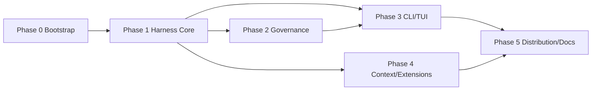

# KL Code Implementation Plan

> **For agentic workers:** REQUIRED SUB-SKILL: Use superpowers:subagent-driven-development (recommended) or superpowers:executing-plans to implement this plan task-by-task. Steps use checkbox (`- [ ]`) syntax for tracking.

**Goal:** Build the first version of KL Code, a local coding agent harness with a Python FastAPI server and a TypeScript React Ink CLI/TUI, where governance is the deep dimension and all core mechanisms are testable with a mock LLM.

**Architecture:** FastAPI server owns the agent loop, tool dispatch, guardrails, feedback, memory, context assembly, sessions, and audit logging. The React Ink TUI is a thin client using REST and WebSocket. The server supports multi-provider LLM configuration, MCP, skills, hooks, and user Python tool plugins.

**Tech Stack:** Python 3.11+, FastAPI, Pydantic, SQLite, pytest; TypeScript, React Ink, Vitest; GitHub Actions and GitLab CI.

---

## 1. Scope

This plan implements the first version defined in `SPEC.md`.

Explicitly deferred and tracked as future work:

- Subagent orchestration
- WebUI
- Remote deployment
- Docker sandbox/deployment
- Semantic search
- User-defined slash commands

## 2. Repository Layout

```text
SimpleCodingAgent/
  server/
    pyproject.toml
    kl_server/
      __init__.py
      main.py
      api/
        app.py
        routes.py
        ws.py
      config/
        config.py
        credentials.py
      core/
        agent_loop.py
        context.py
        event_logger.py
        feedback.py
        guardrail.py
        sandbox.py
        session_manager.py
        snapshot.py
        task_manager.py
        tool_executor.py
      hooks/
        manager.py
      memory/
        store.py
      mcp/
        adapter.py
      models/
        action.py
        feedback.py
        task.py
      plugins/
        loader.py
      providers/
        base.py
        mock.py
        registry.py
        openai_compatible.py
      skills/
        loader.py
      storage/
        database.py
      tools/
        base.py
        registry.py
        builtin/
          filesystem.py
          git.py
          patch.py
          search.py
          shell.py
          task.py
          validation.py
    tests/
      conftest.py
      test_agent_loop.py
      test_context.py
      test_credentials.py
      test_feedback.py
      test_guardrail.py
      test_hooks.py
      test_mcp_adapter.py
      test_memory.py
      test_models.py
      test_plugin_loader.py
      test_providers.py
      test_sandbox.py
      test_session.py
      test_skills.py
      test_snapshot.py
      test_storage.py
      test_tool_executor.py
      test_tool_registry.py
      test_tools.py
      test_task.py
      test_ws.py
      test_event_logger.py
      test_builtin_tools.py
  cli/
    package.json
    tsconfig.json
    src/
      main.ts
      api/
        client.ts
        events.ts
      commands/
        registry.ts
        config.ts
        session.ts
        task.ts
      tui/
        app.tsx
        screens/
          approval.tsx
          config.tsx
          session.tsx
          task.tsx
    test/
      client.test.ts
      commands.test.ts
      registry.test.ts
  docs/
    superpowers/
      plans/
        README.md
  examples/
    guardrail_demo.py
    feedback_demo.py
    context_demo.py
    tool_error_demo.py
  .github/
    workflows/
      ci.yml
  .gitlab-ci.yml
  Makefile
  README.md
  AGENT_LOG.md
  SPEC_PROCESS.md
  REFLECTION.md
  SPEC.md
  PLAN.md
```

## 3. Task Dependencies



Parallelization rule:

- After Phase 1 tasks 1.1-1.5 pass, governance tasks 2.1-2.5 and CLI tasks 3.1-3.3 can run in separate worktrees.
- After tasks 1.1 and 1.4 pass, memory/context tasks 4.1-4.3 can start.
- Skills, hooks, MCP, and plugins depend on the tool registry and can be parallel after task 1.5.

## 4. Task Tracking

| Task | Name | Status |
|---|---|---|
| 0.1 | Server package skeleton | Pending |
| 0.2 | CLI package skeleton | Pending |
| 0.3 | Makefile and test runner | Pending |
| 0.4 | CI configuration | Pending |
| 1.1 | Core models | Pending |
| 1.2 | Provider abstraction and mock | Pending |
| 1.3 | Tool interface and registry | Pending |
| 1.4 | Built-in file/search tools | Pending |
| 1.5 | ToolExecutor error isolation | Pending |
| 1.6 | Feedback sensors | Pending |
| 1.7 | SQLite storage and sessions/tasks | Pending |
| 1.8 | Config and credentials | Pending |
| 1.9 | Basic AgentLoop | Pending |
| 2.1 | ScopeFence | Pending |
| 2.2 | SandboxPolicy | Pending |
| 2.3 | DangerClassifier | Pending |
| 2.4 | HITL state machine | Pending |
| 2.5 | Guardrail pipeline | Pending |
| 2.6 | Non-Git snapshot/rollback | Pending |
| 2.7 | Audit logger | Pending |
| 3.1 | FastAPI routes and WebSocket | Pending |
| 3.2 | CLI API client | Pending |
| 3.3 | Slash command registry | Pending |
| 3.4 | TUI task/approval screens | Pending |
| 3.5 | TUI config wizard | Pending |
| 3.6 | TUI session commands | Pending |
| 4.1 | MemoryStore | Pending |
| 4.2 | ContextAssembler token budget | Pending |
| 4.3 | LLM summarizer | Pending |
| 4.4 | SkillLoader | Pending |
| 4.5 | HookManager | Pending |
| 4.6 | MCP adapter | Pending |
| 4.7 | User tool plugin loader | Pending |
| 5.1 | Mock-LLM demos | Pending |
| 5.2 | README and install docs | Pending |
| 5.3 | Distribution polish | Pending |
| 5.4 | Process docs and reflection | Pending |
| 5.5 | Final CI pass and deliverables | Pending |

Every completed task updates this table, `AGENT_LOG.md`, and the relevant `- [ ]` checkboxes in this file.

---

## 5. Phase 0: Bootstrap

### Task 0.1: Server package skeleton

**Files:**

- Create: `server/pyproject.toml`
- Create: `server/kl_server/__init__.py`
- Create: `server/tests/test_package.py`

- [ ] **Step 1: Write the failing test**

```python
from kl_server import __version__


def test_package_version():
    assert __version__ == "0.1.0"
```

- [ ] **Step 2: Run it to verify it fails**

Run: `python -m pytest server/tests/test_package.py -v`
Expected: FAIL with `ImportError` or missing `__version__`.

- [ ] **Step 3: Implement the minimal package**

```python
__version__ = "0.1.0"
```

Create `server/pyproject.toml` with `[project] name = "kl-server"`, `version = "0.1.0"`, dependencies `fastapi`, `uvicorn`, `pydantic`, `pydantic-settings`, `aiosqlite`, `keyring`, and dev dependencies `pytest`, `pytest-asyncio`, `httpx`.

- [ ] **Step 4: Run the test to verify it passes**

Run: `python -m pytest server/tests/test_package.py -v`
Expected: PASS.

- [ ] **Step 5: Commit**

```bash
git add server/pyproject.toml server/kl_server/__init__.py server/tests/test_package.py
git commit -m "feat: bootstrap kl-server package"
```

### Task 0.2: CLI package skeleton

**Files:**

- Create: `cli/package.json`
- Create: `cli/tsconfig.json`
- Create: `cli/src/main.ts`
- Create: `cli/test/main.test.ts`

- [ ] **Step 1: Write the failing test**

```ts
import { expect, test } from 'vitest';
import { cliName } from '../src/main';

test('cli exposes package name', () => {
  expect(cliName()).toBe('kl-code');
});
```

- [ ] **Step 2: Run it to verify it fails**

Run: `npm test`
Expected: FAIL with missing `cliName`.

- [ ] **Step 3: Implement the minimal module**

```ts
export function cliName(): string {
  return 'kl-code';
}
```

Create `cli/package.json` with name `@kl-code/cli`, `type: module`, dependencies `ink`, `react`, `commander`, dev dependencies `typescript`, `vitest`, `tsx`, `@types/react`.

- [ ] **Step 4: Run the test to verify it passes**

Run: `npm test`
Expected: PASS.

- [ ] **Step 5: Commit**

```bash
git add cli/package.json cli/tsconfig.json cli/src/main.ts cli/test/main.test.ts
git commit -m "feat: bootstrap kl-code cli"
```

### Task 0.3: Makefile and test runner

**Files:**

- Create: `Makefile`

- [ ] **Step 1: Write the Makefile**

```make
.PHONY: install test dev

install:
	python -m pip install -e "server[dev]"
	cd cli && npm install

test:
	python -m pytest server/tests -q
	cd cli && npm test

dev:
	cd server && uvicorn kl_server.main:app --reload --port 8700 &
	cd cli && npm run tui
```

- [ ] **Step 2: Verify `make test` runs both suites**

Run: `make test`
Expected: server tests and CLI tests both run and pass.

- [ ] **Step 3: Commit**

```bash
git add Makefile
git commit -m "chore: add make test and dev runner"
```

### Task 0.4: CI configuration

**Files:**

- Modify: `.github/workflows/ci.yml`
- Create: `.gitlab-ci.yml`

- [ ] **Step 1: Update GitHub Actions**

```yaml
name: CI

on:
  push:
  pull_request:

jobs:
  unit-test:
    runs-on: ubuntu-latest
    steps:
      - name: Checkout
        uses: actions/checkout@v4

      - name: Setup Python
        uses: actions/setup-python@v5
        with:
          python-version: '3.11'

      - name: Setup Node
        uses: actions/setup-node@v4
        with:
          node-version: '20'

      - name: Install dependencies
        run: make install

      - name: Run tests
        run: make test
```

- [ ] **Step 2: Create GitLab CI**

```yaml
image: python:3.11

unit-test:
  stage: test
  script:
    - apt-get update && apt-get install -y nodejs npm
    - make install
    - make test
```

- [ ] **Step 3: Verify CI files are valid YAML**

Run: `python -c "import yaml; yaml.safe_load(open('.github/workflows/ci.yml')); yaml.safe_load(open('.gitlab-ci.yml'))"`
Expected: no exception.

- [ ] **Step 4: Commit**

```bash
git add .github/workflows/ci.yml .gitlab-ci.yml
git commit -m "ci: add python and node unit-test pipeline"
```

---

## 6. Phase 1: Harness Core

### Task 1.1: Core models

**Files:**

- Create: `server/kl_server/models/__init__.py`
- Create: `server/kl_server/models/action.py`
- Create: `server/kl_server/models/feedback.py`
- Create: `server/kl_server/models/task.py`
- Test: `server/tests/test_models.py`

- [ ] **Step 1: Write the failing test**

```python
from kl_server.models.action import Action, ToolResult
from kl_server.models.feedback import Feedback, FeedbackCategory
from kl_server.models.task import Session, Task, TaskStatus


def test_action_and_result_roundtrip():
    action = Action(tool="read_file", args={"path": "a.py"}, task_id="t1")
    result = ToolResult(ok=True, output="content")
    assert action.tool == "read_file"
    assert result.ok is True


def test_feedback_category():
    feedback = Feedback(category=FeedbackCategory.TEST_FAILURE, summary="1 failed")
    assert feedback.category.value == "test_failure"


def test_session_and_task_relationships():
    session = Session(id="s1", workspace="E:/repo", name="main")
    task = Task(id="t1", session_id=session.id, description="fix tests", status=TaskStatus.PENDING)
    assert task.session_id == "s1"
```

- [ ] **Step 2: Run it to verify it fails**

Run: `python -m pytest server/tests/test_models.py -v`
Expected: FAIL with missing modules.

- [ ] **Step 3: Implement the models**

```python
# server/kl_server/models/action.py
from dataclasses import dataclass, field
from typing import Any


@dataclass(frozen=True)
class Action:
    tool: str
    args: dict[str, Any]
    task_id: str
    seq: int = 0
    workspace: str = ""
    raw_command: str | None = None


@dataclass
class ToolResult:
    ok: bool
    output: str
    error: str | None = None
```

```python
# server/kl_server/models/feedback.py
from dataclasses import dataclass
from enum import Enum


class FeedbackCategory(str, Enum):
    SUCCESS = "success"
    TEST_FAILURE = "test_failure"
    BUILD_FAILURE = "build_failure"
    LINT_ERROR = "lint_error"
    TYPE_ERROR = "type_error"
    TIMEOUT = "timeout"
    TOOL_ERROR = "tool_error"
    PROVIDER_ERROR = "provider_error"
    UNKNOWN = "unknown_error"


@dataclass(frozen=True)
class Feedback:
    category: FeedbackCategory
    summary: str
    raw_ref: str | None = None
```

```python
# server/kl_server/models/task.py
from dataclasses import dataclass, field
from enum import Enum
from datetime import datetime, timezone


class TaskStatus(str, Enum):
    PENDING = "pending"
    RUNNING = "running"
    AWAITING_APPROVAL = "awaiting_approval"
    PAUSED = "paused"
    SUCCEEDED = "succeeded"
    FAILED = "failed"
    CANCELED = "canceled"


@dataclass
class Session:
    id: str
    workspace: str
    name: str = "default"
    provider: str = "mock"
    model: str = "mock-model"
    status: str = "active"
    created_at: datetime = field(default_factory=lambda: datetime.now(timezone.utc))


@dataclass
class Task:
    id: str
    session_id: str
    description: str
    status: TaskStatus = TaskStatus.PENDING
    workspace_mode: str = "git"
    branch: str | None = None
    snapshot_path: str | None = None
    summary: str = ""
    created_at: datetime = field(default_factory=lambda: datetime.now(timezone.utc))
```

- [ ] **Step 4: Run the test to verify it passes**

Run: `python -m pytest server/tests/test_models.py -v`
Expected: PASS.

- [ ] **Step 5: Commit**

```bash
git add server/kl_server/models server/tests/test_models.py
git commit -m "feat: add harness core models"
```

### Task 1.2: Provider abstraction and mock

**Files:**

- Create: `server/kl_server/providers/__init__.py`
- Create: `server/kl_server/providers/base.py`
- Create: `server/kl_server/providers/mock.py`
- Create: `server/kl_server/providers/registry.py`
- Test: `server/tests/test_providers.py`

- [ ] **Step 1: Write the failing test**

```python
import pytest
from kl_server.providers.base import ProviderRequest
from kl_server.providers.mock import MockProvider
from kl_server.providers.registry import ProviderRegistry


@pytest.mark.asyncio
async def test_mock_provider_returns_sequence():
    provider = MockProvider(responses=["first", "second"])
    first = await provider.complete(ProviderRequest(messages=[], model="mock-model"))
    second = await provider.complete(ProviderRequest(messages=[], model="mock-model"))
    assert (first.text, second.text) == ("first", "second")


def test_registry_requires_known_provider():
    registry = ProviderRegistry()
    with pytest.raises(KeyError):
        registry.get("missing")
```

- [ ] **Step 2: Run it to verify it fails**

Run: `python -m pytest server/tests/test_providers.py -v`
Expected: FAIL.

- [ ] **Step 3: Implement provider layer**

```python
# server/kl_server/providers/base.py
from dataclasses import dataclass
from typing import Protocol


@dataclass(frozen=True)
class ProviderRequest:
    messages: list[dict[str, str]]
    model: str
    max_tokens: int = 2048


@dataclass(frozen=True)
class ProviderResponse:
    text: str
    raw: dict | None = None


class Provider(Protocol):
    async def complete(self, request: ProviderRequest) -> ProviderResponse:
        ...
```

```python
# server/kl_server/providers/mock.py
from kl_server.providers.base import ProviderRequest, ProviderResponse


class MockProvider:
    def __init__(self, responses: list[str] | None = None):
        self.responses = responses or []
        self.calls: list[ProviderRequest] = []

    async def complete(self, request: ProviderRequest) -> ProviderResponse:
        self.calls.append(request)
        if not self.responses:
            return ProviderResponse(text="final")
        return ProviderResponse(text=self.responses.pop(0))
```

```python
# server/kl_server/providers/registry.py
from kl_server.providers.mock import MockProvider


class ProviderRegistry:
    def __init__(self):
        self._providers = {"mock": MockProvider()}

    def register(self, name: str, provider) -> None:
        self._providers[name] = provider

    def get(self, name: str):
        return self._providers[name]
```

- [ ] **Step 4: Run the test to verify it passes**

Run: `python -m pytest server/tests/test_providers.py -v`
Expected: PASS.

- [ ] **Step 5: Commit**

```bash
git add server/kl_server/providers server/tests/test_providers.py
git commit -m "feat: add provider abstraction and mock provider"
```

### Task 1.3: Tool interface and registry

**Files:**

- Create: `server/kl_server/tools/__init__.py`
- Create: `server/kl_server/tools/base.py`
- Create: `server/kl_server/tools/registry.py`
- Test: `server/tests/test_tool_registry.py`

- [ ] **Step 1: Write the failing test**

```python
import pytest
from kl_server.models.action import ToolResult
from kl_server.tools.base import Tool, ToolContext
from kl_server.tools.registry import ToolRegistry


class EchoTool(Tool):
    name = "echo"
    description = "echo args"
    schema = {"type": "object", "properties": {"text": {"type": "string"}}}

    async def execute(self, args, ctx: ToolContext) -> ToolResult:
        return ToolResult(ok=True, output=args["text"])


@pytest.mark.asyncio
async def test_registry_executes_tool():
    registry = ToolRegistry()
    registry.register(EchoTool())
    result = await registry.execute("echo", {"text": "hi"}, ToolContext(workspace="."))
    assert result.output == "hi"


def test_registry_unknown_tool():
    registry = ToolRegistry()
    with pytest.raises(KeyError):
        registry.get("missing")
```

- [ ] **Step 2: Run it to verify it fails**

Run: `python -m pytest server/tests/test_tool_registry.py -v`
Expected: FAIL.

- [ ] **Step 3: Implement tool layer**

```python
# server/kl_server/tools/base.py
from dataclasses import dataclass
from typing import Any, Protocol

from kl_server.models.action import ToolResult


@dataclass
class ToolContext:
    workspace: str
    task_id: str = ""


class Tool(Protocol):
    name: str
    description: str
    schema: dict[str, Any]

    async def execute(self, args: dict[str, Any], ctx: ToolContext) -> ToolResult:
        ...
```

```python
# server/kl_server/tools/registry.py
from typing import Any

from kl_server.models.action import ToolResult
from kl_server.tools.base import Tool, ToolContext


class ToolRegistry:
    def __init__(self):
        self._tools: dict[str, Tool] = {}

    def register(self, tool: Tool) -> None:
        self._tools[tool.name] = tool

    def get(self, name: str) -> Tool:
        return self._tools[name]

    def catalog(self) -> list[dict[str, Any]]:
        return [
            {"name": tool.name, "description": tool.description, "schema": tool.schema}
            for tool in self._tools.values()
        ]

    async def execute(self, name: str, args: dict[str, Any], ctx: ToolContext) -> ToolResult:
        return await self.get(name).execute(args, ctx)
```

- [ ] **Step 4: Run the test to verify it passes**

Run: `python -m pytest server/tests/test_tool_registry.py -v`
Expected: PASS.

- [ ] **Step 5: Commit**

```bash
git add server/kl_server/tools server/tests/test_tool_registry.py
git commit -m "feat: add tool interface and registry"
```

### Task 1.4: Built-in file/search tools

**Files:**

- Create: `server/kl_server/tools/builtin/__init__.py`
- Create: `server/kl_server/tools/builtin/filesystem.py`
- Create: `server/kl_server/tools/builtin/search.py`
- Test: `server/tests/test_builtin_tools.py`

- [ ] **Step 1: Write the failing test**

```python
import pytest
from kl_server.tools.base import ToolContext
from kl_server.tools.builtin.filesystem import ListDirTool, ReadFileTool, WriteFileTool
from kl_server.tools.builtin.search import GlobTool, GrepTool


@pytest.mark.asyncio
async def test_write_read_list(tmp_path):
    ctx = ToolContext(workspace=str(tmp_path))
    write = await WriteFileTool().execute({"path": "a.txt", "content": "hello"}, ctx)
    read = await ReadFileTool().execute({"path": "a.txt"}, ctx)
    listed = await ListDirTool().execute({}, ctx)
    assert write.ok and read.output == "hello" and "a.txt" in listed.output


@pytest.mark.asyncio
async def test_grep_and_glob(tmp_path):
    ctx = ToolContext(workspace=str(tmp_path))
    (tmp_path / "a.py").write_text("def add(): pass", encoding="utf-8")
    grep = await GrepTool().execute({"pattern": "def add", "path": "."}, ctx)
    glob = await GlobTool().execute({"pattern": "*.py"}, ctx)
    assert "a.py" in grep.output and "a.py" in glob.output
```

- [ ] **Step 2: Run it to verify it fails**

Run: `python -m pytest server/tests/test_builtin_tools.py -v`
Expected: FAIL.

- [ ] **Step 3: Implement tools**

```python
# server/kl_server/tools/builtin/filesystem.py
from pathlib import Path

from kl_server.models.action import ToolResult
from kl_server.tools.base import Tool, ToolContext


class ListDirTool(Tool):
    name = "list_dir"
    description = "List files and directories in a workspace path"
    schema = {"type": "object", "properties": {"path": {"type": "string", "default": "."}}}

    async def execute(self, args, ctx: ToolContext) -> ToolResult:
        target = (Path(ctx.workspace) / args.get("path", ".")).resolve()
        if not str(target).startswith(str(Path(ctx.workspace).resolve())):
            return ToolResult(ok=False, output="", error="path outside workspace")
        lines = [p.name for p in target.iterdir()]
        return ToolResult(ok=True, output="\n".join(lines))


class ReadFileTool(Tool):
    name = "read_file"
    description = "Read a UTF-8 text file inside the workspace"
    schema = {"type": "object", "properties": {"path": {"type": "string"}}, "required": ["path"]}

    async def execute(self, args, ctx: ToolContext) -> ToolResult:
        target = (Path(ctx.workspace) / args["path"]).resolve()
        if not str(target).startswith(str(Path(ctx.workspace).resolve())):
            return ToolResult(ok=False, output="", error="path outside workspace")
        return ToolResult(ok=True, output=target.read_text(encoding="utf-8"))


class WriteFileTool(Tool):
    name = "write_file"
    description = "Write UTF-8 text into a file inside the workspace"
    schema = {
        "type": "object",
        "properties": {"path": {"type": "string"}, "content": {"type": "string"}},
        "required": ["path", "content"],
    }

    async def execute(self, args, ctx: ToolContext) -> ToolResult:
        target = (Path(ctx.workspace) / args["path"]).resolve()
        if not str(target).startswith(str(Path(ctx.workspace).resolve())):
            return ToolResult(ok=False, output="", error="path outside workspace")
        target.parent.mkdir(parents=True, exist_ok=True)
        target.write_text(args["content"], encoding="utf-8")
        return ToolResult(ok=True, output=str(target))
```

```python
# server/kl_server/tools/builtin/search.py
import re
from pathlib import Path

from kl_server.models.action import ToolResult
from kl_server.tools.base import Tool, ToolContext


class GrepTool(Tool):
    name = "grep"
    description = "Search file contents by regex inside the workspace"
    schema = {"type": "object", "properties": {"pattern": {"type": "string"}, "path": {"type": "string"}}, "required": ["pattern"]}

    async def execute(self, args, ctx: ToolContext) -> ToolResult:
        root = Path(ctx.workspace).resolve()
        pattern = re.compile(args["pattern"])
        matches = []
        for path in root.rglob("*"):
            if path.is_file():
                try:
                    text = path.read_text(encoding="utf-8", errors="ignore")
                except OSError:
                    continue
                if pattern.search(text):
                    matches.append(str(path.relative_to(root)))
        return ToolResult(ok=True, output="\n".join(matches))


class GlobTool(Tool):
    name = "glob"
    description = "Find files matching a glob pattern inside the workspace"
    schema = {"type": "object", "properties": {"pattern": {"type": "string"}}, "required": ["pattern"]}

    async def execute(self, args, ctx: ToolContext) -> ToolResult:
        root = Path(ctx.workspace).resolve()
        matches = [str(p.relative_to(root)) for p in root.glob(args["pattern"]) if p.is_file()]
        return ToolResult(ok=True, output="\n".join(matches))
```

- [ ] **Step 4: Run the test to verify it passes**

Run: `python -m pytest server/tests/test_builtin_tools.py -v`
Expected: PASS.

- [ ] **Step 5: Commit**

```bash
git add server/kl_server/tools/builtin server/tests/test_builtin_tools.py
git commit -m "feat: add built-in file and search tools"
```

### Task 1.5: ToolExecutor error isolation

**Files:**

- Create: `server/kl_server/core/__init__.py`
- Create: `server/kl_server/core/tool_executor.py`
- Test: `server/tests/test_tool_executor.py`

- [ ] **Step 1: Write the failing test**

```python
import pytest
from kl_server.models.action import ToolResult
from kl_server.tools.base import Tool, ToolContext
from kl_server.tools.registry import ToolRegistry
from kl_server.core.tool_executor import ToolExecutor


class CrashTool(Tool):
    name = "crash"
    description = "always crashes"
    schema = {"type": "object", "properties": {}}

    async def execute(self, args, ctx: ToolContext) -> ToolResult:
        raise RuntimeError("boom")


@pytest.mark.asyncio
async def test_crash_returns_tool_error():
    registry = ToolRegistry()
    registry.register(CrashTool())
    executor = ToolExecutor(registry)
    result = await executor.execute("crash", {}, ToolContext(workspace="."))
    assert result.ok is False
    assert result.error == "boom"
```

- [ ] **Step 2: Run it to verify it fails**

Run: `python -m pytest server/tests/test_tool_executor.py -v`
Expected: FAIL because exception propagates.

- [ ] **Step 3: Implement ToolExecutor**

```python
from kl_server.models.action import ToolResult
from kl_server.tools.base import ToolContext
from kl_server.tools.registry import ToolRegistry


class ToolExecutor:
    def __init__(self, registry: ToolRegistry):
        self.registry = registry

    async def execute(self, name: str, args: dict, ctx: ToolContext) -> ToolResult:
        try:
            return await self.registry.execute(name, args, ctx)
        except Exception as exc:
            return ToolResult(ok=False, output="", error=str(exc))
```

- [ ] **Step 4: Run the test to verify it passes**

Run: `python -m pytest server/tests/test_tool_executor.py -v`
Expected: PASS.

- [ ] **Step 5: Commit**

```bash
git add server/kl_server/core/tool_executor.py server/tests/test_tool_executor.py
git commit -m "feat: isolate tool crashes from agent loop"
```

### Task 1.6: Feedback sensors

**Files:**

- Create: `server/kl_server/core/feedback.py`
- Test: `server/tests/test_feedback.py`

- [ ] **Step 1: Write the failing test**

```python
from kl_server.core.feedback import classify_command_result
from kl_server.models.feedback import FeedbackCategory


def test_exit_zero_is_success():
    feedback = classify_command_result(exit_code=0, stdout="ok", stderr="")
    assert feedback.category == FeedbackCategory.SUCCESS


def test_pytest_failure_is_test_failure():
    feedback = classify_command_result(1, "1 failed", "assert 1 == 2")
    assert feedback.category == FeedbackCategory.TEST_FAILURE


def test_timeout_is_timeout():
    feedback = classify_command_result(None, "", "timeout")
    assert feedback.category == FeedbackCategory.TIMEOUT
```

- [ ] **Step 2: Run it to verify it fails**

Run: `python -m pytest server/tests/test_feedback.py -v`
Expected: FAIL.

- [ ] **Step 3: Implement feedback sensor**

```python
from kl_server.models.feedback import Feedback, FeedbackCategory


def classify_command_result(exit_code: int | None, stdout: str, stderr: str) -> Feedback:
    combined = f"{stdout}\n{stderr}".lower()
    if exit_code is None:
        return Feedback(category=FeedbackCategory.TIMEOUT, summary=stderr or stdout)
    if exit_code == 0:
        return Feedback(category=FeedbackCategory.SUCCESS, summary=stdout)
    if "failed" in combined or "assert" in combined:
        return Feedback(category=FeedbackCategory.TEST_FAILURE, summary=combined[-1000:])
    return Feedback(category=FeedbackCategory.UNKNOWN, summary=combined[-1000:])
```

- [ ] **Step 4: Run the test to verify it passes**

Run: `python -m pytest server/tests/test_feedback.py -v`
Expected: PASS.

- [ ] **Step 5: Commit**

```bash
git add server/kl_server/core/feedback.py server/tests/test_feedback.py
git commit -m "feat: add deterministic feedback classification"
```

### Task 1.7: SQLite storage and session/task management

**Files:**

- Create: `server/kl_server/storage/__init__.py`
- Create: `server/kl_server/storage/database.py`
- Create: `server/kl_server/core/session_manager.py`
- Create: `server/kl_server/core/task_manager.py`
- Test: `server/tests/test_storage.py`

- [ ] **Step 1: Write the failing test**

```python
import pytest
from kl_server.models.task import Session, Task, TaskStatus
from kl_server.storage.database import Database
from kl_server.core.session_manager import SessionManager
from kl_server.core.task_manager import TaskManager


@pytest.mark.asyncio
async def test_session_and_task_persist(tmp_path):
    db = Database(tmp_path / "kl.db")
    sessions = SessionManager(db)
    tasks = TaskManager(db)
    session = await sessions.create(Session(id="s1", workspace=str(tmp_path), name="main"))
    task = await tasks.create(Task(id="t1", session_id=session.id, description="fix"))
    loaded = await sessions.get("s1")
    task.status = TaskStatus.SUCCEEDED
    await tasks.update(task)
    assert loaded.id == "s1"
    assert (await tasks.get("t1")).status == TaskStatus.SUCCEEDED
```

- [ ] **Step 2: Run it to verify it fails**

Run: `python -m pytest server/tests/test_storage.py -v`
Expected: FAIL.

- [ ] **Step 3: Implement storage**

```python
import sqlite3
from pathlib import Path

from kl_server.models.task import Session, Task, TaskStatus


class Database:
    def __init__(self, path: Path):
        self.conn = sqlite3.connect(path)
        self.conn.execute("CREATE TABLE IF NOT EXISTS sessions (id TEXT PRIMARY KEY, workspace TEXT, name TEXT)")
        self.conn.execute(
            "CREATE TABLE IF NOT EXISTS tasks (id TEXT PRIMARY KEY, session_id TEXT, description TEXT, status TEXT)"
        )
        self.conn.commit()
```

```python
from kl_server.models.task import Session, Task, TaskStatus
from kl_server.storage.database import Database


class SessionManager:
    def __init__(self, db: Database):
        self.db = db

    async def create(self, session: Session) -> Session:
        self.db.conn.execute("INSERT INTO sessions VALUES (?, ?, ?)", (session.id, session.workspace, session.name))
        self.db.conn.commit()
        return session

    async def get(self, session_id: str) -> Session:
        row = self.db.conn.execute("SELECT id, workspace, name FROM sessions WHERE id = ?", (session_id,)).fetchone()
        if row is None:
            raise KeyError(session_id)
        return Session(id=row[0], workspace=row[1], name=row[2])


class TaskManager:
    def __init__(self, db: Database):
        self.db = db

    async def create(self, task: Task) -> Task:
        self.db.conn.execute(
            "INSERT INTO tasks VALUES (?, ?, ?, ?)",
            (task.id, task.session_id, task.description, task.status.value),
        )
        self.db.conn.commit()
        return task

    async def get(self, task_id: str) -> Task:
        row = self.db.conn.execute("SELECT id, session_id, description, status FROM tasks WHERE id = ?", (task_id,)).fetchone()
        if row is None:
            raise KeyError(task_id)
        return Task(id=row[0], session_id=row[1], description=row[2], status=TaskStatus(row[3]))

    async def update(self, task: Task) -> None:
        self.db.conn.execute("UPDATE tasks SET status = ? WHERE id = ?", (task.status.value, task.id))
        self.db.conn.commit()
```

- [ ] **Step 4: Run the test to verify it passes**

Run: `python -m pytest server/tests/test_storage.py -v`
Expected: PASS.

- [ ] **Step 5: Commit**

```bash
git add server/kl_server/storage server/kl_server/core/session_manager.py server/kl_server/core/task_manager.py server/tests/test_storage.py
git commit -m "feat: add sqlite session and task persistence"
```

### Task 1.8: Config and credentials

**Files:**

- Create: `server/kl_server/config/__init__.py`
- Create: `server/kl_server/config/config.py`
- Create: `server/kl_server/config/credentials.py`
- Test: `server/tests/test_credentials.py`

- [ ] **Step 1: Write the failing test**

```python
from kl_server.config.credentials import InMemoryCredentialStore


def test_credential_store_never_returns_plaintext_config():
    store = InMemoryCredentialStore()
    store.set("openai", "sk-test")
    assert store.has("openai") is True
    assert store.get("openai") == "sk-test"
    assert "sk-test" not in store.safe_snapshot()
```

- [ ] **Step 2: Run it to verify it fails**

Run: `python -m pytest server/tests/test_credentials.py -v`
Expected: FAIL.

- [ ] **Step 3: Implement credential store**

```python
from typing import Protocol


class CredentialStore(Protocol):
    def set(self, ref: str, secret: str) -> None: ...
    def get(self, ref: str) -> str | None: ...
    def has(self, ref: str) -> bool: ...
    def clear(self, ref: str) -> None: ...
    def safe_snapshot(self) -> dict[str, bool]: ...


class InMemoryCredentialStore:
    def __init__(self):
        self._secrets: dict[str, str] = {}

    def set(self, ref: str, secret: str) -> None:
        self._secrets[ref] = secret

    def get(self, ref: str) -> str | None:
        return self._secrets.get(ref)

    def has(self, ref: str) -> bool:
        return ref in self._secrets

    def clear(self, ref: str) -> None:
        self._secrets.pop(ref, None)

    def safe_snapshot(self) -> dict[str, bool]:
        return {ref: True for ref in self._secrets}
```

Create `server/kl_server/config/config.py` with Pydantic models `ProviderConfig` and `AppConfig`; provider config stores `name`, `type`, `base_url`, `default_model`, `credential_ref` and rejects secret fields.

- [ ] **Step 4: Run the test to verify it passes**

Run: `python -m pytest server/tests/test_credentials.py -v`
Expected: PASS.

- [ ] **Step 5: Commit**

```bash
git add server/kl_server/config server/tests/test_credentials.py
git commit -m "feat: add credential-safe config layer"
```

### Task 1.9: Basic AgentLoop

**Files:**

- Create: `server/kl_server/core/agent_loop.py`
- Test: `server/tests/test_agent_loop.py`

- [ ] **Step 1: Write the failing test**

```python
import pytest
from kl_server.core.agent_loop import AgentLoop, LoopSettings
from kl_server.models.action import Action, ToolResult
from kl_server.models.task import Session
from kl_server.providers.mock import MockProvider
from kl_server.tools.base import Tool, ToolContext
from kl_server.tools.registry import ToolRegistry


class FinalTool(Tool):
    name = "final"
    description = "returns final marker"
    schema = {"type": "object", "properties": {}}

    async def execute(self, args, ctx: ToolContext) -> ToolResult:
        return ToolResult(ok=True, output="done")


@pytest.mark.asyncio
async def test_loop_runs_tool_and_stops():
    registry = ToolRegistry()
    registry.register(FinalTool())
    provider = MockProvider(responses=['{"tool":"final","args":{}}', "DONE"])
    loop = AgentLoop(provider=provider, tools=registry, settings=LoopSettings(max_iterations=3))
    result = await loop.run(Session(id="s1", workspace="."), "finish task")
    assert result == "DONE"
    assert len(provider.calls) == 2
```

- [ ] **Step 2: Run it to verify it fails**

Run: `python -m pytest server/tests/test_agent_loop.py -v`
Expected: FAIL.

- [ ] **Step 3: Implement basic loop**

```python
import json
from dataclasses import dataclass

from kl_server.models.action import Action
from kl_server.models.task import Session
from kl_server.providers.base import ProviderRequest
from kl_server.tools.base import ToolContext
from kl_server.tools.registry import ToolRegistry


@dataclass
class LoopSettings:
    max_iterations: int = 10


class AgentLoop:
    def __init__(self, provider, tools: ToolRegistry, settings: LoopSettings):
        self.provider = provider
        self.tools = tools
        self.settings = settings

    async def run(self, session: Session, task: str) -> str:
        history = [{"role": "user", "content": task}]
        for _ in range(self.settings.max_iterations):
            response = await self.provider.complete(ProviderRequest(messages=history, model=session.model))
            text = response.text.strip()
            if text == "DONE":
                return text
            try:
                payload = json.loads(text)
            except json.JSONDecodeError:
                history.append({"role": "assistant", "content": text})
                continue
            result = await self.tools.execute(
                payload["tool"],
                payload.get("args", {}),
                ToolContext(workspace=session.workspace),
            )
            history.append({"role": "assistant", "content": text})
            history.append({"role": "tool", "content": result.output})
        return "MAX_ITERATIONS"
```

- [ ] **Step 4: Run the test to verify it passes**

Run: `python -m pytest server/tests/test_agent_loop.py -v`
Expected: PASS.

- [ ] **Step 5: Commit**

```bash
git add server/kl_server/core/agent_loop.py server/tests/test_agent_loop.py
git commit -m "feat: add basic agent main loop"
```

---

## 7. Phase 2: Governance Deep Dive

### Task 2.1: ScopeFence

**Files:**

- Create: `server/kl_server/core/guardrail.py`
- Test: `server/tests/test_guardrail.py`

- [ ] **Step 1: Write the failing test**

```python
from pathlib import Path
from kl_server.core.guardrail import ScopeFence


def test_scope_fence_allows_inside_and_blocks_outside(tmp_path):
    fence = ScopeFence(str(tmp_path))
    inside = tmp_path / "a.py"
    outside = tmp_path.parent / "outside.py"
    assert fence.allow(inside) is True
    assert fence.allow(outside) is False
```

- [ ] **Step 2: Run it to verify it fails**

Run: `python -m pytest server/tests/test_guardrail.py -v`
Expected: FAIL.

- [ ] **Step 3: Implement ScopeFence**

```python
from pathlib import Path


class ScopeFence:
    def __init__(self, workspace: str):
        self.root = Path(workspace).resolve()

    def allow(self, path: Path | str) -> bool:
        candidate = Path(path).resolve()
        return candidate == self.root or self.root in candidate.parents
```

- [ ] **Step 4: Run the test to verify it passes**

Run: `python -m pytest server/tests/test_guardrail.py -v`
Expected: PASS.

- [ ] **Step 5: Commit**

```bash
git add server/kl_server/core/guardrail.py server/tests/test_guardrail.py
git commit -m "feat: add workspace scope fence"
```

### Task 2.2: SandboxPolicy

**Files:**

- Modify: `server/kl_server/core/guardrail.py`
- Create: `server/kl_server/core/sandbox.py`
- Test: `server/tests/test_sandbox.py`

- [ ] **Step 1: Write the failing test**

```python
from kl_server.core.sandbox import SandboxPolicy


def test_sandbox_denies_blacklisted_command():
    policy = SandboxPolicy(allow=["pytest"], deny=["rm"])
    assert policy.allow_command("pytest tests") is True
    assert policy.allow_command("rm -rf .") is False
```

- [ ] **Step 2: Run it to verify it fails**

Run: `python -m pytest server/tests/test_sandbox.py -v`
Expected: FAIL.

- [ ] **Step 3: Implement SandboxPolicy**

```python
class SandboxPolicy:
    def __init__(self, allow: list[str], deny: list[str]):
        self.allow = allow
        self.deny = deny

    def allow_command(self, command: str) -> bool:
        binary = command.split()[0]
        if binary in self.deny:
            return False
        return not self.allow or binary in self.allow
```

- [ ] **Step 4: Run the test to verify it passes**

Run: `python -m pytest server/tests/test_sandbox.py -v`
Expected: PASS.

- [ ] **Step 5: Commit**

```bash
git add server/kl_server/core/sandbox.py server/tests/test_sandbox.py
git commit -m "feat: add sandbox command policy"
```

### Task 2.3: DangerClassifier

**Files:**

- Modify: `server/kl_server/core/guardrail.py`
- Test: update `server/tests/test_guardrail.py`

- [ ] **Step 1: Write the failing test**

```python
from kl_server.core.guardrail import DangerClassifier
from kl_server.models.action import Action


def test_dangerous_rm_is_critical():
    classifier = DangerClassifier()
    action = Action(tool="run_command", args={"command": "rm -rf /"}, task_id="t1")
    assert classifier.classify(action) == "critical"


def test_safe_command_is_normal():
    classifier = DangerClassifier()
    action = Action(tool="run_command", args={"command": "pytest"}, task_id="t1")
    assert classifier.classify(action) == "normal"
```

- [ ] **Step 2: Run it to verify it fails**

Run: `python -m pytest server/tests/test_guardrail.py -v`
Expected: FAIL.

- [ ] **Step 3: Implement classifier**

```python
from kl_server.models.action import Action


class DangerClassifier:
    CRITICAL_PATTERNS = ["rm -rf /", "format c:", "drop database", "git push --force"]

    def classify(self, action: Action) -> str:
        command = " ".join(str(v) for v in action.args.values()).lower()
        if any(pattern in command for pattern in self.CRITICAL_PATTERNS):
            return "critical"
        if action.tool == "delete_file":
            return "dangerous"
        return "normal"
```

- [ ] **Step 4: Run the test to verify it passes**

Run: `python -m pytest server/tests/test_guardrail.py -v`
Expected: PASS.

- [ ] **Step 5: Commit**

```bash
git add server/kl_server/core/guardrail.py server/tests/test_guardrail.py
git commit -m "feat: add danger classifier"
```

### Task 2.4: HITL state machine

**Files:**

- Modify: `server/kl_server/core/guardrail.py`
- Test: update `server/tests/test_guardrail.py`

- [ ] **Step 1: Write the failing test**

```python
from kl_server.core.guardrail import ApprovalRequest, HITLManager


def test_hitl_approve_and_reject():
    manager = HITLManager()
    req = manager.request("a1", "run_command", "rm -rf /")
    assert req.state == "pending"
    assert manager.approve("a1") == "approved"
    assert manager.reject("a2") == "rejected"
```

- [ ] **Step 2: Run it to verify it fails**

Run: `python -m pytest server/tests/test_guardrail.py -v`
Expected: FAIL.

- [ ] **Step 3: Implement HITL state machine**

```python
from dataclasses import dataclass, field


@dataclass
class ApprovalRequest:
    action_id: str
    tool: str
    command: str
    state: str = "pending"


class HITLManager:
    def __init__(self):
        self.requests: dict[str, ApprovalRequest] = {}

    def request(self, action_id: str, tool: str, command: str) -> ApprovalRequest:
        req = ApprovalRequest(action_id=action_id, tool=tool, command=command)
        self.requests[action_id] = req
        return req

    def approve(self, action_id: str) -> str:
        self.requests[action_id].state = "approved"
        return self.requests[action_id].state

    def reject(self, action_id: str) -> str:
        if action_id not in self.requests:
            self.requests[action_id] = ApprovalRequest(action_id=action_id, tool="", command="")
        self.requests[action_id].state = "rejected"
        return self.requests[action_id].state
```

- [ ] **Step 4: Run the test to verify it passes**

Run: `python -m pytest server/tests/test_guardrail.py -v`
Expected: PASS.

- [ ] **Step 5: Commit**

```bash
git add server/kl_server/core/guardrail.py server/tests/test_guardrail.py
git commit -m "feat: add hitl approval state machine"
```

### Task 2.5: Guardrail pipeline

**Files:**

- Modify: `server/kl_server/core/guardrail.py`
- Test: update `server/tests/test_guardrail.py`

- [ ] **Step 1: Write the failing test**

```python
from kl_server.core.guardrail import DangerClassifier, Guardrail, HITLManager, ScopeFence
from kl_server.core.sandbox import SandboxPolicy
from kl_server.models.action import Action


def test_guardrail_blocks_outside_scope(tmp_path):
    guardrail = Guardrail(
        scope=ScopeFence(str(tmp_path)),
        sandbox=SandboxPolicy(allow=["pytest"], deny=["rm"]),
        danger=DangerClassifier(),
        hitl=HITLManager(),
    )
    action = Action(tool="read_file", args={"path": "../outside.py"}, task_id="t1")
    decision = guardrail.check(action)
    assert decision == "rejected"
```

- [ ] **Step 2: Run it to verify it fails**

Run: `python -m pytest server/tests/test_guardrail.py -v`
Expected: FAIL.

- [ ] **Step 3: Implement pipeline**

```python
from kl_server.models.action import Action


class Guardrail:
    def __init__(self, scope, sandbox, danger, hitl):
        self.scope = scope
        self.sandbox = sandbox
        self.danger = danger
        self.hitl = hitl

    def check(self, action: Action) -> str:
        path = action.args.get("path")
        if path and not self.scope.allow(path):
            return "rejected"
        command = action.args.get("command", "")
        if command and not self.sandbox.allow_command(command):
            return "rejected"
        level = self.danger.classify(action)
        if level == "critical":
            self.hitl.request(action.task_id, action.tool, command)
            return "requires_approval"
        return "allowed"
```

- [ ] **Step 4: Run the test to verify it passes**

Run: `python -m pytest server/tests/test_guardrail.py -v`
Expected: PASS.

- [ ] **Step 5: Commit**

```bash
git add server/kl_server/core/guardrail.py server/tests/test_guardrail.py
git commit -m "feat: add guardrail pipeline"
```

### Task 2.6: Non-Git snapshot/rollback

**Files:**

- Create: `server/kl_server/core/snapshot.py`
- Test: `server/tests/test_snapshot.py`

- [ ] **Step 1: Write the failing test**

```python
from pathlib import Path
from kl_server.core.snapshot import SnapshotManager


def test_snapshot_and_rollback(tmp_path):
    target = tmp_path / "work"
    target.mkdir()
    (target / "a.txt").write_text("before", encoding="utf-8")
    manager = SnapshotManager(str(target))
    snapshot = manager.create()
    (target / "a.txt").write_text("after", encoding="utf-8")
    manager.restore(snapshot)
    assert (target / "a.txt").read_text(encoding="utf-8") == "before"
```

- [ ] **Step 2: Run it to verify it fails**

Run: `python -m pytest server/tests/test_snapshot.py -v`
Expected: FAIL.

- [ ] **Step 3: Implement snapshot manager**

```python
import shutil
from pathlib import Path


class SnapshotManager:
    def __init__(self, workspace: str):
        self.workspace = Path(workspace)

    def create(self) -> Path:
        snapshot = Path(self.workspace.parent) / f"{self.workspace.name}.snapshot"
        if snapshot.exists():
            shutil.rmtree(snapshot)
        shutil.copytree(self.workspace, snapshot)
        return snapshot

    def restore(self, snapshot: Path) -> None:
        for child in self.workspace.iterdir():
            if child.is_dir():
                shutil.rmtree(child)
            else:
                child.unlink()
        for child in snapshot.iterdir():
            shutil.move(str(child), self.workspace / child.name)
```

- [ ] **Step 4: Run the test to verify it passes**

Run: `python -m pytest server/tests/test_snapshot.py -v`
Expected: PASS.

- [ ] **Step 5: Commit**

```bash
git add server/kl_server/core/snapshot.py server/tests/test_snapshot.py
git commit -m "feat: add non-git snapshot and rollback"
```

### Task 2.7: Audit logger

**Files:**

- Create: `server/kl_server/core/event_logger.py`
- Test: `server/tests/test_event_logger.py`

- [ ] **Step 1: Write the failing test**

```python
import json
from kl_server.core.event_logger import EventLogger


def test_event_logger_appends_and_redacts(tmp_path):
    logger = EventLogger(tmp_path / "audit.jsonl")
    logger.write("action", {"key": "sk-secret", "command": "pytest"})
    lines = (tmp_path / "audit.jsonl").read_text(encoding="utf-8").strip().splitlines()
    payload = json.loads(lines[0])["payload"]
    assert payload["key"] == "[REDACTED]"
```

- [ ] **Step 2: Run it to verify it fails**

Run: `python -m pytest server/tests/test_event_logger.py -v`
Expected: FAIL.

- [ ] **Step 3: Implement audit logger**

```python
import json
import re
from pathlib import Path


class EventLogger:
    def __init__(self, path: Path):
        self.path = path
        self.path.parent.mkdir(parents=True, exist_ok=True)

    def write(self, event: str, payload: dict) -> None:
        redacted = self._redact(payload)
        with self.path.open("a", encoding="utf-8") as f:
            f.write(json.dumps({"event": event, "payload": redacted}, ensure_ascii=False) + "\n")

    def _redact(self, payload: dict) -> dict:
        return {key: ("[REDACTED]" if re.search(r"key|secret|token", key, re.I) else value) for key, value in payload.items()}
```

- [ ] **Step 4: Run the test to verify it passes**

Run: `python -m pytest server/tests/test_event_logger.py -v`
Expected: PASS.

- [ ] **Step 5: Commit**

```bash
git add server/kl_server/core/event_logger.py server/tests/test_event_logger.py
git commit -m "feat: add redacting audit logger"
```

---

## 8. Phase 3: API and CLI/TUI

### Task 3.1: FastAPI routes and WebSocket

**Files:**

- Create: `server/kl_server/main.py`
- Create: `server/kl_server/api/__init__.py`
- Create: `server/kl_server/api/app.py`
- Create: `server/kl_server/api/routes.py`
- Create: `server/kl_server/api/ws.py`
- Test: `server/tests/test_ws.py`

- [ ] **Step 1: Write the failing test**

```python
from fastapi.testclient import TestClient
from kl_server.api.app import create_app


def test_health_route():
    client = TestClient(create_app())
    response = client.get("/health")
    assert response.status_code == 200
    assert response.json() == {"status": "ok"}
```

- [ ] **Step 2: Run it to verify it fails**

Run: `python -m pytest server/tests/test_ws.py -v`
Expected: FAIL.

- [ ] **Step 3: Implement API app**

```python
from fastapi import FastAPI


def create_app() -> FastAPI:
    app = FastAPI()

    @app.get("/health")
    def health():
        return {"status": "ok"}

    return app
```

Add `server/kl_server/main.py` that calls `create_app()` and exposes `app`.
Add WebSocket route `/ws/tasks/{task_id}` that broadcasts task events; the WebSocket handler only sends events, it does not run the loop.

- [ ] **Step 4: Run the test to verify it passes**

Run: `python -m pytest server/tests/test_ws.py -v`
Expected: PASS.

- [ ] **Step 5: Commit**

```bash
git add server/kl_server/main.py server/kl_server/api server/tests/test_ws.py
git commit -m "feat: add fastapi health and task websocket"
```

### Task 3.2: CLI API client

**Files:**

- Create: `cli/src/api/client.ts`
- Create: `cli/src/api/events.ts`
- Test: `cli/test/client.test.ts`

- [ ] **Step 1: Write the failing test**

```ts
import { expect, test } from 'vitest';
import { ApiClient } from '../src/api/client';

test('client builds task URL', () => {
  const client = new ApiClient({ baseUrl: 'http://127.0.0.1:8700' });
  expect(client.taskUrl('t1')).toBe('http://127.0.0.1:8700/api/v1/tasks/t1');
});
```

- [ ] **Step 2: Run it to verify it fails**

Run: `npm test`
Expected: FAIL.

- [ ] **Step 3: Implement client**

```ts
export interface ApiClientOptions {
  baseUrl: string;
}

export class ApiClient {
  constructor(private readonly options: ApiClientOptions) {}

  taskUrl(taskId: string): string {
    return `${this.options.baseUrl}/api/v1/tasks/${taskId}`;
  }
}
```

Create `cli/src/api/events.ts` with a `TaskEvent` type and a `connectTaskEvents(taskId, onEvent)` WebSocket helper.

- [ ] **Step 4: Run the test to verify it passes**

Run: `npm test`
Expected: PASS.

- [ ] **Step 5: Commit**

```bash
git add cli/src/api cli/test/client.test.ts
git commit -m "feat: add cli api client"
```

### Task 3.3: Slash command registry

**Files:**

- Create: `cli/src/commands/registry.ts`
- Test: `cli/test/registry.test.ts`

- [ ] **Step 1: Write the failing test**

```ts
import { expect, test } from 'vitest';
import { CommandRegistry } from '../src/commands/registry';

test('registry resolves command and help', () => {
  const registry = new CommandRegistry();
  registry.register({ name: 'help', aliases: ['/h'], run: () => 'help text' });
  expect(registry.resolve('/h').name).toBe('help');
  expect(registry.help().includes('/help')).toBe(true);
});
```

- [ ] **Step 2: Run it to verify it fails**

Run: `npm test`
Expected: FAIL.

- [ ] **Step 3: Implement registry**

```ts
export interface Command {
  name: string;
  aliases: string[];
  run: (args: string[]) => string | Promise<string>;
}

export class CommandRegistry {
  private commands: Command[] = [];

  register(command: Command): void {
    this.commands.push(command);
  }

  resolve(input: string): Command {
    const name = input.toLowerCase();
    const found = this.commands.find((c) => c.name === name || c.aliases.includes(name));
    if (!found) throw new Error(`unknown command: ${input}`);
    return found;
  }

  help(): string {
    return this.commands.map((c) => `/${c.name}`).join('\n');
  }
}
```

- [ ] **Step 4: Run the test to verify it passes**

Run: `npm test`
Expected: PASS.

- [ ] **Step 5: Commit**

```bash
git add cli/src/commands/registry.ts cli/test/registry.test.ts
git commit -m "feat: add extensible slash command registry"
```

### Task 3.4: TUI task/approval screens

**Files:**

- Create: `cli/src/tui/app.tsx`
- Create: `cli/src/tui/screens/task.tsx`
- Create: `cli/src/tui/screens/approval.tsx`
- Test: `cli/test/tui.test.tsx`

- [ ] **Step 1: Write the failing test**

```tsx
import { expect, test } from 'vitest';
import { render } from 'ink-testing-library';
import React from 'react';
import { TaskInput } from '../src/tui/screens/task';

test('task input renders prompt', () => {
  const { lastFrame } = render(<TaskInput onSubmit={() => {}} />);
  expect(lastFrame()).toContain('task>');
});
```

- [ ] **Step 2: Run it to verify it fails**

Run: `npm test`
Expected: FAIL.

- [ ] **Step 3: Implement task input screen**

```tsx
import React, { useState } from 'react';
import { Text, TextInput } from 'ink';

export function TaskInput({ onSubmit }: { onSubmit: (value: string) => void }) {
  const [value, setValue] = useState('');
  return (
    <>
      <Text>task&gt;</Text>
      <TextInput value={value} onChange={setValue} onSubmit={onSubmit} />
    </>
  );
}
```

Add `cli/src/tui/app.tsx` rendering task input, event log, and approval panel.
Add `cli/src/tui/screens/approval.tsx` rendering approve/reject/modify actions.
Add `ink-testing-library` to dev dependencies.

- [ ] **Step 4: Run the test to verify it passes**

Run: `npm test`
Expected: PASS.

- [ ] **Step 5: Commit**

```bash
git add cli/src/tui cli/test/tui.test.tsx
git commit -m "feat: add tui task and approval screens"
```

### Task 3.5: TUI config wizard

**Files:**

- Create: `cli/src/commands/config.ts`
- Create: `cli/src/tui/screens/config.tsx`
- Test: `cli/test/commands.test.ts`

- [ ] **Step 1: Write the failing test**

```ts
import { expect, test } from 'vitest';
import { ConfigCommand } from '../src/commands/config';

test('config command exposes wizard name', () => {
  expect(ConfigCommand.name).toBe('config');
});
```

- [ ] **Step 2: Run it to verify it fails**

Run: `npm test`
Expected: FAIL.

- [ ] **Step 3: Implement command**

```ts
export const ConfigCommand = {
  name: 'config',
  aliases: ['/cfg'],
  run: () => 'opening config wizard',
};
```

Add `cli/src/tui/screens/config.tsx` with provider name, type, base URL, model, and hidden API key inputs.

- [ ] **Step 4: Run the test to verify it passes**

Run: `npm test`
Expected: PASS.

- [ ] **Step 5: Commit**

```bash
git add cli/src/commands/config.ts cli/src/tui/screens/config.tsx cli/test/commands.test.ts
git commit -m "feat: add tui config wizard"
```

### Task 3.6: TUI session commands

**Files:**

- Create: `cli/src/commands/session.ts`
- Test: update `cli/test/commands.test.ts`

- [ ] **Step 1: Write the failing test**

```ts
import { expect, test } from 'vitest';
import { SessionCommand } from '../src/commands/session';

test('session command exposes subcommands', () => {
  expect(SessionCommand.aliases).toContain('/sessions');
});
```

- [ ] **Step 2: Run it to verify it fails**

Run: `npm test`
Expected: FAIL.

- [ ] **Step 3: Implement command**

```ts
export const SessionCommand = {
  name: 'session',
  aliases: ['/sessions'],
  run: (args: string[]) => `session command: ${args.join(' ') || 'list'}`,
};
```

Wire `/sessions`, `/session new`, `/session open <id>`, `/session rename <id>`, `/session close`, `/session delete <id>` into the command registry.

- [ ] **Step 4: Run the test to verify it passes**

Run: `npm test`
Expected: PASS.

- [ ] **Step 5: Commit**

```bash
git add cli/src/commands/session.ts cli/test/commands.test.ts
git commit -m "feat: add tui session commands"
```

---

## 9. Phase 4: Memory, Context, and Extensions

### Task 4.1: MemoryStore

**Files:**

- Create: `server/kl_server/memory/__init__.py`
- Create: `server/kl_server/memory/store.py`
- Test: `server/tests/test_memory.py`

- [ ] **Step 1: Write the failing test**

```python
from kl_server.memory.store import MemoryStore


def test_memory_stores_and_finds_by_tag(tmp_path):
    store = MemoryStore(tmp_path / "memory.db")
    store.add("project", "decision", ["auth"], "use tokens")
    result = store.find(["auth"])
    assert result == ["use tokens"]
```

- [ ] **Step 2: Run it to verify it fails**

Run: `python -m pytest server/tests/test_memory.py -v`
Expected: FAIL.

- [ ] **Step 3: Implement MemoryStore**

```python
import sqlite3
from pathlib import Path


class MemoryStore:
    def __init__(self, path: Path):
        self.conn = sqlite3.connect(path)
        self.conn.execute("CREATE TABLE IF NOT EXISTS memory (id INTEGER PRIMARY KEY, scope TEXT, kind TEXT, tags TEXT, content TEXT)")
        self.conn.commit()

    def add(self, scope: str, kind: str, tags: list[str], content: str) -> None:
        self.conn.execute("INSERT INTO memory (scope, kind, tags, content) VALUES (?, ?, ?, ?)", (scope, kind, ",".join(tags), content))
        self.conn.commit()

    def find(self, tags: list[str]) -> list[str]:
        rows = self.conn.execute("SELECT content, tags FROM memory").fetchall()
        return [content for content, stored_tags in rows if any(tag in stored_tags.split(",") for tag in tags)]
```

- [ ] **Step 4: Run the test to verify it passes**

Run: `python -m pytest server/tests/test_memory.py -v`
Expected: PASS.

- [ ] **Step 5: Commit**

```bash
git add server/kl_server/memory server/tests/test_memory.py
git commit -m "feat: add tagged project and session memory"
```

### Task 4.2: ContextAssembler token budget

**Files:**

- Create: `server/kl_server/core/context.py`
- Test: `server/tests/test_context.py`

- [ ] **Step 1: Write the failing test**

```python
import pytest
from kl_server.core.context import ContextAssembler


@pytest.mark.asyncio
async def test_context_keeps_priority_sections():
    assembler = ContextAssembler(max_tokens=100)
    result = await assembler.build(tool_catalog=[], rules="rules", memory=["m1", "m2"], history=["h1", "h2", "h3"])
    assert result.contains_priority("rules")
    assert result.used_tokens <= 100
```

- [ ] **Step 2: Run it to verify it fails**

Run: `python -m pytest server/tests/test_context.py -v`
Expected: FAIL.

- [ ] **Step 3: Implement context assembler**

```python
from dataclasses import dataclass


@dataclass
class AssembledContext:
    text: str
    used_tokens: int

    def contains_priority(self, text: str) -> bool:
        return text in self.text


class ContextAssembler:
    def __init__(self, max_tokens: int):
        self.max_tokens = max_tokens
        self.summarizer = None

    async def build(
        self,
        tool_catalog: list[dict],
        rules: str,
        memory: list[str],
        history: list[str],
        task_id: str = "t1",
    ) -> AssembledContext:
        summary = ""
        if self.summarizer and len(history) > 2:
            try:
                summary = await self.summarizer.summarize(history[:-1], task_id)
            except Exception:
                summary = history[-1]
        sections = [rules] + memory[-1:] + ([summary] if summary else []) + history[-1:]
        text = "\n\n".join(sections)
        return AssembledContext(text=text, used_tokens=max(1, len(text) // 4))
```

- [ ] **Step 4: Run the test to verify it passes**

Run: `python -m pytest server/tests/test_context.py -v`
Expected: PASS.

- [ ] **Step 5: Commit**

```bash
git add server/kl_server/core/context.py server/tests/test_context.py
git commit -m "feat: add token-budgeted context assembler"
```

### Task 4.3: LLM summarizer

**Files:**

- Modify: `server/kl_server/core/context.py`
- Test: update `server/tests/test_context.py`

- [ ] **Step 1: Write the failing test**

```python
import pytest
from kl_server.core.context import LLMSummarizer
from kl_server.providers.mock import MockProvider


@pytest.mark.asyncio
async def test_summarizer_uses_provider_and_keeps_raw():
    provider = MockProvider(responses=["summary"])
    summarizer = LLMSummarizer(provider)
    result = await summarizer.summarize(["old action", "old result"], "t1")
    assert result == "summary"
```

- [ ] **Step 2: Run it to verify it fails**

Run: `python -m pytest server/tests/test_context.py -v`
Expected: FAIL.

- [ ] **Step 3: Implement summarizer**

```python
from kl_server.providers.base import ProviderRequest


class LLMSummarizer:
    def __init__(self, provider):
        self.provider = provider

    async def summarize(self, segments: list[str], task_id: str) -> str:
        prompt = "Summarize these segments with goals, results, failures, and open items:\n" + "\n".join(segments)
        response = await self.provider.complete(ProviderRequest(messages=[{"role": "user", "content": prompt}], model="mock-model"))
        return response.text
```

Then assign `assembler.summarizer = LLMSummarizer(provider)`. `ContextAssembler.build` already catches summarizer failures and falls back to `history[-1]`.

- [ ] **Step 4: Run the test to verify it passes**

Run: `python -m pytest server/tests/test_context.py -v`
Expected: PASS.

- [ ] **Step 5: Commit**

```bash
git add server/kl_server/core/context.py server/tests/test_context.py
git commit -m "feat: add provider-backed context summarizer"
```

### Task 4.4: SkillLoader

**Files:**

- Create: `server/kl_server/skills/__init__.py`
- Create: `server/kl_server/skills/loader.py`
- Test: `server/tests/test_skills.py`

- [ ] **Step 1: Write the failing test**

```python
from kl_server.skills.loader import SkillLoader


def test_skill_loader_finds_by_keyword(tmp_path):
    skill_dir = tmp_path / "skills"
    (skill_dir / "python").mkdir(parents=True)
    (skill_dir / "python" / "SKILL.md").write_text("# Python\nUse pytest", encoding="utf-8")
    loader = SkillLoader(str(skill_dir))
    assert "pytest" in loader.load(["python"])
```

- [ ] **Step 2: Run it to verify it fails**

Run: `python -m pytest server/tests/test_skills.py -v`
Expected: FAIL.

- [ ] **Step 3: Implement SkillLoader**

```python
from pathlib import Path


class SkillLoader:
    def __init__(self, root: str):
        self.root = Path(root)

    def load(self, keywords: list[str]) -> str:
        docs = []
        for skill_dir in self.root.iterdir():
            markdown = skill_dir / "SKILL.md"
            if markdown.exists() and any(keyword in skill_dir.name for keyword in keywords):
                docs.append(markdown.read_text(encoding="utf-8"))
        return "\n\n".join(docs)
```

- [ ] **Step 4: Run the test to verify it passes**

Run: `python -m pytest server/tests/test_skills.py -v`
Expected: PASS.

- [ ] **Step 5: Commit**

```bash
git add server/kl_server/skills server/tests/test_skills.py
git commit -m "feat: add skill loader"
```

### Task 4.5: HookManager

**Files:**

- Create: `server/kl_server/hooks/__init__.py`
- Create: `server/kl_server/hooks/manager.py`
- Test: `server/tests/test_hooks.py`

- [ ] **Step 1: Write the failing test**

```python
from kl_server.hooks.manager import HookManager


def test_command_hook_receives_event(tmp_path):
    script = tmp_path / "hook.py"
    script.write_text("import sys, json; print(json.load(sys.stdin)['event'])", encoding="utf-8")
    manager = HookManager({"task_start": [{"type": "command", "command": f"python {script}"}]})
    output = manager.run("task_start", {"task_id": "t1"})
    assert output[0] == "task_start"
```

- [ ] **Step 2: Run it to verify it fails**

Run: `python -m pytest server/tests/test_hooks.py -v`
Expected: FAIL.

- [ ] **Step 3: Implement HookManager**

```python
import json
import subprocess


class HookManager:
    def __init__(self, hooks: dict[str, list[dict]]):
        self.hooks = hooks

    def run(self, event: str, payload: dict) -> list[str]:
        outputs = []
        for hook in self.hooks.get(event, []):
            if hook["type"] == "command":
                proc = subprocess.run(hook["command"], input=json.dumps(payload), text=True, capture_output=True)
                outputs.append(proc.stdout.strip())
        return outputs
```

- [ ] **Step 4: Run the test to verify it passes**

Run: `python -m pytest server/tests/test_hooks.py -v`
Expected: PASS.

- [ ] **Step 5: Commit**

```bash
git add server/kl_server/hooks server/tests/test_hooks.py
git commit -m "feat: add command hook manager"
```

### Task 4.6: MCP adapter

**Files:**

- Create: `server/kl_server/mcp/__init__.py`
- Create: `server/kl_server/mcp/adapter.py`
- Test: `server/tests/test_mcp_adapter.py`

- [ ] **Step 1: Write the failing test**

```python
from kl_server.mcp.adapter import McpAdapter


def test_mcp_adapter_registers_tool_descriptions():
    adapter = McpAdapter({"my-server": {"url": "http://localhost:9999"}})
    assert adapter.catalog() == [{"server": "my-server", "url": "http://localhost:9999"}]
```

- [ ] **Step 2: Run it to verify it fails**

Run: `python -m pytest server/tests/test_mcp_adapter.py -v`
Expected: FAIL.

- [ ] **Step 3: Implement adapter**

```python
class McpAdapter:
    def __init__(self, servers: dict[str, dict]):
        self.servers = servers

    def catalog(self) -> list[dict]:
        return [{"server": name, "url": config["url"]} for name, config in self.servers.items()]
```

Extend `McpAdapter` with `tool(name, args)` that returns `ToolResult(ok=False, output="", error="not connected")` until the real MCP client transport is added.

- [ ] **Step 4: Run the test to verify it passes**

Run: `python -m pytest server/tests/test_mcp_adapter.py -v`
Expected: PASS.

- [ ] **Step 5: Commit**

```bash
git add server/kl_server/mcp server/tests/test_mcp_adapter.py
git commit -m "feat: add mcp adapter registry"
```

### Task 4.7: User tool plugin loader

**Files:**

- Create: `server/kl_server/plugins/__init__.py`
- Create: `server/kl_server/plugins/loader.py`
- Test: `server/tests/test_plugin_loader.py`

- [ ] **Step 1: Write the failing test**

```python
from kl_server.plugins.loader import PluginLoader


def test_plugin_loader_imports_tool_module(tmp_path):
    (tmp_path / "hello_tool.py").write_text(
        "from kl_server.models.action import ToolResult\n"
        "async def execute(args, ctx):\n"
        "    return ToolResult(ok=True, output='hello')\n",
        encoding="utf-8",
    )
    loader = PluginLoader(str(tmp_path))
    assert loader.load_tools()["hello_tool"].__name__ == "hello_tool"
```

- [ ] **Step 2: Run it to verify it fails**

Run: `python -m pytest server/tests/test_plugin_loader.py -v`
Expected: FAIL.

- [ ] **Step 3: Implement plugin loader**

```python
import importlib.util
from pathlib import Path


class PluginLoader:
    def __init__(self, root: str):
        self.root = Path(root)

    def load_tools(self) -> dict[str, object]:
        modules = {}
        for path in self.root.glob("*.py"):
            spec = importlib.util.spec_from_file_location(path.stem, path)
            module = importlib.util.module_from_spec(spec)
            spec.loader.exec_module(module)
            modules[path.stem] = module
        return modules
```

- [ ] **Step 4: Run the test to verify it passes**

Run: `python -m pytest server/tests/test_plugin_loader.py -v`
Expected: PASS.

- [ ] **Step 5: Commit**

```bash
git add server/kl_server/plugins server/tests/test_plugin_loader.py
git commit -m "feat: add user tool plugin loader"
```

---

## 10. Phase 5: Distribution, Demos, and Docs

### Task 5.1: Mock-LLM demos

**Files:**

- Create: `examples/guardrail_demo.py`
- Create: `examples/feedback_demo.py`
- Create: `examples/context_demo.py`
- Create: `examples/tool_error_demo.py`

- [ ] **Step 1: Write the demos**

Each demo must run without network access and use `MockProvider` or direct pure functions.

- `guardrail_demo.py`: classify `run_command("rm -rf /")` as `critical`.
- `feedback_demo.py`: feed a pytest failure and assert feedback category is `test_failure`.
- `context_demo.py`: build context under a token budget and show summarizer output.
- `tool_error_demo.py`: run a crashing tool through `ToolExecutor` and print `ToolError`.

- [ ] **Step 2: Verify all demos run**

Run: `python examples/guardrail_demo.py && python examples/feedback_demo.py && python examples/context_demo.py && python examples/tool_error_demo.py`
Expected: four scripts print deterministic output.

- [ ] **Step 3: Commit**

```bash
git add examples
git commit -m "docs: add mock-llm mechanism demos"
```

### Task 5.2: README and install docs

**Files:**

- Modify: `README.md`
- Create: `docs/superpowers/plans/README.md`

- [ ] **Step 1: Write required README sections**

Include: project intro, install, run, distribution commands, directory structure, security boundary, key configuration, known limitations.
Create `docs/superpowers/plans/README.md` describing where the master plan and per-phase execution details live.

- [ ] **Step 2: Verify cold-start commands against README**

Run each README command in a clean Python/Node environment.
Expected: `make test`, `make dev`, `kl init`, and `kl tui` work or fail with clear prerequisites.

- [ ] **Step 3: Commit**

```bash
git add README.md docs/superpowers/plans/README.md
git commit -m "docs: add cold-start and plan index"
```

### Task 5.3: Distribution polish

**Files:**

- Modify: `server/pyproject.toml`
- Modify: `cli/package.json`

- [ ] **Step 1: Add package metadata**

Add entry points, package data, CLI bin, and publishing configuration to both packages.

- [ ] **Step 2: Verify package builds**

Run: `python -m build server` and `npm pack --dry-run`
Expected: both produce valid artifacts.

- [ ] **Step 3: Commit**

```bash
git add server/pyproject.toml cli/package.json
git commit -m "chore: polish distribution metadata"
```

### Task 5.4: Process docs and reflection

**Files:**

- Create: `SPEC_PROCESS.md`
- Create: `AGENT_LOG.md`
- Create: `REFLECTION.md`

- [ ] **Step 1: Write process evidence**

`SPEC_PROCESS.md` records at least three key brainstorming iterations, decisions adopted/rejected, and spec revisions.
`AGENT_LOG.md` records every task with timestamps, Superpowers skills used, subagent outputs, and human interventions.
`REFLECTION.md` is a 1500-2500 character Chinese reflection covering the required prompts from the project requirement.

- [ ] **Step 2: Verify no placeholders**

Run: `rg -n "TBD|TODO|待补充" SPEC_PROCESS.md AGENT_LOG.md REFLECTION.md`
Expected: no matches.

- [ ] **Step 3: Commit**

```bash
git add SPEC_PROCESS.md AGENT_LOG.md REFLECTION.md
git commit -m "docs: add process logs and reflection"
```

### Task 5.5: Final CI pass and deliverables

**Files:**

- All repository files

- [ ] **Step 1: Run full test suite**

Run: `make test`
Expected: all server and CLI tests pass.

- [ ] **Step 2: Run CI checks locally**

Run: `python -c "import yaml; yaml.safe_load(open('.github/workflows/ci.yml')); yaml.safe_load(open('.gitlab-ci.yml'))"`
Expected: no exception.

- [ ] **Step 3: Update PLAN status**

Mark every task complete and record commit hashes in the tracking table.

- [ ] **Step 4: Commit final status**

```bash
git add PLAN.md
git commit -m "docs: mark implementation plan complete"
```

---

## 11. Self-Review Checklist

Before execution starts, each subagent must verify:

- No task references a type or function that does not exist in a completed task.
- Every code step includes a failing test before implementation.
- Every test can run with `make test`.
- Every commit leaves the test suite green.
- No real credential is ever written to source, logs, or test fixtures.
