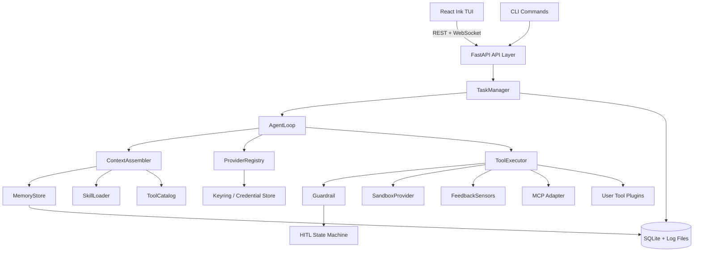

# SPEC: KL Code Coding Agent Harness

> 状态：已确认设计，等待实现计划  
> 日期：2026-08-02  
> 仓库：`SimpleCodingAgent` / 项目名：`KL Code`

## 1. 问题陈述

KL Code 是一个长期可用的本地 coding agent。它面向“在已有代码库中用自然语言接任务”的开发者，能够读取项目、修改文件、执行命令、跑测试，并基于客观反馈自我修正。

当前很多 coding agent 的问题是核心机制依赖提示词或现成 agent 编排框架，导致行为不确定、难以测试、难以审计。KL Code 的目标是：agent 主循环、工具分发、治理、反馈、记忆、上下文管理都由项目自己的代码实现，并且移除真实 LLM 后仍能通过确定性单元测试验证。

目标用户是个人开发者、学生以及需要本地安全编码助手的人。第一版优先保证真实小任务可用，同时架构面向跨文件修改、多轮修正、复杂任务、subagent、WebUI 和远程部署扩展。

## 2. 用户故事

1. 作为开发者，我可以运行 `kl init` 安全录入供应商、模型和 API key，key 不进入源码、配置、日志或 Git 历史。
2. 作为开发者，我可以在已有 Git 仓库中通过 TUI 提交一个真实任务，agent 修改文件并运行测试验证，危险动作由我审批。
3. 作为开发者，我可以在 TUI 中查看/添加/切换供应商和模型，而不需要手动编辑配置文件。
4. 作为开发者，我可以关闭并重新打开 TUI，恢复之前的 session、任务历史和会话记忆。
5. 作为开发者，我可以添加 Python 插件工具，工具自动出现在 agent 的工具目录中，并受同样的治理约束。
6. 作为开发者，我可以为项目或用户配置 skill、hook、MCP server，让 agent 按需加载指令、扩展动作和生命周期行为。
7. 作为维护者，我可以运行 `make test`，在 mock LLM 下确定性验证治理、反馈、上下文压缩、会话、任务和工具容错机制。

## 3. 功能规约

### 3.1 Session 会话

输入：

- `kl tui` 启动会话
- `/sessions` 列出历史会话
- `/session new` 新建会话
- `/session open <id>` 恢复会话
- `/session rename <id>` 重命名会话
- `/session close` 关闭当前会话
- `/session delete <id>` 删除会话

行为：

- session 是持久化对话单元，可以跨 TUI 重启保留。
- session 持有当前工作区、供应商/模型选择、规则加载状态、会话记忆和任务历史。
- 一个 session 可以包含多个 task。

输出：

- session 列表、当前 session 状态、恢复结果。

边界：

- 一个 TUI 进程同一时间只打开一个当前 session。
- 删除 session 必须二次确认。
- 删除 session 不删除共享的项目记忆。

错误处理：

- session id 不存在时返回明确错误。
- session 数据损坏时提示备份路径，并阻止继续写入。
- 当前 session 正在运行任务时，`/session close` 要求先暂停/中止任务。

### 3.2 Task 任务

输入：

- TUI 任务输入
- `kl run "<task>"` 一次性任务
- 可选：工作区模式、目标分支、上下文附加说明

行为：

- 提交任务后创建 task 记录。
- Git 工作区默认创建任务分支；非 Git 工作区创建文件快照。
- 任务执行状态包括：`pending`、`running`、`awaiting_approval`、`paused`、`succeeded`、`failed`、`canceled`。
- 任务运行中用户可暂停、继续、中止、追加说明。

输出：

- 任务状态、事件流、执行摘要、行为日志引用。

边界：

- 同一 task 同一时间只有一个主循环。
- 非 Git 工作区默认执行更严格审批。
- 任务默认在当前工作区范围内运行。

错误处理：

- 工作区不存在或不可写时，任务创建失败并给出原因。
- Git 分支创建失败时，回退到非 Git 快照模式并提示。
- 非 Git 快照失败时拒绝启动任务，不进入半运行状态。

### 3.3 AgentLoop 主循环

输入：

- 已激活的 session
- 一个 task
- provider/model 配置

行为：

- 每轮组织上下文，调用 LLM，解析结构化动作或最终回答。
- 动作经工具注册、治理、沙箱、执行、反馈后回到下一轮。
- 根据停止条件结束：任务完成、最大轮次、token 预算、用户中止、致命错误。
- 每轮状态写入行为日志。

输出：

- 最终总结、任务状态、事件流。

边界：

- 不调用现成 agent 编排框架的顶层循环。
- 工具崩溃不能导致主循环崩溃。
- 不允许无限循环：必须有最大轮次和 token 预算。

错误处理：

- provider 调用失败时生成结构化错误并进入反馈闭环。
- 连续失败达到阈值时任务失败并保留现场。

### 3.4 ProviderRegistry 供应商

输入：

- `.kl/config.yaml` 中的供应商配置
- CLI/TUI 配置命令
- provider 请求

行为：

- 支持多供应商、多模型配置。
- 第一版实现 OpenAI 兼容接口，预留 Anthropic adapter。
- 内置 `MockProvider`，用于测试和机制演示。
- 供应商配置只保存 `credential_ref`，不保存 key。

输出：

- 模型列表、请求结果、测试连接结果。

边界：

- 未配置 key 的付费供应商不可用。
- 本地 provider 可以允许无 key。
- 供应商 base URL 必须显式配置，不允许默认外网地址硬编码为唯一选项。

错误处理：

- 配置不合法时给出字段级错误。
- 鉴权失败、限流、超时分别映射为结构化 provider 错误。

### 3.5 ToolRegistry 与 ToolExecutor 工具系统

输入：

- `Action`：工具名、参数、工作区信息
- 内置工具、MCP 工具、用户 Python 插件工具

行为：

- 所有工具通过统一 `Tool` 接口注册：名称、参数 schema、权限声明、沙箱要求、超时。
- 内置工具：`list_dir`、`read_file`、`write_file`、`delete_file`、`grep`、`glob`、`apply_patch`、`run_command`、`git_status`、`git_diff`、`git_branch`、`git_commit`、`run_tests`、`run_lint`、`typecheck`、`task_manage`、`mcp_tool`。
- 用户工具放在 `.kl/tools/<name>/`，通过 Python 插件 API 注册。
- 工具描述自动进入系统提示词。

输出：

- `ToolResult` 或结构化 `ToolError`。

边界：

- 工具必须声明权限和沙箱要求，不能绕过治理。
- 工具执行有超时和资源限制。
- 大型输出截断并保留文件引用。

错误处理：

- 工具崩溃、超时、schema 错误、权限不足分别返回结构化错误。
- 错误进入反馈闭环，主循环继续或按策略停机。

### 3.6 Guardrail 治理

输入：

- `Action`
- 工作区模式：`managed` / `unmanaged`
- 命令策略、危险规则、审批配置

行为：

- `ScopeFence`：解析真实路径，阻止越出工作区。
- `SandboxPolicy`：应用命令白名单/黑名单、环境变量清理、超时和资源限制。
- `DangerClassifier`：按动作类型、目标路径、命令内容、影响范围输出危险等级。
- HITL 状态机：危险动作进入 `pending_approval`，等待批准、拒绝、修改或超时。
- 非 Git 模式默认更严格。

输出：

- 治理决策：允许执行、拒绝、需要审批、需要修改。
- 审批记录。

边界：

- 治理逻辑不依赖 LLM。
- 每条决策写入行为日志。
- `delete_file`、危险 shell、越界写、发布类命令默认危险。

错误处理：

- 配置错误导致策略不可解析时，默认拒绝执行。
- 审批超时按配置拒绝或冻结任务。

### 3.7 FeedbackSensors 反馈闭环

输入：

- 工具输出、退出码、stdout/stderr
- 测试、lint、类型检查结果

行为：

- 解析并分类为：成功、测试失败、构建失败、lint 错误、类型错误、超时、工具错误、provider 错误。
- 生成结构化 `Feedback`，供下一轮上下文使用。
- 反馈结果写入记忆和行为日志。

输出：

- 结构化 `Feedback`。

边界：

- 反馈分类不依赖 LLM。
- 失败信息去重、截断、脱敏后回灌。

错误处理：

- 无法解析的产物归类为 `unknown_error` 并保留原始引用。

### 3.8 ContextAssembler 上下文、记忆与压缩

输入：

- 基础上下文、工具目录、规则、session 记忆、项目记忆、skill 内容、任务状态、历史消息

行为：

- 每段上下文估算 token 用量，按模型预算分配配额。
- 超预算时选择可摘要片段，通过 provider 生成结构化摘要。
- 当前轮次、审批状态、工具目录、规则、未完成任务默认不摘要。
- 摘要写入记忆；原始内容完整保留在日志和任务记录中。
- 摘要失败时执行结构化 fallback，不崩溃。

输出：

- 不超过预算的 LLM 上下文。
- 摘要记录。

边界：

- token 计量和优先级规则可脱离 LLM 测试。
- 记忆按需检索，不全量注入。
- 用户规则 > 项目规则 > 默认行为。

错误处理：

- 摘要重试失败后使用 fallback。
- fallback 后仍超预算时按优先级丢弃低价值历史，并在日志中记录。

### 3.9 Skill、Hook、MCP 与用户工具

输入：

- `.kl/skills/` 与用户级 skills
- `.kl/hooks.yaml`
- MCP server 配置
- `.kl/tools/<name>/` 用户工具

行为：

- skill 是 manifest + Markdown 内容，按任务类型/关键词按需加载。
- hook 支持事件：任务开始/结束、动作前/后、反馈生成、审批请求/完成、错误、中止。
- hook 支持 `command` 和 `http` 两类，payload 自动脱敏。
- MCP 工具通过 adapter 进入 `ToolRegistry`；第一版实现 stdio 与 streamable-http 两种传输，传输不可用时返回结构化工具错误。
- 用户工具使用 Python 插件 API，与内置工具同等治理。

输出：

- 上下文中的 skill 文档
- hook 执行结果
- MCP 工具结果
- 用户工具注册结果

边界：

- skill 只是内容，不替代 harness 机制。
- hook 失败策略可配置：忽略或中止任务。
- 用户工具默认受沙箱和审批约束。

错误处理：

- skill 加载失败时忽略该 skill 并记录。
- MCP server 不可用时返回工具错误。
- hook 超时按失败策略处理。

### 3.10 CLI/TUI 与斜杠指令

命令：

- `kl init`
- `kl config provider add/list/test`
- `kl config key set/test/clear/show`
- `kl server start/stop/status`
- `kl run "<task>"`
- `kl tui`

TUI 斜杠指令：

- `/config`
- `/provider`
- `/model`
- `/key`
- `/tools`
- `/hooks`
- `/skills`
- `/mcp`
- `/sessions`
- `/session new`
- `/session open <id>`
- `/session rename <id>`
- `/session close`
- `/session delete <id>`
- `/pause`
- `/continue`
- `/abort`
- `/status`
- `/help`
- `/exit`

行为：

- 指令通过 `CommandRegistry` 注册，每个指令有名称、别名、参数 schema、适用状态、说明和处理器。
- `/help` 自动从注册表生成。
- 配置向导支持供应商、模型、base URL、API key 隐藏输入。

输出：

- 实时任务视图、审批面板、指令结果、会话恢复界面。

边界：

- 运行中指令和空闲指令分开限制。
- `/exit` 在任务运行时先确认。

错误处理：

- 未知指令给出帮助提示。
- 参数错误显示该指令的 schema。

### 3.11 行为日志与审计

输入：

- 所有任务、动作、治理、反馈、审批、摘要、hook、人工干预事件

行为：

- 写入 append-only 结构化日志。
- `AGENT_LOG` 在任务执行全程按事件视情况实时记录，不在任务完成后才统一补写。
- 凭据、key、敏感环境变量自动脱敏。
- 日志支持按 task/session 回放。

输出：

- 日志文件、审计查询接口。

边界：

- 日志不保存明文凭据。
- 日志不覆盖历史记录。

错误处理：

- 日志写入失败时任务停止并提示磁盘/权限问题。

## 4. 非功能需求

### 4.1 性能

- 本地 daemon 默认只监听 `127.0.0.1`。
- TUI 事件延迟目标为秒级内可见。
- 上下文装配有 token 预算，避免无限增长。
- 工具执行有超时、重试上限和资源限制。

### 4.2 安全

威胁模型：

- 源码或 Git 历史泄露 key。
- 配置文件、shell history、日志、hook payload 泄露 key。
- 本地未授权进程访问 daemon。
- 工具越界访问工作区外文件。
- 危险 shell 命令造成破坏。
- 恶意 MCP server 或用户插件窃取数据。
- 未来远程部署后网络传输被窃听。

对策：

- key 优先存系统钥匙串，配置只存 `credential_ref`。
- 所有日志、hook payload、工具输出统一脱敏。
- daemon 使用随机本地 token，默认仅本机访问。
- `ScopeFence` 和 `SandboxPolicy` 在代码层强制执行。
- 用户工具、MCP server 和 hook 需要用户显式配置，并标记信任边界。
- 远程化时引入 TLS、认证和密钥轮换。

### 4.3 可用性

- `make test` 一键运行全部测试。
- `kl init` 覆盖全新机器冷启动。
- 首次配置通过 CLI 或 TUI 引导，不要求用户手写配置。
- 错误信息包含动作、原因和可操作建议。

### 4.4 可观测性

- 行为日志覆盖任务、动作、治理、反馈、审批、摘要、hook 和人工干预。
- 日志可回放，支持排查 agent 偏离。
- 状态接口提供当前 session、task、token 用量和上下文预算。

### 4.5 CI/CD

- GitHub Actions 保留 `unit-test` job，每次 push 自动运行测试。
- 根目录提供 `.gitlab-ci.yml`，包含名为 `unit-test` 的 job。
- 分发阶段增加构建检查和产物检查。
- 最终交付前必须有一次 CI pass 记录。

## 5. 系统架构

数据流：

1. TUI/CLI 创建 session 和 task。
2. TaskManager 准备工作区并启动 AgentLoop。
3. ContextAssembler 生成上下文。
4. ProviderRegistry 调用 LLM。
5. AgentLoop 解析动作并交给 ToolExecutor。
6. Guardrail 决定允许、拒绝或审批。
7. 执行结果交给 FeedbackSensors，反馈回灌到下一轮。
8. 状态、记忆、摘要、审计日志持久化。

外部依赖：

- LLM 供应商
- MCP server
- OS 钥匙串
- Git
- Shell / 测试 / lint 工具

## 6. 数据模型

- `Session`：id、名称、工作区路径、provider/model、规则快照、状态、时间戳。
- `Task`：id、session_id、任务描述、状态、工作区模式、分支/快照引用、token 用量、摘要、时间戳；预留 `parent_task_id` 供后续 subagent 使用。
- `Action`：id、task_id、序号、工具名、参数、治理结果、沙箱结果、审批状态、执行结果。
- `Approval`：id、action_id、危险等级、原因、结果、用户备注。
- `Feedback`：id、task_id、action_id、类别、摘要、原始输出引用。
- `MemoryEntry`：id、session_id 或 project_id、类型、标签、内容/摘要、token 估算、时间戳。
- `EventLog`：id、task_id、事件类型、脱敏 payload、时间戳。
- `WorkspaceSnapshot`：id、task_id、Git 分支或非 Git 快照路径、校验值。

存储规则：

- SQLite 保存状态、任务、记忆元数据和审计索引。
- 大型输出存文件，数据库只存引用和摘要。
- 项目数据放 `.kl/` 并 gitignore；用户级配置放用户目录。
- 凭据不进入 SQLite 或日志。

## 7. 凭据与分发设计

### 7.1 凭据

- `kl init` 通过隐藏输入录入 API key。
- key 优先存入系统钥匙串：Windows Credential Manager、macOS Keychain、Linux Secret Service。
- 钥匙串不可用时，允许带主密码的本地加密文件，并在初始化时说明风险。
- 允许环境变量经 `.env` 加载作为可选来源（不写入源码），并在初始化时说明其明文风险。
- 配置文件只保存 `credential_ref`。
- 支持 `kl config key set/test/clear/show` 和 TUI `/key`。
- `kl config key show` 只显示是否已配置。

### 7.2 分发

- 服务端：PyPI / uv 安装。
- CLI/TUI：npm 安装。
- 全新机器流程：安装 Node.js 和 Python，安装两个包，进入仓库执行 `kl init`，再运行 `kl tui`。
- 开发期提供 `make dev` 同时启动服务端和 TUI。
- Docker 作为后续远程/WebUI 部署方案。

## 8. 技术选型与理由

- Python + FastAPI：适合快速实现异步 agent 服务、插件生态、pydantic schema 和测试。
- TypeScript + React Ink：适合构建交互式 TUI，并为未来 WebUI 复用 React 知识。
- 第一版 TUI 使用 React Ink 组件模型，不引入 Web 设计系统；未来 WebUI 接入时再评估 Open Design 与对应前端 skill。
- SQLite：本地持久化简单可靠，无需额外服务。
- pytest + vitest：服务端和客户端测试。
- OpenAI 兼容接口优先：覆盖 OpenAI、DeepSeek、通义、Ollama/vLLM 等；预留 Anthropic adapter。
- 不使用 LangChain AgentExecutor、AutoGen、CrewAI、LlamaIndex agent 等现成 agent 编排框架；主循环、工具分发、治理、反馈和记忆必须由本项目实现。

## 9. 验收标准

1. 全新机器可按 README 安装 npm/PyPI 包并完成 `kl init`，key 不进入源码和日志。
2. TUI 支持提交任务、实时观察、审批、暂停/继续/中止、会话恢复和斜杠指令。
3. 内置工具齐全，用户 Python 插件工具可注册并通过治理执行。
4. mock-LLM 单测覆盖：危险动作拦截、审批状态机、越界路径、工具崩溃不中断主循环、反馈分类和回灌。
5. 上下文装配有 token 预算，mock provider 可确定性验证 LLM 摘要和 fallback。
6. 行为日志覆盖关键事件，且不包含明文 key。
7. `make test` 一键通过，GitHub Actions 和 `.gitlab-ci.yml` 均含 `unit-test` job。
8. `examples/` 提供 mock-LLM 机制演示：治理拦截、反馈闭环、上下文摘要、工具容错。
9. `SPEC.md`、`PLAN.md`、`SPEC_PROCESS.md`、`AGENT_LOG.md`、`REFLECTION.md`、README 齐全。

## 10. 风险与未决问题

- 复杂任务成功率依赖上下文质量、任务分解和反馈闭环，需要迭代评估。
- 内部沙箱不等于完整 OS 隔离；Windows/Linux 行为差异需要测试覆盖。
- 系统钥匙串在部分 Linux 环境可能不可用，加密文件 fallback 需要明确提示。
- MCP server 和用户工具属于外部代码，存在数据泄露风险，需要信任边界和日志审计。
- LLM 供应商接口差异可能导致行为不一致，provider adapter 需要独立测试。
- subagent、WebUI、远程部署、Docker 沙箱 / Docker 部署为后续范围（见 §12），未获用户允许前不得开工。

## 11. 领域与机制设计

### 11.1 工具

Coding agent 的工具必须覆盖读代码、搜代码、改代码、执行命令、验证结果和 Git 操作。第一版提供文件、搜索、补丁、shell、git、测试/lint、任务编排、MCP 和用户插件工具。

### 11.2 反馈信号

最有价值的反馈是测试、lint、类型检查和命令退出码。反馈必须由代码解析并结构化，而不是让 LLM 自行判断。失败分类、错误摘要和重试预算共同构成可测试的闭环。

### 11.3 危险动作

危险动作包括越界文件写、删除、危险 shell、发布、强制 git 操作、网络上传等。治理采用代码级识别与 HITL，不依赖提示词。非 Git 模式由于缺少 diff/分支，审批默认更严格。

### 11.4 记忆

项目记忆保存历史决策、任务摘要和项目约定；会话记忆保存当前任务轨迹。记忆按需检索并注入，不整库载入。原始事件保留在日志中，压缩后的摘要也写入记忆。

### 11.5 重点维度

治理是本次重点做深维度。原因：

- 它是 coding agent 长期可用的安全基础。
- 范围围栏、命令策略、危险分类、HITL 状态机都可以用纯代码实现。
- 移除 LLM 后仍可确定性验证，最符合本项目“机制必须可测试”的要求。

反馈闭环、工具扩展、记忆和上下文管理提供基础可用实现；subagent、WebUI 和远程化作为后续扩展。

## 12. 后续范围与开工门禁

### 12.1 已记录但未授权的后续功能

以下功能已记录为 KL Code 的后续版本方向，但不属于第一版范围：

- Subagent 编排
- WebUI
- 远程部署
- Docker 沙箱 / Docker 部署

这些内容出现在 SPEC 中只代表“被纳入长期方向”，不代表“已授权开工”。

### 12.2 开工门禁

- 任何后续功能必须由用户明确允许后才能进入 `PLAN.md` 并开始实现。
- 允许的表述包括用户明确说“开始”“允许”“纳入本版本”等；不能由 agent 自行推断。
- 若 subagent 或执行流程发现自己在实现未授权后续功能，必须立即停止、回退该任务范围，并在 `AGENT_LOG.md` 记录越界原因。
- 每项后续功能开工前必须更新本节状态和对应 PLAN 任务状态，并由用户确认。
- 当前所有后续功能状态均为：未授权。

### 12.3 扩展性预留（仅声明接口，不实现）

以下接口预留用于保证后续版本扩展时不需要重写核心 harness：

**Subagent**

- `AgentLoop` 保持“provider -> action -> tool dispatch -> feedback”的固定主循环，subagent 以后作为 `ToolRegistry` 中的受治理工具接入。
- 预留工具名：`spawn_subagent`、`await_subagent`、`list_subagents`、`abort_subagent`。
- 预留 `Task.parent_task_id` 字段，用于表达父子任务关系。
- `ToolResult.meta` 预留用于携带 subagent id、状态和结果引用。
- `TaskManager` 后续可以在此基础上增加任务图持久化，而不改变 API 主形态。

**WebUI**

- FastAPI REST + WebSocket 是唯一客户端 API，TUI 只是其中一个消费者。
- API 统一使用 `/api/v1` 前缀，WebUI 复用任务、会话、配置、事件流接口。
- 服务端不保存 TUI 专属状态，避免 WebUI 需要复制领域逻辑。
- 远程部署预留 TLS、认证、CORS 和 token/SSO 接入点。

这些预留只声明接口和兼容边界，不改变 §12.2 的开工门禁。
